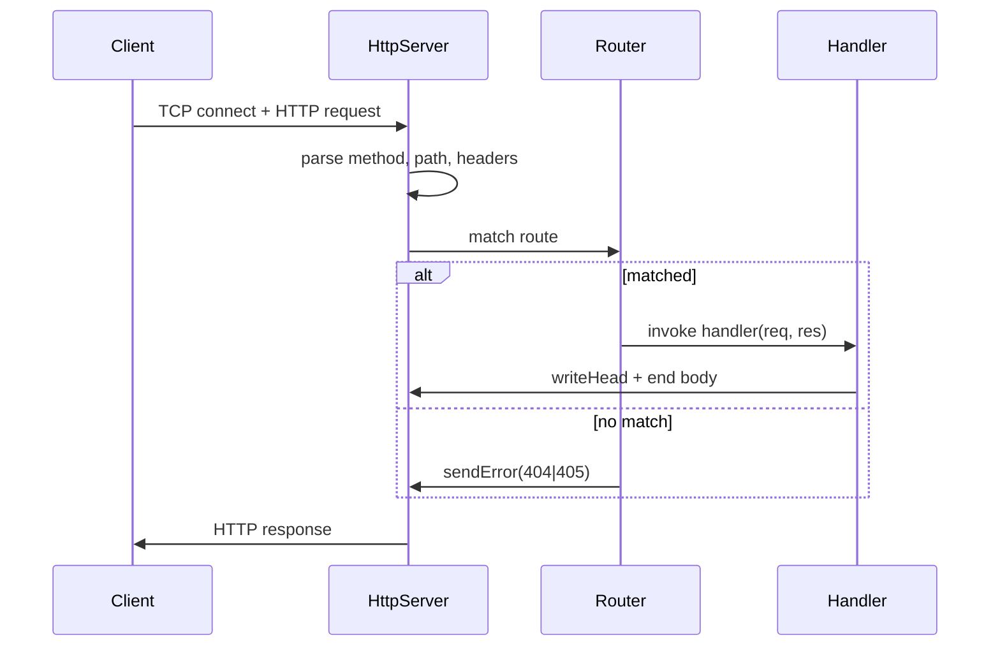

# Architecture — HTTP Server From Scratch

## Summary

The lab isolates Node platform HTTP semantics behind a small typed API. Source of truth: [[06-NodeJS/code/src/http-server.ts|http-server.ts]]. Tests call public behavior through real TCP/HTTP integration, not mocked sockets.

## Component and Data Flow

## Public Surface

| Symbol | Responsibility |
| --- | --- |
| `HttpServer` | Wraps `http.createServer`, owns router and limits |
| `RouteTable` | Registers method/path → handler |
| `RequestContext` | Parsed path, query, bounded body reader |
| `sendJson` | Sets `Content-Type`, serializes, finishes once |

## Invariants

- Every successful response calls `writeHead` exactly once before body bytes.
- Handlers must not leave sockets half-open after `res.end()` or `res.destroy()`.
- Router matching is deterministic; first registered route wins on duplicate keys (test-enforced).
- Body reader aborts when cumulative bytes exceed configured `maxBodyBytes`.

## Failure Model

Malformed requests fail at the parser with `400` without invoking user handlers. Handler throws map to `500` with generic body in tests (no stack trace leakage). Server `close()` rejects new connections and waits for in-flight handlers up to `drainTimeoutMs`.

## Complexity and Ownership

The server owns listening socket and per-connection state during request lifetime. Handlers must not retain `req`/`res` references after completion. No filesystem or database I/O in core lab—static routes use in-memory fixtures only.

## Trade-offs and Native Gaps

| Gap | Engineering consequence |
| --- | --- |
| No HTTP/2 or TLS | Production edge termination required upstream |
| Simple router | No parametric routes, middleware stacks, or framework ergonomics |
| Single-threaded handlers | CPU-heavy work blocks the event loop—offload to [[06-NodeJS/projects/Worker Pool Lab/README\|Worker Pool Lab]] |
| Platform `http` parser | Not a from-scratch byte parser; teaches host boundaries, not RFC ABNF implementation |

Using platform `http` is intentional: the learning goal is lifecycle, backpressure, and operational hooks—not reimplementing Node core.

## Evolution Rules

- Preserve response ordering and status codes unless versioned contract documents a change.
- Add a failing test in [[06-NodeJS/code/tests/labs.test.ts|labs.test.ts]] before fixing edge cases.
- Do not claim framework parity; link product APIs to [[07-Backend/02-Frameworks-and-Middleware/Express Application and Router Internals|Express Application and Router Internals]] when appropriate.

## Related Documents

- [[06-NodeJS/projects/HTTP Server From Scratch/README|Project README]]
- [[06-NodeJS/projects/Node Runtime Toolkit/Architecture|Toolkit Architecture]]
- [[06-NodeJS/projects/Graceful Shutdown Harness/Architecture|Shutdown Harness Architecture]]
