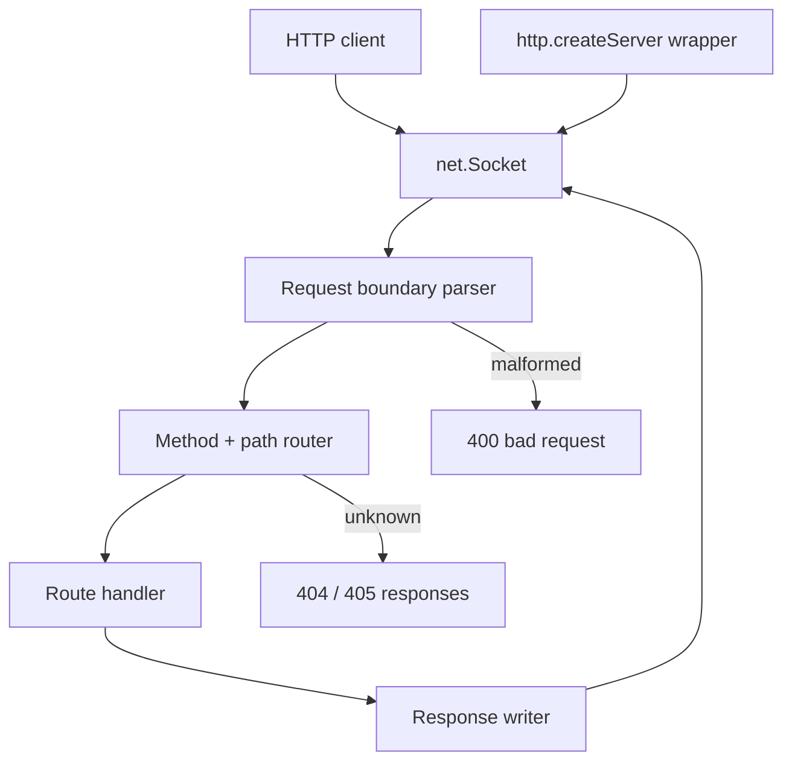

# HTTP Server From Scratch

## One-Line Purpose

Build a thin HTTP/1.1 listener on Node platform `http`/`net` primitives—explicit request parsing boundaries, header discipline, keep-alive behavior, and error responses without Express or framework routing magic.

## Status

**Active.** The learning surface targets [[06-NodeJS/code/src/http-server.ts|http-server.ts]] and executable checks in [[06-NodeJS/code/tests/labs.test.ts|labs.test.ts]]. This folder defines routing contracts, lifecycle hooks, and acceptance against integration vectors.

## Prerequisites

- [[06-NodeJS/05-Networking/http and https Platform Servers|http and https Platform Servers]]
- [[06-NodeJS/05-Networking/Request Response Lifecycle and Headers|Request Response Lifecycle and Headers]]
- [[06-NodeJS/05-Networking/net Sockets and Servers|net Sockets and Servers]]
- [[06-NodeJS/05-Networking/Keep-Alive Timeouts and Connection Limits|Keep-Alive Timeouts and Connection Limits]]
- [[06-NodeJS/04-Buffers-Streams-and-IO/Readable Writable and Duplex Streams|Readable Writable and Duplex Streams]]
- [[06-NodeJS/02-Event-Loop-and-libuv/Event Loop Phases|Event Loop Phases]]

## Architecture



See [[06-NodeJS/projects/HTTP Server From Scratch/Architecture|Architecture]] for handler contracts and connection lifecycle.

## Acceptance Criteria

- [ ] Server binds to ephemeral port and serves `GET /health` with `200` and JSON body.
- [ ] Unknown routes return `404` with stable error shape; wrong method returns `405` when configured.
- [ ] Request body reads respect backpressure; oversized bodies abort with `413`.
- [ ] Response headers include `Content-Length` or chunked encoding consistently—no double-finish.
- [ ] `Connection: close` and keep-alive paths both terminate without socket leaks in tests.
- [ ] Integration tests use Node `http.request` only—no Express, Fastify, or supertest dependency in lab scope.
- [ ] Server `close()` drains in-flight requests before callback (ties to shutdown harness).

## Run and Test

From the repository root:

```bash
cd 06-NodeJS/code
npm install
npm test -- tests/labs.test.ts -t "HttpServer"
```

Run the complete Node lab suite with `npm test`. Keep experiments in [[06-NodeJS/code|06-NodeJS/code]]; this directory contains documentation, not a second implementation.

## Benchmarks

| Workload | Variants | Primary metrics |
| --- | --- | --- |
| 1k sequential GET /health | keep-alive on vs off | req/s, p99 latency |
| 100 concurrent connections | default timeouts | open socket count at drain |
| 1 MB POST body | streaming read vs buffer-all | heap delta, time to first byte |
| Malformed request flood | parser fail-fast | error rate without event-loop stall |

Benchmark entry point (when added): `06-NodeJS/code/bench/http-server.bench.ts`.

## Security and Failure Constraints

- Reject path segments containing `..` before any filesystem handler is wired.
- Cap header count, header byte size, and body bytes at the parser boundary.
- Do not reflect raw `Host` or `User-Agent` into error pages without encoding.
- Timeouts on idle sockets; no unbounded connection accumulation in tests.
- TLS termination is out of lab scope—document handoff to [[06-NodeJS/05-Networking/TLS Certificates and Secure Servers Concepts|TLS Certificates and Secure Servers Concepts]].

## Exercises and Reflection

1. Add `Expect: 100-continue` handling with explicit accept/deny policy.
2. Implement conditional `GET` with `If-None-Match` using in-memory etag store.
3. Trace one request through libuv read callback → `data` event → handler → `res.end`.

**Reflection prompts**

- What breaks if you call `res.end()` twice on the same response?
- When does keep-alive help versus hurt under slow clients?
- Why is thin `http` insufficient for production without timeouts, limits, and graceful shutdown?

## Interview Questions

- Walk through Node `http` request/response object lifecycle.
- How do you detect and prevent slowloris-style header dribbling at the app layer?
- When would you choose `http2` over `http` for a new internal service?

## Related Notes

- [[06-NodeJS/projects/HTTP Server From Scratch/Architecture|Architecture]]
- [[06-NodeJS/projects/HTTP Server From Scratch/Testing|Testing]]
- [[06-NodeJS/projects/HTTP Server From Scratch/Security|Security]]
- [[06-NodeJS/README|Node.js MOC]]
- [[06-NodeJS/code/README|Node.js Code Labs]]
- [[06-NodeJS/projects/Node Runtime Toolkit/README|Node Runtime Toolkit]]
- [[Career/README|Career]]
