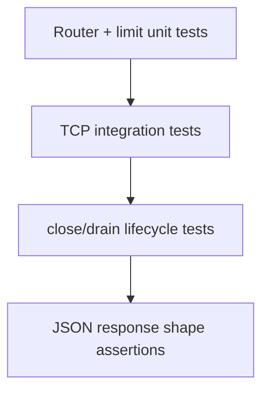

# Testing — HTTP Server From Scratch

## Strategy

Integration-first: spin real `http.Server` on ephemeral port, drive with Node `http.request`/`http.get`. Unit tests cover router matching and body-limit logic in isolation where parsing is deterministic.



## Critical Paths

1. `GET /health` → `200`, valid JSON, `Content-Type: application/json`
2. Unknown path → `404` with stable `{ error, code }` shape
3. Wrong method on registered path → `405` when method guard enabled
4. POST body at limit − 1 byte succeeds; at limit + 1 → `413`
5. Handler throw → `500` without stack in body
6. `server.close()` waits for slow handler before callback
7. Keep-alive: two sequential requests on one connection when enabled

## Commands

```bash
cd 06-NodeJS/code
npm install
npm test -- tests/labs.test.ts -t "HttpServer"
```

Full suite: `npm test`. No network beyond `127.0.0.1` in CI.

## Definition of Done

- [ ] Integration tests bind ephemeral ports and always `close()` server in `afterEach`
- [ ] No open handle warnings from `@vitest` or manual `process._getActiveHandles` spot checks
- [ ] Response contract tests fail if `Content-Length` and body disagree
- [ ] Malformed request fixture returns `400` without hanging
- [ ] Benchmarks (when present) run offline with fixed concurrency

## Related Documents

- [[06-NodeJS/projects/HTTP Server From Scratch/README|README]]
- [[06-NodeJS/10-Production-Node/Testing Node Servers Integration and Contract Tests|Testing Node Servers Integration and Contract Tests]]
- [[06-NodeJS/projects/Node Runtime Toolkit/Testing|Node Runtime Toolkit Testing]]
