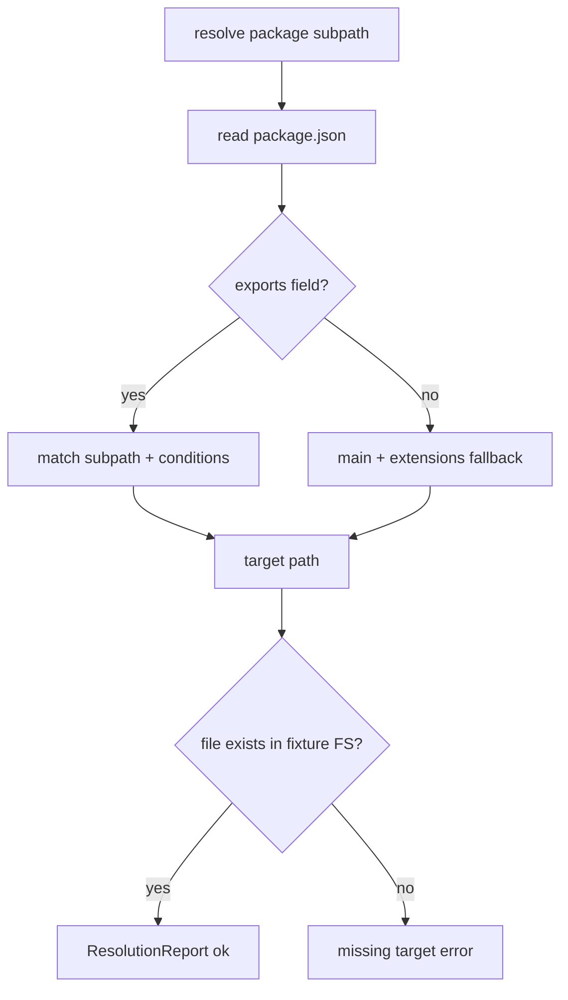

# Architecture — Module Resolution and Exports Clinic

## Summary

An in-memory resolver models Node export maps and resolution conditions without replacing Node's native resolver or loader hooks. Source: [[06-NodeJS/code/src/module-resolution.ts|module-resolution.ts]].

## Resolution Flow

## Public Surface

| Symbol | Responsibility |
| --- | --- |
| `ExportsResolver` | Condition-aware resolution |
| `ResolutionReport` | `{ ok, path, conditions, warnings }` |
| `detectDualPackageHazard` | Flags split ESM/CJS surfaces |
| `FixturePackageFS` | Sandboxed virtual tree for tests |

## Invariants

- Condition order documented and test-locked: `import`, `require`, `node`, `default` where applicable.
- Resolver never mutates input manifest objects (frozen copies).
- Hazard detector is advisory—does not block resolution.

## Failure Model

Invalid manifest schema throws `InvalidManifestError`. Unmatched export throws `ExportNotFoundError`. Dual hazard adds warning, not hard error unless strict mode enabled in tests.

## Trade-offs

| Gap | Consequence |
| --- | --- |
| Not Node core resolver | Edge cases differ; link Node docs for production |
| No TypeScript path mapping | Handoff to bundler/tsconfig paths |
| In-memory FS only | No real `node_modules` hoisting quirks unless fixture models them |

## Related Documents

- [[06-NodeJS/projects/Module Resolution and Exports Clinic/README|Project README]]
- [[06-NodeJS/projects/Node Runtime Toolkit/Architecture|Toolkit Architecture]]
