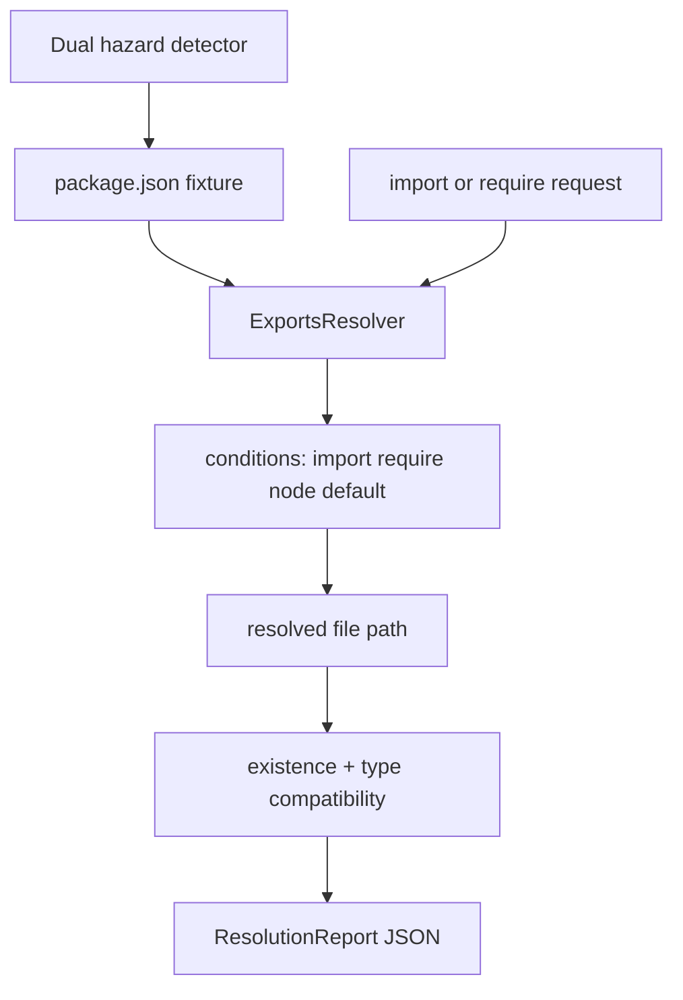

# Module Resolution and Exports Clinic

## One-Line Purpose

Simulate Node `package.json` `exports`, `type`, and dual-package hazard scenarios in-process—predicting import/require outcomes, subpath conditions, and mismatch errors before they fail in production bundlers or CI.

## Status

**Active.** The learning surface targets [[06-NodeJS/code/src/module-resolution.ts|module-resolution.ts]] and fixture packages under [[06-NodeJS/code/tests/fixtures/packages|tests/fixtures/packages]] with checks in [[06-NodeJS/code/tests/labs.test.ts|labs.test.ts]].

## Prerequisites

- [[06-NodeJS/03-Modules-and-Loading/CJS and ESM Execution in Node|CJS and ESM Execution in Node]]
- [[06-NodeJS/03-Modules-and-Loading/package.json type exports and Dual Package Hazard|package.json type exports and Dual Package Hazard]]
- [[06-NodeJS/03-Modules-and-Loading/node_modules Resolution in Practice|node_modules Resolution in Practice]]
- [[02-JavaScript/06-Modules-and-Tooling/ES Modules|ES Modules]]
- [[06-NodeJS/03-Modules-and-Loading/Custom Loaders and Module Hooks|Custom Loaders and Module Hooks]]

## Architecture



See [[06-NodeJS/projects/Module Resolution and Exports Clinic/Architecture|Architecture]] for condition precedence rules.

## Acceptance Criteria

- [ ] Resolver honors `exports` subpaths and `import`/`require` conditions.
- [ ] `"type":"module"` vs `"commonjs"` changes default extension expectations in reports.
- [ ] Dual-package fixture (separate ESM/CJS entry) flagged with hazard metadata.
- [ ] Missing export target returns distinct error from missing file on disk.
- [ ] `node_modules` layout simulation resolves nested dependency paths.
- [ ] Reports include matched condition trail for debugging.
- [ ] No actual dynamic `import()` of fixture paths in unit tests unless isolation subprocess used.

## Run and Test

```bash
cd 06-NodeJS/code
npm install
npm test -- tests/labs.test.ts -t "ModuleResolution"
```

## Benchmarks

| Workload | Variants | Primary metrics |
| --- | --- | --- |
| 1k resolve calls | deep exports map vs flat | ops/s |
| Monorepo fixture | workspace symlink simulation | cache hit rate |
| Hazard scan | 50 package manifests | warnings emitted |

Benchmark entry point (when added): `06-NodeJS/code/bench/module-resolution.bench.ts`.

## Security and Failure Constraints

- Resolver reads manifest JSON only—no execution of package `postinstall` scripts.
- Fixture paths confined to test temp root; reject absolute paths outside sandbox.
- Prototype pollution keys in manifest (`__proto__`) rejected at parse.
- Do not fetch packages from registry in resolver tests.

## Exercises and Reflection

1. Add `development` export condition for tooling-only entry points.
2. Model incorrect dual package where default export differs between ESM and CJS.
3. Trace how bundler resolution differs from Node conditions (document gap).

**Reflection prompts**

- Why do dual packages cause subtle production bugs?
- When is `"exports"` omitting root `.` intentional?
- How does `require(esm)` error differ on modern Node?

## Interview Questions

- Explain `package.json` `exports` condition keys.
- What is the dual-package hazard?
- How does Node decide ESM vs CJS for a given file?

## Related Notes

- [[06-NodeJS/projects/Module Resolution and Exports Clinic/Architecture|Architecture]]
- [[06-NodeJS/projects/Module Resolution and Exports Clinic/Testing|Testing]]
- [[06-NodeJS/projects/Module Resolution and Exports Clinic/Security|Security]]
- [[06-NodeJS/README|Node.js MOC]]
- [[06-NodeJS/code/README|Node.js Code Labs]]
- [[06-NodeJS/projects/Node Runtime Toolkit/README|Node Runtime Toolkit]]
- [[Career/README|Career]]
