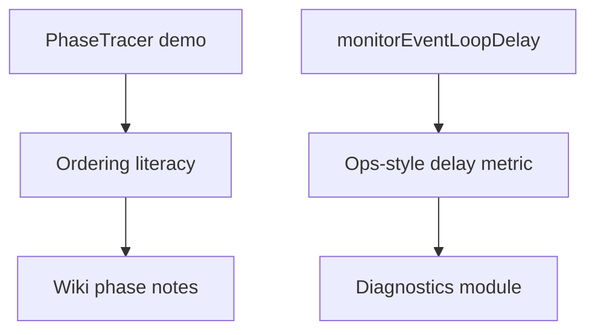

# ADR-001: Event-Loop Teaching Model

## Status

Accepted on 2026-07-22.

## Context

Learners confuse V8 microtasks, `process.nextTick`, and libuv phases. A full libuv tracer is impractical in userland and would imply false precision. The toolkit still needs reproducible ordering demos and loop-delay sampling tied to [[06-NodeJS/02-Event-Loop-and-libuv/process.nextTick vs Microtasks vs Timers|nextTick vs microtasks vs timers]].

## Decision

Provide a **pedagogical** `PhaseTracer` that schedules known callbacks across `nextTick`, microtasks, `setImmediate`, and timers with explicit labels—plus `sampleLoopDelay` using `perf_hooks.monitorEventLoopDelay`. Do not claim byte-for-byte libuv phase accuracy.

## Options Considered

| Option | Pros | Cons |
| --- | --- | --- |
| Pedagogical tracer | Reproducible, testable, honest scope | Not a production profiler |
| Native hooks only | Closer to truth | Hard to teach; version-sensitive |
| Full libuv reimplementation | Maximum detail | Misleading; out of scope |

## Consequences

Tests lock documented ordering for tracer fixtures only. Documentation must link [[06-NodeJS/02-Event-Loop-and-libuv/Event Loop Phases|Event Loop Phases]] for production debugging. CLI `loop` command emits JSON timeline, not raw libuv internals.

## Follow-ups

- Add redacted trace mode (see [[06-NodeJS/projects/Node Runtime Toolkit/Ideas|Ideas]] I-001).
- Document Node version differences for timer/immediate ordering in tests.

## Related Documents

- [[06-NodeJS/projects/Node Runtime Toolkit/Architecture|Architecture]]
- [[06-NodeJS/projects/Node Runtime Toolkit/API|API]]
