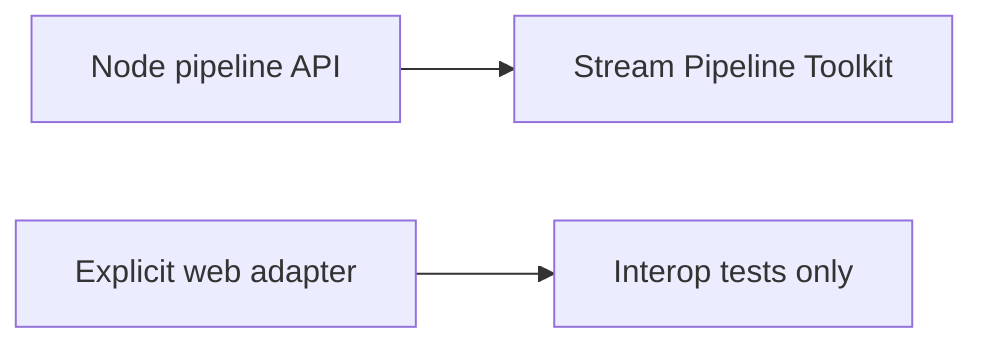

# ADR-002: Node Streams Default with Explicit Web Adapter

## Status

Accepted on 2026-07-22.

## Context

Node 20+ exposes Web Streams interop ([[06-NodeJS/04-Buffers-Streams-and-IO/Web Streams Interop with Node Streams|Web Streams Interop]]). The toolkit must choose a default pipeline API for [[06-NodeJS/projects/Stream Pipeline Toolkit/README|Stream Pipeline Toolkit]] and portfolio exports without forcing dual mental models on beginners.

## Decision

Default to **Node streams** (`stream.Readable`, `Transform`, `Writable`, `stream.promises.pipeline`) in `buildPipeline`. Provide an optional explicit adapter stage (`fromWeb` / `toWeb`) when a fixture or CLI input declares `streamKind: "web"`.

## Options Considered

| Option | Pros | Cons |
| --- | --- | --- |
| Node streams default | Matches `fs`, `http`, most Node I/O | Web-native fetch bodies need adapter |
| Web streams default | WinterCG alignment | Hides Node backpressure APIs beginners must learn |
| Dual parallel APIs | Flexibility | Doubles maintenance and docs |

## Consequences

Tests and benchmarks use Node stream fixtures first. Web interop covered by dedicated adapter tests, not implicit magic. Documentation states WinterCG portability limits versus Node host behavior.

## Follow-ups

- CLI schema field `streamKind` with validation.
- Cross-link [[06-NodeJS/00-Orientation/Deno Bun and WinterCG Portability|Deno Bun and WinterCG Portability]].

## Related Documents

- [[06-NodeJS/projects/Stream Pipeline Toolkit/Architecture|Stream Pipeline Architecture]]
- [[06-NodeJS/projects/Node Runtime Toolkit/API|API]]
