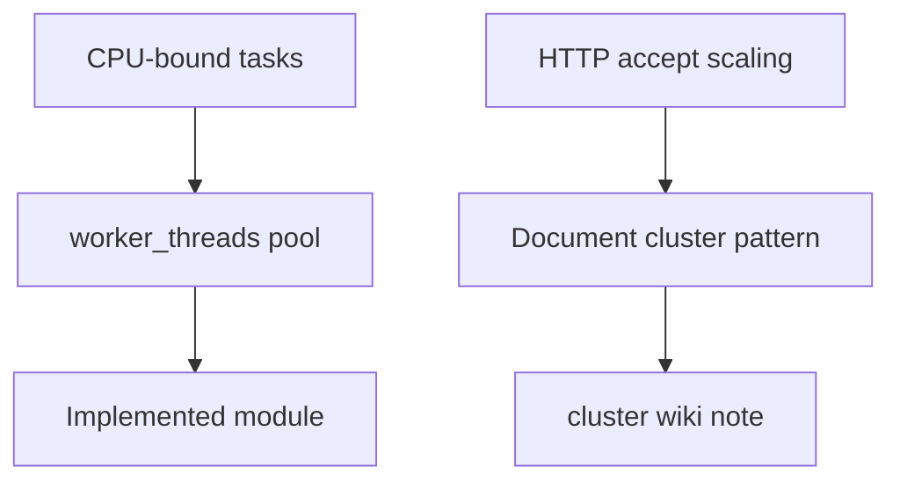

# ADR-003: Worker Pool Default; Cluster Documented Not Implemented

## Status

Accepted on 2026-07-22.

## Context

[[06-NodeJS/06-Concurrency-and-Scaling/Choosing Threads Processes and Offload|Choosing Threads Processes and Offload]] distinguishes CPU offload (`worker_threads`), accept-loop scaling (`cluster`), and isolation (`child_process`). The toolkit includes [[06-NodeJS/projects/Worker Pool Lab/README|Worker Pool Lab]] but must avoid operational complexity of multi-process HTTP scaling in a library lab.

## Decision

Ship **`WorkerPool` / `mapLimit` as the default concurrency primitive** in the portfolio. Document `cluster` trade-offs in Architecture and wiki links; **do not implement cluster orchestration** in v1 toolkit code.

## Options Considered

| Option | Pros | Cons |
| --- | --- | --- |
| Worker pool default | Teaches structured clone + queue; single port in tests | Not multi-core HTTP accept scaling |
| Cluster default | Production HTTP pattern | Fork management, shared state, harder tests |
| Both implemented | Completeness | Scope creep; blurs learning goals |

## Consequences

Portfolio HTTP labs remain single-process; scale story is explicit in docs. ADR referenced from Worker Pool Security (not a sandbox). Future cluster work would be separate mini project, not silent addition.

## Follow-ups

- Add decision table to [[06-NodeJS/projects/Worker Pool Lab/README|Worker Pool README]] interview section.
- Idea I-003 cluster comparison doc module.

## Related Documents

- [[06-NodeJS/projects/Worker Pool Lab/Architecture|Worker Pool Architecture]]
- [[06-NodeJS/06-Concurrency-and-Scaling/cluster and Multi-Process Scaling|cluster and Multi-Process Scaling]]
