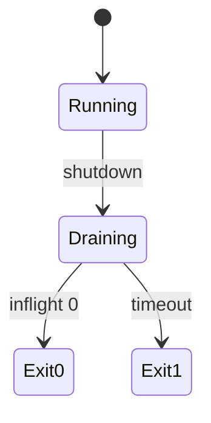

# ADR-004: Graceful Shutdown Contract

## Status

Accepted on 2026-07-22.

## Context

Production Node services must drain under SIGTERM ([[06-NodeJS/10-Production-Node/Graceful Shutdown and Drain|Graceful Shutdown and Drain]]). The toolkit integrates HTTP and async work via [[06-NodeJS/projects/Graceful Shutdown Harness/README|Graceful Shutdown Harness]] and needs testable, documented exit semantics.

## Decision

`ShutdownCoordinator` implements a fixed contract:

1. **Idempotent** `shutdown(reason)` starts drain once.
2. **Stop acceptors** (registered `http.Server`) immediately.
3. **Readiness false** for entire drain phase.
4. **LIFO hooks** run sequentially unless `parallelHooks` opt-in group configured.
5. **Inflight gate** — exit 0 only when inflight count zero before hard timeout.
6. **Hard timeout** — `process.exit(1)` with summary log if inflight or hooks exceed `hardTimeoutMs`.

## Options Considered

| Option | Pros | Cons |
| --- | --- | --- |
| Strict contract above | Testable; matches ops expectations | May exit 1 on stuck work |
| Wait forever | No forced data loss | Violates orchestrator SIGKILL window |
| Immediate exit | Simple | Not graceful |

## Consequences

Integration tests assert exit codes and hook order. HTTP mini project must register server with coordinator. CLI `shutdown` command simulates drain with fake timers in tests.

| Phase | Exit code | Condition |
| --- | --- | --- |
| Clean drain | 0 | inflight == 0 before timeout |
| Forced | 1 | hard timeout exceeded |
| Invalid double-register | N/A (throw) | duplicate hook name in strict mode |

## Follow-ups

- Worker pool hook integration test.
- Platform notes for Windows signal delivery in Testing doc.

## Related Documents

- [[06-NodeJS/projects/Graceful Shutdown Harness/Architecture|Shutdown Harness Architecture]]
- [[06-NodeJS/projects/Graceful Shutdown Harness/Testing|Shutdown Testing]]
