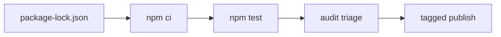

# ADR-005: Supply-Chain Policy

## Status

Accepted on 2026-07-22.

## Context

Node projects inherit npm supply-chain risk ([[06-NodeJS/09-Security-and-Supply-Chain/npm Lockfiles Integrity and Audit|npm Lockfiles Integrity and Audit]], [[06-NodeJS/09-Security-and-Supply-Chain/Dependency Confusion Typosquatting and Install Scripts|Dependency Confusion and Install Scripts]]). The toolkit is a teaching artifact that must model least privilege, not amplify install-script risk.

## Decision

Adopt the following **release policy** for [[06-NodeJS/code|06-NodeJS/code]]:

1. **Lockfile required** — commit `package-lock.json`; CI uses `npm ci`.
2. **Minimal runtime dependencies** — prefer Node built-ins; devDeps only for TypeScript/Vitest/build.
3. **No lifecycle scripts in published package** — `preinstall`/`postinstall` forbidden in published `package.json`.
4. **Audit triage before tag** — `npm audit` run; critical/high exploitable findings block release unless documented exception with expiry.
5. **Provenance on publish** — npm trusted publishing / provenance when available.
6. **No install-time network in tests** — fixtures local; resolver clinic does not hit registry.

## Options Considered

| Option | Pros | Cons |
| --- | --- | --- |
| Strict policy above | Teaches production hygiene | Slower releases |
| Ignore audit noise | Faster | Teaches bad habits |
| Pin transitive via overrides everywhere | Maximum control | High maintenance |

## Consequences

Security doc and Deployment checklist reference this ADR. Idea I-005 may add `nrt audit` JSON wrapper—optional, read-only. Module resolution clinic warns it is **not** a substitute for npm audit.

## Follow-ups

- CI job running `npm audit --audit-level=high` with allowlist file in repo root when needed.
- Document exception template in Engineering Journal when used.

## Related Documents

- [[06-NodeJS/projects/Node Runtime Toolkit/Security|Security]]
- [[06-NodeJS/projects/Node Runtime Toolkit/Deployment|Deployment]]
