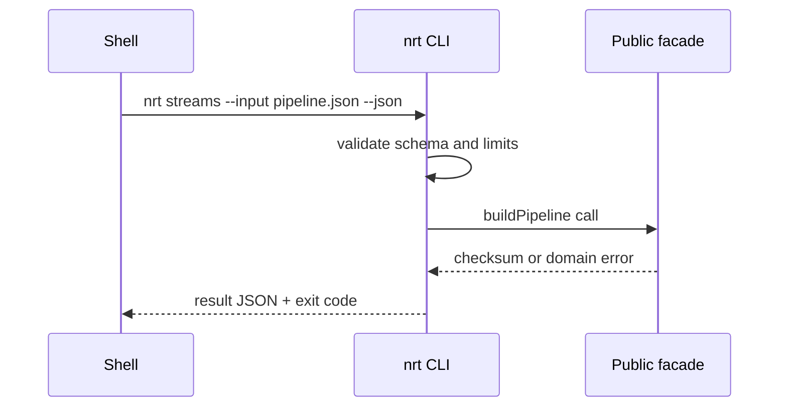

# API — Node Runtime Toolkit

## Library Surface

| Module | Symbols | Contract summary |
| --- | --- | --- |
| event-loop | `PhaseTracer`, `scheduleMicrotaskDemo`, `sampleLoopDelay` | teaches phase/microtask ordering; not libuv introspection |
| stream-pipeline | `PipelineBuilder`, `buildPipeline`, `assertFinished` | Node streams + `promises.pipeline` |
| safe-path | `safeJoin`, `assertInsideRoot` | rejects traversal segments |
| http-server | `HttpServer`, `RouteTable`, `sendJson` | thin HTTP/1.1 on platform `http` |
| worker-pool | `WorkerPool`, `mapLimit`, `PoolClosedError` | bounded worker_threads pool |
| shutdown | `ShutdownCoordinator`, `trackInflight`, `registerHook` | ADR-004 drain contract |
| diagnostics | `LoopDelaySampler`, `DiagnosticsChannelTap` | opt-in perf_hooks / diagnostics_channel |
| module-resolution | `ExportsResolver`, `detectDualPackageHazard` | export map simulation |

Source: [[06-NodeJS/code/src|06-NodeJS/code/src]]. Educational APIs—not drop-in replacements for Express, PM2, or Node core.

## CLI Contract (Target)

Syntax: `nrt <loop|streams|path|http|workers|shutdown|diag|exports> --input <json> --json`

The adapter reads bounded JSON, writes one JSON result to stdout, diagnostics to stderr, and never executes input as code.

## Error Model

| Exit | Code | Meaning | Caller action |
| --- | --- | --- | --- |
| 0 | OK | Completed | Consume stdout |
| 2 | INVALID_INPUT | Parse/schema failure | Correct input |
| 3 | DOMAIN_ERROR | Cycle, limit, routing, resolution failure | Inspect details |
| 4 | ABORTED | AbortSignal or pool closed | Retry only if safe |
| 70 | INTERNAL_ERROR | Unexpected defect | Preserve stderr and report |

## Compatibility

Semantic versioning applies after first tagged release. Export names, JSON fields, exit codes, and ordering are compatibility surfaces. Node core parity is not.

## Related Documents

- [[06-NodeJS/projects/Node Runtime Toolkit/Requirements|Requirements]]
- [[06-NodeJS/projects/Node Runtime Toolkit/Testing|Testing]]
