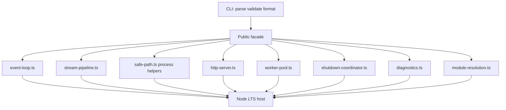
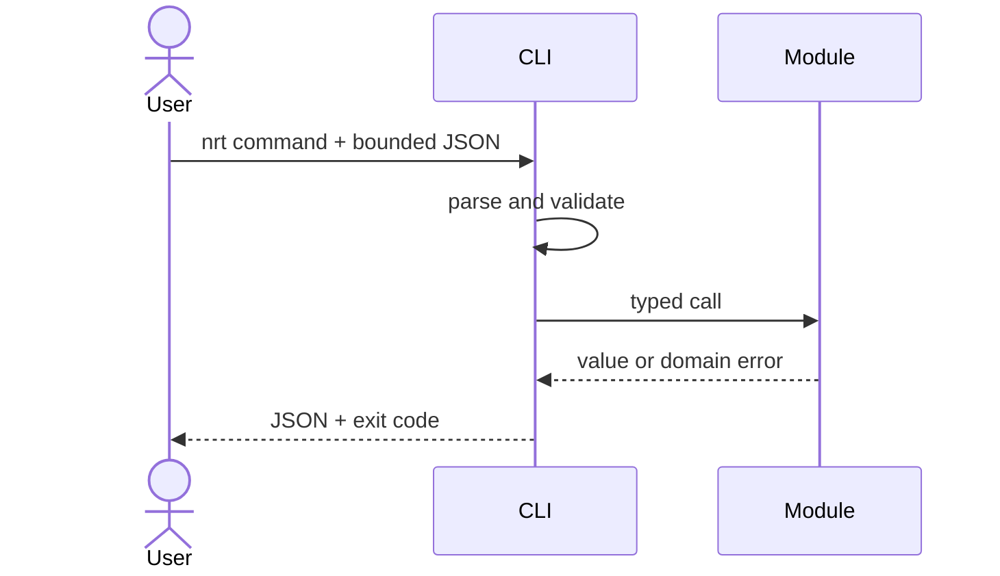

# Architecture — Node Runtime Toolkit

## Summary

A modular monolith: one installable package (`@seb/node-runtime-toolkit` target name in [[06-NodeJS/code|06-NodeJS/code]]), independent domain modules, no network services or persistent store. The CLI validates and serializes input; domain modules own behavior.

## Data Flow

## Key Components

| Component | Responsibility | Boundary |
| --- | --- | --- |
| Public facade | Stable exports and semver | No mechanism policy |
| CLI adapter (`nrt`) | Parsing, limits, JSON, exit codes | No domain logic |
| Event-loop utilities | Phase ordering demos, delay sampling hooks | Not a libuv replacement |
| Stream pipeline | `buildPipeline`, backpressure helpers | Node streams default |
| Process helpers | Safe path join, env read wrappers | No secret logging |
| HttpServer | Thin router + limits | Not a framework |
| WorkerPool | Bounded threads + queue | Not a sandbox |
| ShutdownCoordinator | Drain contract | See ADR-004 |
| Diagnostics | `perf_hooks` loop delay sampler | Opt-in only |
| ExportsResolver | Export map simulation | Not Node core resolver |

## Supporting Mini Projects

Each mini project README maps to one module family above. Portfolio integrates them under one facade without merging unrelated invariants.

## Quality Attributes

- **Correctness:** explicit ordering, backpressure, shutdown, and resolution invariants; differential tests only where Node behavior is comparable.
- **Security:** no `eval`, dynamic worker paths from CLI, or path escape; see [[06-NodeJS/projects/Node Runtime Toolkit/Security|Security]].
- **Performance:** O(n) pipeline work with bounded water marks; worker queue caps; benchmarks gate demonstrated regressions only.
- **Operability:** structured stderr diagnostics; stdout remains machine-readable JSON from CLI.

## Trade-offs

One package simplifies learning and integration but couples releases. Node streams default maximizes I/O teaching surface; Web Streams adapters are explicit opt-in per ADR-002. Worker pool default avoids cluster operational cost for CPU labs; cluster guidance documented, not implemented as default.

## Decisions

- [[06-NodeJS/projects/Node Runtime Toolkit/ADR/ADR-001 Event-Loop Teaching Model|ADR-001: Event-Loop Teaching Model]]
- [[06-NodeJS/projects/Node Runtime Toolkit/ADR/ADR-002 Streams vs Web Streams Default|ADR-002: Streams vs Web Streams Default]]
- [[06-NodeJS/projects/Node Runtime Toolkit/ADR/ADR-003 Worker vs Cluster Default|ADR-003: Worker vs Cluster Default]]
- [[06-NodeJS/projects/Node Runtime Toolkit/ADR/ADR-004 Graceful Shutdown Contract|ADR-004: Graceful Shutdown Contract]]
- [[06-NodeJS/projects/Node Runtime Toolkit/ADR/ADR-005 Supply-Chain Policy|ADR-005: Supply-Chain Policy]]

## Related Documents

- [[06-NodeJS/projects/Node Runtime Toolkit/API|API]]
- [[06-NodeJS/projects/Node Runtime Toolkit/Testing|Testing]]
