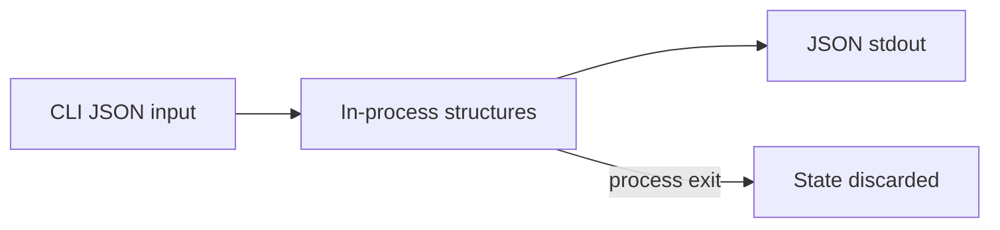

# Database — Node Runtime Toolkit

## Status: Not Applicable

This portfolio is **in-memory and process-scoped only**. It does not define a primary database, cache layer, ORM, migration system, or durable storage.

## Data Stance

| Concern | Approach |
| --- | --- |
| Persistent entities | None in toolkit scope |
| Fixture data | JSON/files under [[06-NodeJS/code/tests/fixtures|tests/fixtures]] for tests only |
| Runtime state | Ephemeral: worker queues, HTTP connections, pipeline buffers, resolver virtual FS |
| Secrets | Environment variables read for demos; never persisted by toolkit |

## Rationale

The learning goal is Node host mechanics—event loop, streams, workers, shutdown—not data modeling. Introducing a database would violate non-goals and blur handoff to [[08-Databases/README|Databases]] and [[07-Backend/README|Backend]].

## If Persistence Appears Later

Any future persistence must be a separate project with its own Requirements, Security, and ADR. It will not ship inside Node Runtime Toolkit v1.

## Related Documents

- [[06-NodeJS/projects/Node Runtime Toolkit/Architecture|Architecture]]
- [[06-NodeJS/projects/Node Runtime Toolkit/Security|Security]]
