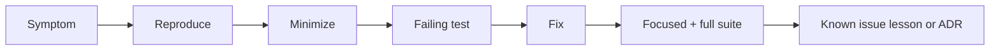

# Debug Diary — Node Runtime Toolkit

## Investigation Index

| Date | Observation | Finding | Prevention | Status |
| --- | --- | --- | --- | --- |
| 2026-07-22 | Portfolio requested integrated toolkit while code tree is greenfield | Facade/CLI not yet present; module docs reference target paths under `06-NodeJS/code/src` | Mark CLI as target; gate release claims on tarball smoke + contract tests | tracked |
| 2026-07-22 | Shutdown signal tests differ Windows vs Unix | Some signal semantics require subprocess tests and platform notes | Document platform matrix in Testing; avoid flaky in-process SIGTERM | tracked |

## Debug Protocol

Reproduce with smallest input, capture Node/Vitest versions and exact command, classify contract versus implementation failure, add failing test, then fix without weakening assertions. Preserve ordering traces, pipeline checksums, and shutdown drain logs when relevant.

Escalate release-impacting or repeated failures to [[06-NodeJS/projects/Node Runtime Toolkit/Postmortem|Postmortem]].

## Related Documents

- [[06-NodeJS/projects/Node Runtime Toolkit/Known Issues|Known Issues]]
- [[06-NodeJS/08-Diagnostics-and-Performance/Inspector CPU Profiling and Heap Snapshots|Inspector CPU Profiling and Heap Snapshots]]
