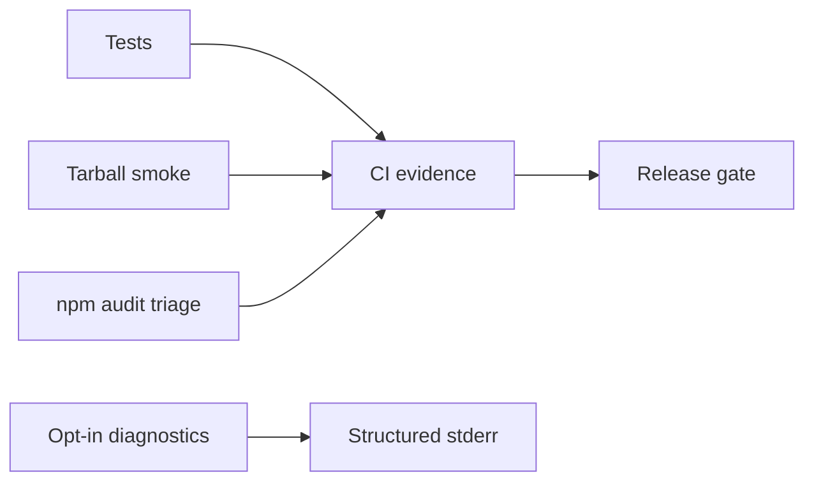

# Monitoring — Node Runtime Toolkit

## Operability Model

This is a local library/CLI, not an always-on service; service availability SLOs would be misleading. Release health is measured through CI, tarball smoke tests, issue trends, and opt-in diagnostics.

| Signal | Target | Evidence |
| --- | --- | --- |
| Supported-platform verification | 100% required jobs pass | CI checks |
| Tarball smoke success | 100% before publish | install/import run |
| Deterministic CLI errors | 100% contract tests | exit-code suite |
| Critical dependency exposure | 0 unmitigated releasable findings | audit record |
| Event-loop delay regression | no >10% regression on bench fixtures | optional bench job |

## Diagnostics

Never emit telemetry by default. With explicit `NRT_DEBUG=1`, report command, duration bucket, input-size bucket, module, and stable error code—never raw secrets, paths, or stack traces on stdout.

`LoopDelaySampler` demonstrates [[06-NodeJS/08-Diagnostics-and-Performance/perf_hooks and Event Loop Delay|perf_hooks loop delay]] suitable for services; the toolkit itself does not phone home.

## Triage

Reproducible wrong result or import failure blocks release. Performance observations become regressions only against versioned benchmark fixtures. Link confirmed defects to [[06-NodeJS/projects/Node Runtime Toolkit/Debug Diary|Debug Diary]] and [[06-NodeJS/projects/Node Runtime Toolkit/Known Issues|Known Issues]].

## Related Documents

- [[06-NodeJS/08-Diagnostics-and-Performance/Diagnostics Channel and Async Context Tracking|Diagnostics Channel and Async Context Tracking]]
- [[06-NodeJS/projects/Node Runtime Toolkit/Deployment|Deployment]]
