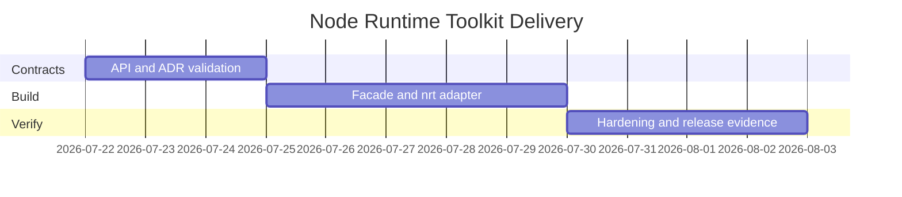

# Planning — Node Runtime Toolkit

## Problem Statement

Node track wiki notes explain host mechanics, but learners lack a discoverable package surface, CLI workflow, compatibility contract, and release evidence suitable for a portfolio—especially across streams, workers, shutdown, and module exports.

## Success Definition

Every documented capability is importable and demonstrable through stable contracts; a clean checkout installs and passes tests; documentation states Node core gaps without implying host replacement or framework parity.

## Scope

**In scope:** package facade, CLI adapter (`nrt`), event-loop utilities, stream pipeline, safe paths, thin HTTP, worker pool, shutdown coordinator, diagnostics hooks, exports resolver, typed contracts, tests, release artifact, security checks, operational diagnostics.

**Out of scope:** Express/Fastify-style frameworks, ORMs, auth products, databases, replacing Node core, arbitrary plugin execution, persistence, and production cluster management.

## Milestones

| Milestone | Outcome | Exit criteria |
| --- | --- | --- |
| M1 Contracts | Public exports and CLI schemas fixed | ADRs accepted; contract tests define gaps |
| M2 Integration | Library + CLI vertical slice | Eight commands pass positive/negative tests |
| M3 Hardening | Release-ready evidence | clean install, vitest, package smoke, docs match behavior |

## Risks

| Risk | Impact | Mitigation |
| --- | --- | --- |
| Docs exceed implementation | Misleading portfolio | Label target vs implemented; test every claimed command |
| Node parity implied | Incorrect learning | Explicit limitations; link core docs |
| CLI accepts unsafe input | Resource exhaustion | Size, depth, concurrency limits |
| Shutdown tests flaky on Windows | CI noise | Subprocess isolation; platform notes in Testing |

## Dependencies

Node.js 20 LTS+ (22 LTS target for curriculum claims), TypeScript, Vitest. See [[06-NodeJS/projects/Node Runtime Toolkit/Roadmap|Roadmap]].

## Related Documents

- [[06-NodeJS/projects/Node Runtime Toolkit/Requirements|Requirements]]
- [[06-NodeJS/projects/Node Runtime Toolkit/Roadmap|Roadmap]]
