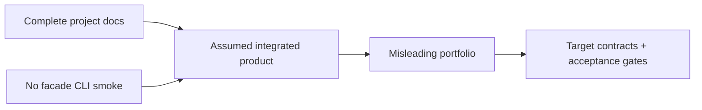

# Postmortem Index — Node Runtime Toolkit

## Delivery Readiness Retrospective

| Date | Event | Severity | Status |
| --- | --- | --- | --- |
| 2026-07-22 | Portfolio documentation landed ahead of full code lab implementation | SEV-4 documentation risk | mitigated, follow-ups open |

## Impact

No released npm consumers affected. Risk was documentation implying runnable `nrt` CLI and cohesive exports before [[06-NodeJS/code|06-NodeJS/code]] implements them.

## Contributing Conditions

Curriculum completeness pressure; parallel wiki track delivery; separate deliverables for modules, facade, CLI, and smoke tests.

## Actions

- Require executable contract evidence before changing target wording to implemented.
- Gate releases on tarball import and CLI smoke tests.
- Keep [[06-NodeJS/projects/Node Runtime Toolkit/Known Issues|Known Issues]] visible from README.

Review is blameless: failure mode came from missing integration evidence, not individual action.

## Related Documents

- [[06-NodeJS/projects/Node Runtime Toolkit/Lessons Learned|Lessons Learned]]
- [[06-NodeJS/projects/Node Runtime Toolkit/Roadmap|Roadmap]]
