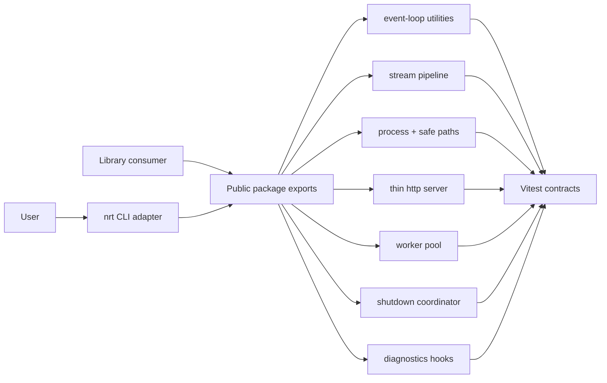

# Node Runtime Toolkit

## One-Line Purpose

A tested TypeScript library and thin CLI learning surface that exposes selected Node host mechanics: event-loop phase teaching, stream pipelines, process/path utilities, thin HTTP primitive, worker pool, graceful shutdown coordinator, diagnostics hooks, typed contracts, and bounded resource limits.

## Status

**Active.** Core modules and tests target [[06-NodeJS/code/src|06-NodeJS/code/src]] and [[06-NodeJS/code/tests/labs.test.ts|labs.test.ts]]. Package facade, public re-exports, and CLI integration (`nrt`) are the active portfolio scope.

This toolkit is **not an Express/Fastify product framework, ORM, auth product, database layer, or replacement for Node core**. It is an inspectable educational model with explicit behavioral limits.

## Goals

- Present integrated host-runtime capabilities through one versioned package boundary and a deterministic CLI.
- Preserve small modules that can be tested and reasoned about independently.
- Make errors, ordering, backpressure, shutdown, and Node-native gaps visible.
- Demonstrate production disciplines: contracts, security, tests, releases, and observability.

## Non-Goals

- Express, Fastify, Nest, or other product HTTP frameworks.
- ORMs, query builders, or persistence layers.
- Auth products, session stores, or identity providers.
- Claiming to replace Node core, libuv, or V8.
- Remote code loading, arbitrary plugin execution, or cluster-as-default for all workloads.

## Architecture Snapshot



## Document Map

| Document | Purpose |
| --- | --- |
| [[06-NodeJS/projects/Node Runtime Toolkit/Planning\|Planning]] | Scope, milestones, risks |
| [[06-NodeJS/projects/Node Runtime Toolkit/Requirements\|Requirements]] | Functional and non-functional requirements |
| [[06-NodeJS/projects/Node Runtime Toolkit/Architecture\|Architecture]] | System shape and major components |
| [[06-NodeJS/projects/Node Runtime Toolkit/Database\|Database]] | In-memory/process-only data stance |
| [[06-NodeJS/projects/Node Runtime Toolkit/API\|API]] | Interfaces and contracts |
| [[06-NodeJS/projects/Node Runtime Toolkit/Deployment\|Deployment]] | Environments and release path |
| [[06-NodeJS/projects/Node Runtime Toolkit/Security\|Security]] | Threats, controls, secrets |
| [[06-NodeJS/projects/Node Runtime Toolkit/Testing\|Testing]] | Verification strategy |
| [[06-NodeJS/projects/Node Runtime Toolkit/Monitoring\|Monitoring]] | Release health and diagnostics |
| [[06-NodeJS/projects/Node Runtime Toolkit/Engineering Journal\|Engineering Journal]] | Session logs |
| [[06-NodeJS/projects/Node Runtime Toolkit/Debug Diary\|Debug Diary]] | Bug investigations |
| [[06-NodeJS/projects/Node Runtime Toolkit/Known Issues\|Known Issues]] | Open defects and debt |
| [[06-NodeJS/projects/Node Runtime Toolkit/Lessons Learned\|Lessons Learned]] | Durable takeaways |
| [[06-NodeJS/projects/Node Runtime Toolkit/Postmortem\|Postmortem]] | Retrospectives |
| [[06-NodeJS/projects/Node Runtime Toolkit/Ideas\|Ideas]] | Backlog |
| [[06-NodeJS/projects/Node Runtime Toolkit/Roadmap\|Roadmap]] | Phased delivery |
| [[06-NodeJS/projects/Node Runtime Toolkit/ADR/ADR-001 Event-Loop Teaching Model\|ADR-001]] · [[06-NodeJS/projects/Node Runtime Toolkit/ADR/ADR-002 Streams vs Web Streams Default\|ADR-002]] · [[06-NodeJS/projects/Node Runtime Toolkit/ADR/ADR-003 Worker vs Cluster Default\|ADR-003]] · [[06-NodeJS/projects/Node Runtime Toolkit/ADR/ADR-004 Graceful Shutdown Contract\|ADR-004]] · [[06-NodeJS/projects/Node Runtime Toolkit/ADR/ADR-005 Supply-Chain Policy\|ADR-005]] |

## Mini Projects

| Mini project | Module focus |
| --- | --- |
| [[06-NodeJS/projects/HTTP Server From Scratch/README\|HTTP Server From Scratch]] | thin `HttpServer`, routing |
| [[06-NodeJS/projects/Stream Pipeline Toolkit/README\|Stream Pipeline Toolkit]] | `buildPipeline`, backpressure |
| [[06-NodeJS/projects/Worker Pool Lab/README\|Worker Pool Lab]] | `WorkerPool`, `mapLimit` |
| [[06-NodeJS/projects/Graceful Shutdown Harness/README\|Graceful Shutdown Harness]] | `ShutdownCoordinator` |
| [[06-NodeJS/projects/Module Resolution and Exports Clinic/README\|Module Resolution and Exports Clinic]] | `ExportsResolver`, hazard detection |

## Run and Test

```bash
cd 06-NodeJS/code
npm install
npm test
```

The documented CLI target is `nrt <command> --json`; until its adapter lands under [[06-NodeJS/code|06-NodeJS/code]], use imported TypeScript APIs described in [[06-NodeJS/projects/Node Runtime Toolkit/API|API]].

## Portfolio Acceptance Checklist

- [ ] All documented capabilities export from one package boundary.
- [ ] CLI output is deterministic JSON; errors use stable non-zero exit codes.
- [ ] Unit and integration tests cover happy paths, edge cases, ordering, backpressure, and shutdown.
- [ ] Package ships typed public symbols and excludes test fixtures from artifacts.
- [ ] Security and monitoring checks pass before a tagged release.

## Related Notes

- [[06-NodeJS/code/README|Node.js Code Labs]]
- [[06-NodeJS/README|Node.js Track]]
- [[Projects/README|Projects]]
- [[Career/README|Career]]
