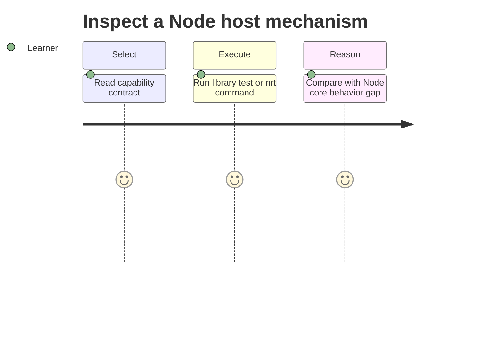

# Requirements — Node Runtime Toolkit

## Actors

| Actor | Goal |
| --- | --- |
| Learner | Inspect Node host mechanisms and reproduce edge cases |
| Library consumer | Import typed, documented APIs |
| CLI user | Run deterministic examples without writing code |
| Maintainer | Change modules without silently breaking contracts |

## Functional Requirements

| ID | Requirement | Acceptance |
| --- | --- | --- |
| FR-001 | Export event-loop teaching utilities | Import smoke resolves phase tracer symbols |
| FR-002 | Export stream pipeline builder with backpressure | Pipeline tests pass on byte fixtures |
| FR-003 | Export safe path join helper | Traversal vectors rejected |
| FR-004 | Export thin HTTP server primitive | Integration tests pass without frameworks |
| FR-005 | Export bounded worker pool | Ordered `mapLimit` tests pass |
| FR-006 | Export shutdown coordinator | Drain/idempotency tests pass per ADR-004 |
| FR-007 | Export diagnostics sampler hooks | Loop delay sample returns numeric summary |
| FR-008 | Export module exports resolver | Golden resolution fixtures pass |
| FR-009 | Offer JSON CLI for each capability | Valid input → documented JSON + exit 0 |

## Non-Functional Requirements

| ID | Category | Requirement | Measurement |
| --- | --- | --- | --- |
| NFR-001 | Correctness | Deterministic results for deterministic inputs | 100% contract suite pass |
| NFR-002 | Performance | Bounded queue, body, and payload sizes | limits enforced before work |
| NFR-003 | Security | No eval of CLI input; jail path operations | negative security tests pass |
| NFR-004 | Portability | Node LTS on Windows/Linux/macOS | CI matrix passes |
| NFR-005 | Observability | JSON stdout; diagnostics stderr | integration tests assert separation |
| NFR-006 | Honesty | Document Node core gaps | each module links limitations |

## Traceability

FR-001 → [[06-NodeJS/projects/Node Runtime Toolkit/ADR/ADR-001 Event-Loop Teaching Model|ADR-001]]; FR-002 → [[06-NodeJS/projects/Node Runtime Toolkit/ADR/ADR-002 Streams vs Web Streams Default|ADR-002]]; FR-005 → [[06-NodeJS/projects/Node Runtime Toolkit/ADR/ADR-003 Worker vs Cluster Default|ADR-003]]; FR-006 → [[06-NodeJS/projects/Node Runtime Toolkit/ADR/ADR-004 Graceful Shutdown Contract|ADR-004]]; supply-chain → [[06-NodeJS/projects/Node Runtime Toolkit/ADR/ADR-005 Supply-Chain Policy|ADR-005]].

## Related Documents

- [[06-NodeJS/projects/Node Runtime Toolkit/API|API]]
- [[06-NodeJS/projects/Node Runtime Toolkit/Testing|Testing]]
