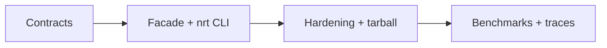

# Roadmap — Node Runtime Toolkit

## Current Phase

P0 contract and integration design is active. Wiki and project documentation exist; distributable product boundaries in [[06-NodeJS/code|06-NodeJS/code]] do not.

| Phase | Outcome | Exit criteria |
| --- | --- | --- |
| P0 | Truthful contracts and decisions | requirements, API, security, tests, ADRs reviewed |
| P1 | Integrated vertical slice | eight exports and eight CLI commands pass contracts |
| P2 | Release-ready artifact | CI matrix, audit triage, tarball smoke, docs match behavior |
| P3 | Evidence-led enhancements | bench/trace work justified by measured need |

## Now

Implement core modules under `06-NodeJS/code/src`, define facade exports, CLI JSON schemas, resource ceilings, error codes, and Vitest suites per mini project.

## Next

Land `nrt` adapter, npm pack smoke test, clean-install CI job.

## Later

Evaluate trace mode, cluster comparison docs, and supply-chain lint from [[06-NodeJS/projects/Node Runtime Toolkit/Ideas|Ideas]]. Do not add Express, ORM, database, or Node-replacement scope.

## Related Documents

- [[06-NodeJS/projects/Node Runtime Toolkit/Planning|Planning]]
- [[06-NodeJS/projects/Node Runtime Toolkit/Known Issues|Known Issues]]
