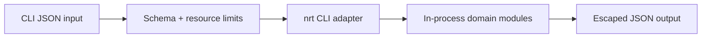

# Security — Node Runtime Toolkit

## Trust Boundaries

## Threat Model

| Threat | Example | Control |
| --- | --- | --- |
| Code execution | input treated as JS source | parse JSON only; forbid `eval`, `Function`, dynamic `import()` from CLI paths |
| Path traversal | unsafe join to `/etc/passwd` | `safeJoin` + root jail; negative tests |
| Resource exhaustion | huge pipeline or worker queue | byte, item, queue, and concurrency caps |
| Worker escape assumptions | treating threads as sandbox | document shared UID; fixed worker entry path |
| Supply-chain compromise | malicious dependency | ADR-005 lockfile, audit, minimal deps |
| Secret leakage | logging `process.env` on shutdown | redact env in default diagnostics |

## Controls

The package needs no credentials, network access, or filesystem writes for core labs beyond test temp dirs. HTTP server binds loopback in tests by default. Worker pool accepts cloneable payloads only with size limits. Shutdown hooks must not dump environment in production mode.

## Security Acceptance

- Negative tests cover malformed, oversized, deeply nested, cyclic, and aborted inputs.
- `npm audit` findings triaged by exploitability before release.
- Publish token scope is publish-only; unavailable to pull-request jobs.
- Limitations link to [[06-NodeJS/projects/Node Runtime Toolkit/Known Issues|Known Issues]] and [[06-NodeJS/projects/Node Runtime Toolkit/Postmortem|Postmortem]].

## Related Documents

- [[06-NodeJS/projects/Node Runtime Toolkit/Requirements|Requirements]]
- [[06-NodeJS/projects/Node Runtime Toolkit/ADR/ADR-005 Supply-Chain Policy|ADR-005]]
- [[06-NodeJS/09-Security-and-Supply-Chain/npm Lockfiles Integrity and Audit|npm Lockfiles Integrity and Audit]]
