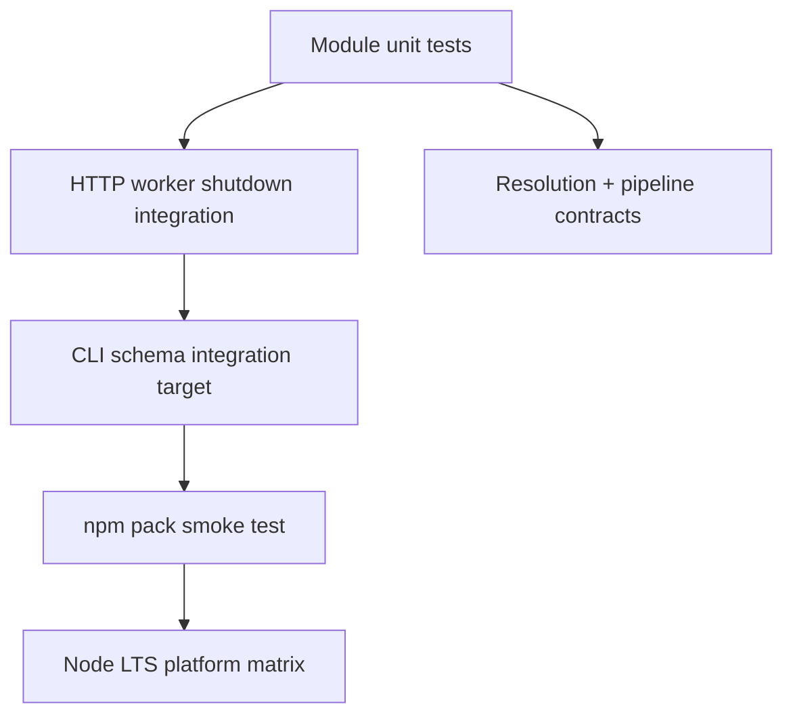

# Testing — Node Runtime Toolkit

## Strategy



## Test Layers

| Layer | Coverage |
| --- | --- |
| Unit | event-loop demos, pipeline stages, safe paths, resolver |
| Integration | HttpServer + ShutdownCoordinator; WorkerPool subprocess |
| Contract | JSON CLI schemas, stderr/stdout separation, exit codes |
| Package | install tarball, import facade, invoke `nrt` entry |
| Platform | Windows/Linux/macOS on Node 20+ LTS |

## Current Command

```bash
cd 06-NodeJS/code
npm install
npm test
```

Target executable coverage: [[06-NodeJS/code/tests/labs.test.ts|labs.test.ts]]. Required additions include facade export smoke tests, CLI schema validation, hostile path fixtures, worker failure paths, shutdown subprocess tests, and packed-artifact smoke tests.

## Module Test Filters

| Capability | Vitest filter |
| --- | --- |
| Event loop | `-t "PhaseTracer|LoopDelay"` |
| Streams | `-t "StreamPipeline"` |
| Safe paths | `-t "SafePath"` |
| HTTP | `-t "HttpServer"` |
| Workers | `-t "WorkerPool"` |
| Shutdown | `-t "ShutdownCoordinator"` |
| Diagnostics | `-t "Diagnostics"` |
| Exports | `-t "ModuleResolution"` |

## Definition of Done

Tests assert failure modes and observable ordering; avoid wall-clock dependence except timeout cases. Coverage percentage cannot replace invariant-oriented cases. No network beyond loopback in CI.

## Related Documents

- [[06-NodeJS/projects/Node Runtime Toolkit/API|API]]
- [[06-NodeJS/10-Production-Node/Testing Node Servers Integration and Contract Tests|Testing Node Servers Integration and Contract Tests]]
