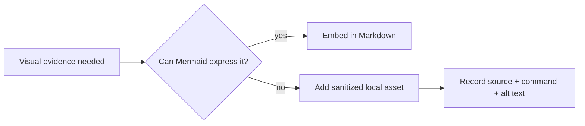

# Assets — Node Runtime Toolkit

## Purpose

Store project-local exported diagrams, benchmark charts, and sanitized CLI screenshots only when Mermaid or text cannot express the evidence.

## Rules

- Prefer Mermaid embedded in [[06-NodeJS/projects/Node Runtime Toolkit/Architecture|Architecture]], [[06-NodeJS/projects/Node Runtime Toolkit/Security|Security]], and [[06-NodeJS/projects/Node Runtime Toolkit/Testing|Testing]].
- Use descriptive lowercase filenames with date or semver when time-dependent.
- Include source, generation command, license, and accessibility description beside every binary asset.
- Never commit credentials, `.env` dumps, user paths, production data, unredacted terminal output, or `npm pack` tarballs.
- Keep executable fixtures in [[06-NodeJS/code/tests|code/tests]], not in this documentation directory.

## Related Documents

- [[06-NodeJS/projects/Node Runtime Toolkit/README|Project README]]
- [[06-NodeJS/code/README|Node.js Code Labs]]
