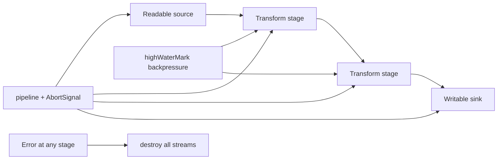

# Stream Pipeline Toolkit

## One-Line Purpose

Compose Node readable, transform, and writable streams with explicit backpressure, `pipeline` error propagation, and object-mode boundaries—proving correct drain behavior under failure without buffering entire payloads in memory.

## Status

**Active.** The learning surface targets [[06-NodeJS/code/src/stream-pipeline.ts|stream-pipeline.ts]] and checks in [[06-NodeJS/code/tests/labs.test.ts|labs.test.ts]]. This folder defines stage contracts, high-water marks, and acceptance against byte and object-mode fixtures.

## Prerequisites

- [[06-NodeJS/04-Buffers-Streams-and-IO/Readable Writable and Duplex Streams|Readable Writable and Duplex Streams]]
- [[06-NodeJS/04-Buffers-Streams-and-IO/Transform Streams and Object Mode|Transform Streams and Object Mode]]
- [[06-NodeJS/04-Buffers-Streams-and-IO/pipeline and Finished|pipeline and Finished]]
- [[06-NodeJS/04-Buffers-Streams-and-IO/Backpressure and HighWaterMark|Backpressure and HighWaterMark]]
- [[06-NodeJS/04-Buffers-Streams-and-IO/Web Streams Interop with Node Streams|Web Streams Interop with Node Streams]]
- [[06-NodeJS/02-Event-Loop-and-libuv/Starvation Backpressure and Loop Health|Starvation Backpressure and Loop Health]]

## Architecture



See [[06-NodeJS/projects/Stream Pipeline Toolkit/Architecture|Architecture]] for stage typing and cleanup guarantees.

## Acceptance Criteria

- [ ] `buildPipeline(stages)` wires readable → transforms → writable with `stream.promises.pipeline`.
- [ ] Slow sink applies backpressure; source `read()` pauses when `highWaterMark` exceeded.
- [ ] Mid-pipeline throw destroys upstream/downstream without hanging `pipeline` promise.
- [ ] Object-mode stage rejects Buffer chunks when `objectMode: false` (and vice versa) with explicit error.
- [ ] AbortSignal abort mid-flight rejects pipeline and releases handles.
- [ ] `finished()` helper resolves only after writable `finish` and readable `end`.
- [ ] Golden byte fixtures produce deterministic checksum without loading full file into RAM.

## Run and Test

```bash
cd 06-NodeJS/code
npm install
npm test -- tests/labs.test.ts -t "StreamPipeline"
```

## Benchmarks

| Workload | Variants | Primary metrics |
| --- | --- | --- |
| 100 MB passthrough | default vs tuned `highWaterMark` | throughput MB/s, heap high-water |
| Slow sink (10 ms/write) | with vs without backpressure | source pause count |
| Object-mode 1M records | transform map vs filter | GC pause proxy, items/s |
| Failure at stage 2 | pipeline vs manual pipe | open handle count after reject |

Benchmark entry point (when added): `06-NodeJS/code/bench/stream-pipeline.bench.ts`.

## Security and Failure Constraints

- Cap maximum in-flight object count in object-mode pipelines.
- Reject pipelines mixing Web Streams and Node streams without explicit adapter stage.
- Transform stages must not execute user-provided strings as code from stream payloads.
- Temp file sinks (if added) must use safe path join per [[06-NodeJS/09-Security-and-Supply-Chain/Path Traversal and Safe Filesystem Access|Path Traversal and Safe Filesystem Access]].

## Exercises and Reflection

1. Implement a rate-limited transform using `setImmediate` pacing.
2. Bridge one Web ReadableStream stage via `Readable.fromWeb`.
3. Measure event-loop delay while a misconfigured pipeline buffers unbounded data.

**Reflection prompts**

- Why is `pipe()` alone insufficient for production error handling?
- When should object mode be avoided even if convenient?
- What symptom distinguishes backpressure failure from CPU starvation?

## Interview Questions

- Explain `highWaterMark` in bytes versus object count.
- How does `pipeline` differ from `pipe` + manual `destroy`?
- When would you choose Web Streams over Node streams on Node 20+?

## Related Notes

- [[06-NodeJS/projects/Stream Pipeline Toolkit/Architecture|Architecture]]
- [[06-NodeJS/projects/Stream Pipeline Toolkit/Testing|Testing]]
- [[06-NodeJS/projects/Stream Pipeline Toolkit/Security|Security]]
- [[06-NodeJS/README|Node.js MOC]]
- [[06-NodeJS/code/README|Node.js Code Labs]]
- [[06-NodeJS/projects/Node Runtime Toolkit/README|Node Runtime Toolkit]]
- [[Career/README|Career]]
