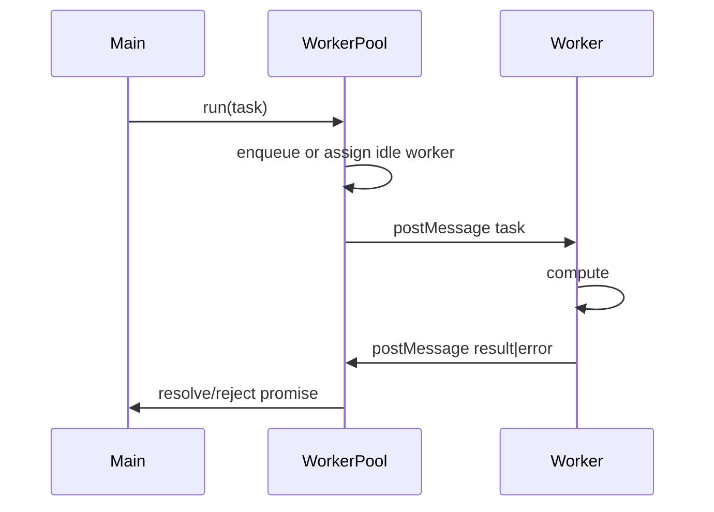

# Architecture — Worker Pool Lab

## Summary

`WorkerPool` manages N persistent `Worker` instances, a FIFO task queue, and per-task promise resolution over `postMessage`. Source: [[06-NodeJS/code/src/worker-pool.ts|worker-pool.ts]].

## Data Flow

## Public Surface

| Symbol | Responsibility |
| --- | --- |
| `WorkerPool` | Lifecycle, queue, worker recycling |
| `PoolTask` | `{ id, payload }` cloneable envelope |
| `PoolClosedError` | Rejected when pool shutting down |
| `mapLimit` | Ordered results with concurrency cap |

## Invariants

- At most `size` workers exist at any time after construction settles.
- Each task ID maps to exactly one settlement (resolve or reject).
- Idle workers pull next queued task; no duplicate assignment.
- `close()` sets closed flag; new `run` rejects immediately.

## Failure Model

Worker `error` event rejects active task and spawns replacement worker if pool not closed. Non-cloneable enqueue throws synchronously. OOM in worker surfaces as task failure, not silent hang.

## Trade-offs

See [[06-NodeJS/projects/Node Runtime Toolkit/ADR/ADR-003 Worker vs Cluster Default|ADR-003]]: worker pool default for CPU offload within one process; cluster for accept-loop scaling.

## Related Documents

- [[06-NodeJS/projects/Worker Pool Lab/README|Project README]]
- [[06-NodeJS/projects/Node Runtime Toolkit/Architecture|Toolkit Architecture]]
