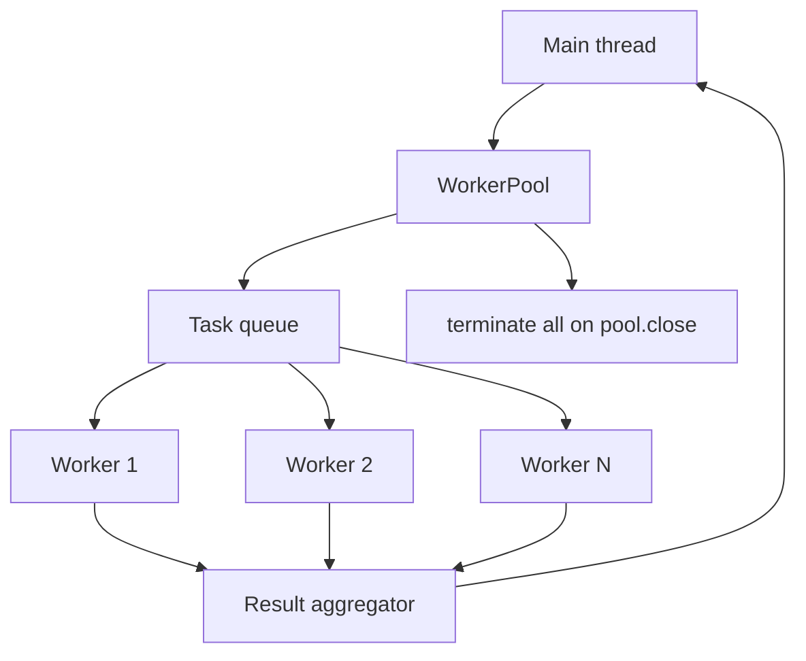

# Worker Pool Lab

## One-Line Purpose

Orchestrate a bounded `worker_threads` pool with structured-clone task messages, ordered or keyed results, failure propagation, and explicit pool shutdown—without claiming process isolation or replacing cluster scaling.

## Status

**Active.** The learning surface targets [[06-NodeJS/code/src/worker-pool.ts|worker-pool.ts]] and worker script [[06-NodeJS/code/src/workers/task-worker.ts|task-worker.ts]] with tests in [[06-NodeJS/code/tests/labs.test.ts|labs.test.ts]].

## Prerequisites

- [[06-NodeJS/06-Concurrency-and-Scaling/worker_threads Model|worker_threads Model]]
- [[06-NodeJS/06-Concurrency-and-Scaling/Worker Pools and Message Passing|Worker Pools and Message Passing]]
- [[06-NodeJS/07-Timers-Events-and-IPC/MessagePort BroadcastChannel and Structured Clone|MessagePort BroadcastChannel and Structured Clone]]
- [[06-NodeJS/06-Concurrency-and-Scaling/Choosing Threads Processes and Offload|Choosing Threads Processes and Offload]]
- [[06-NodeJS/02-Event-Loop-and-libuv/Thread Pool and Blocking Work|Thread Pool and Blocking Work]]

## Architecture



See [[06-NodeJS/projects/Worker Pool Lab/Architecture|Architecture]] for concurrency caps and error channels.

## Acceptance Criteria

- [ ] Pool size fixed at construction; excess tasks queue FIFO.
- [ ] Tasks return results via structured-clone-safe payloads.
- [ ] Worker throw or `process.exit` in worker fails task promise without crashing main unless unhandled.
- [ ] `pool.map(tasks, fn)` preserves input order in output array.
- [ ] `pool.close()` drains queue or rejects pending with `PoolClosedError`.
- [ ] Non-cloneable objects rejected at enqueue with explicit error.
- [ ] Pool does not leak workers after close—thread count returns to baseline in tests.

## Run and Test

```bash
cd 06-NodeJS/code
npm install
npm test -- tests/labs.test.ts -t "WorkerPool"
```

## Benchmarks

| Workload | Variants | Primary metrics |
| --- | --- | --- |
| 10k CPU-light tasks | pool 2 vs 4 vs 8 | tasks/s, queue wait p99 |
| 100 CPU-heavy hash tasks | main thread vs pool | event-loop delay delta |
| Worker failure mid-batch | fail-fast vs continue | completed count, error shape |
| Pool close under load | drain vs reject pending | pending rejection rate |

Benchmark entry point (when added): `06-NodeJS/code/bench/worker-pool.bench.ts`.

## Security and Failure Constraints

- Worker script path fixed at pool construction—no runtime path from task payload.
- Task payload size capped; reject SharedArrayBuffer unless explicitly enabled in contract.
- Workers are not security boundaries—document sandbox limits.
- No dynamic `eval` of task strings inside worker script.

## Exercises and Reflection

1. Add task timeout with `AbortSignal` forwarded to worker.
2. Compare pool throughput to libuv thread pool for crypto `pbkdf2`.
3. Implement keyed results where completion order differs from submission order.

**Reflection prompts**

- Why are worker threads not a substitute for multi-process isolation?
- When does queue depth indicate you need fewer workers, not more?
- What breaks if you pass a closure to a worker instead of a cloneable message?

## Interview Questions

- Worker threads vs cluster vs child_process—decision matrix?
- What can and cannot be structured-cloned?
- How do you shut down a pool without losing in-flight tasks?

## Related Notes

- [[06-NodeJS/projects/Worker Pool Lab/Architecture|Architecture]]
- [[06-NodeJS/projects/Worker Pool Lab/Testing|Testing]]
- [[06-NodeJS/projects/Worker Pool Lab/Security|Security]]
- [[06-NodeJS/README|Node.js MOC]]
- [[06-NodeJS/code/README|Node.js Code Labs]]
- [[06-NodeJS/projects/Node Runtime Toolkit/README|Node Runtime Toolkit]]
- [[Career/README|Career]]
