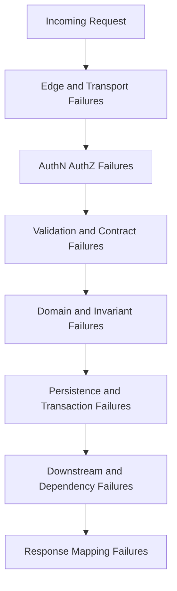
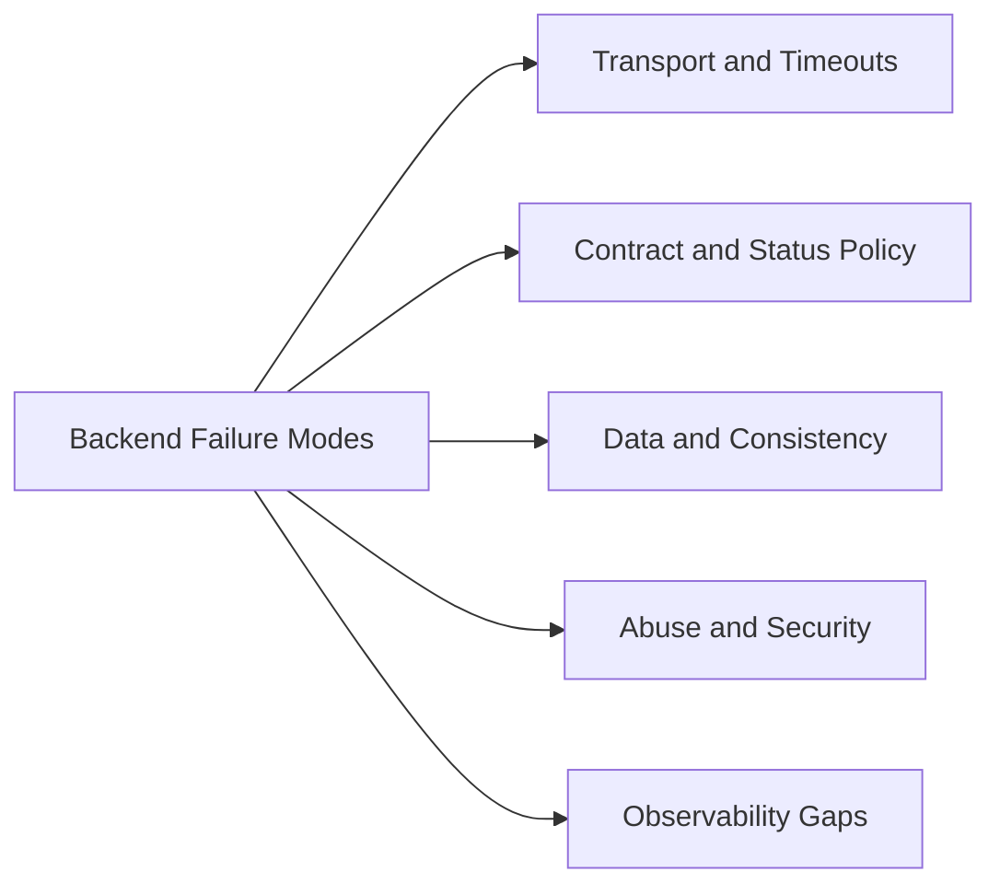
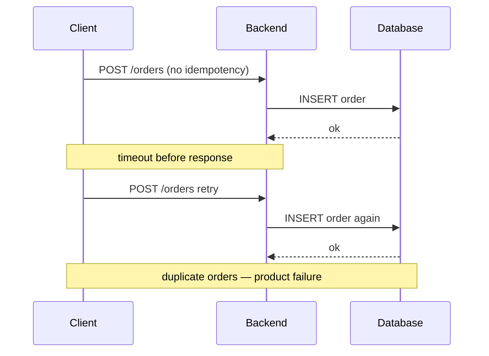

# Backend Failure Modes in Production

## Overview

**Backend failure modes** are the ways HTTP services break in production *after* the happy path works locally: partial outages, retry storms, auth confusion, cache incoherence, dual writes, and ambiguous errors. They are **product-level** failures—clients experience broken contracts even when the Node process is "up."

This note catalogs common patterns, maps them to request-pipeline stages, and ties mitigations to later Backend modules (reliability, auth, data access). Host-level failures (OOM, event-loop stall) cross-link to Node; multi-region partitions cross-link to System Design.

## Learning Objectives

- Classify failures by pipeline stage: edge, middleware, domain, persistence, downstream
- Distinguish client errors, server errors, and **misleading success**
- Explain retry amplification and missing idempotency as backend failures
- Design error responses and metrics that make failures actionable
- Build a mental model for security/abuse failures vs. reliability failures

## Prerequisites

- [[07-Backend/00-Orientation/Why Backend Services Exist|Why Backend Services Exist]]
- [[06-NodeJS/01-Process-and-Runtime/unhandledRejection uncaughtException and Fatal Errors|unhandledRejection uncaughtException and Fatal Errors]]
- [[02-JavaScript/07-Production-JavaScript/Error Design and Exception Safety|Error Design and Exception Safety]]

## Difficulty

`intermediate`

## Estimated Time

- Reading: 2 hours
- Exercises: 2 hours
- Mini project: 4 hours

## History

Pre-cloud backends failed loudly: connection refused, 500 pages. Modern systems fail **subtly**: elevated latency, flaky checkout, duplicated webhooks, stale reads after cache deploys. Microservices increased **partial failure** surface. Industry response: SRE error budgets, idempotency keys, circuit breakers, outbox patterns, and contract testing—this note frames the *taxonomy* before diving into each tool in module 06.

## Problem It Solves

Without a failure-mode vocabulary, teams:

- Retry POST on 500 and double-charge customers
- Return 200 with `{ ok: false }` and break client retry logic
- Blame the database for missing tenancy filters
- Ship "works on my machine" APIs with no timeout or payload limits

Naming failures accelerates design reviews, runbooks, and interviews.

## Internal Implementation

### Failure taxonomy by pipeline stage



### Categories table

| Category | Example | Client-visible signal | Mitigation direction |
| --- | --- | --- | --- |
| Abuse / overload | 10 MB JSON body | 413 / 429 | Limits, rate limits ([[07-Backend/06-Reliability-and-Abuse-Resistance/Rate Limiting and Quotas|Rate Limiting]]) |
| Auth confusion | Valid user, wrong tenant | 403 / 404 (policy) | Tenancy filters ([[07-Backend/05-Authorization-and-Tenancy/Multi-Tenant Isolation at the App Boundary|Multi-Tenant Isolation]]) |
| Ambiguous error | 500 for validation bug | Wrong retries | Fix mapping; problem+json |
| Partial write | Charge succeeded, order not saved | Money lost | Outbox / saga ([[07-Backend/07-Caching-Jobs-and-Messaging/Transactional Outbox and Inbox Patterns|Transactional Outbox]]) |
| Retry storm | Client + gateway retries | Cascading outage | Idempotency, jitter ([[07-Backend/01-HTTP-APIs-and-Contracts/Idempotency Keys and Safe Retries|Idempotency Keys]]) |
| Stale cache | Price update invisible | Undercharge/overcharge | Cache-aside TTL ([[07-Backend/07-Caching-Jobs-and-Messaging/Cache-Aside and TTL Strategies|Cache-Aside]]) |
| Host stall | Sync CPU in handler | Global timeout | Worker offload ([[06-NodeJS/06-Concurrency-and-Scaling/worker_threads Model|worker_threads]]) |

## Mermaid Diagrams

### Structure



### Sequence / Lifecycle — retry double-create



## Examples

### Minimal Example — misleading success

```typescript
// ANTI-PATTERN — clients cannot rely on HTTP semantics
app.post("/v1/transfer", async (req, res) => {
  try {
    await transferFunds(req.body);
    res.status(200).json({ success: true });
  } catch {
    res.status(200).json({ success: false, error: "failed" }); // still 200!
  }
});
```

### Production-Shaped Example — explicit failure mapping

```typescript
import express from "express";

class InsufficientFundsError extends Error {
  readonly code = "insufficient_funds";
}
class DuplicateRequestError extends Error {
  readonly code = "duplicate_request";
}

export function createTransferApp(transfer: (input: unknown, key: string) => Promise<{ id: string }>) {
  const app = express();
  app.use(express.json({ limit: "32kb" }));

  app.post("/v1/transfers", async (req, res, next) => {
    const key = req.header("idempotency-key");
    if (!key) return res.status(400).json({ error: "missing_idempotency_key" });

    try {
      const result = await transfer(req.body, key);
      return res.status(201).json(result);
    } catch (err) {
      if (err instanceof DuplicateRequestError) {
        return res.status(409).json({ error: err.code });
      }
      if (err instanceof InsufficientFundsError) {
        return res.status(422).json({ error: err.code });
      }
      return next(err);
    }
  });

  app.use((_err: unknown, _req: express.Request, res: express.Response, _next: express.NextFunction) => {
    res.status(500).json({ error: "internal_error" });
  });

  return app;
}
```

Status policy details: [[07-Backend/01-HTTP-APIs-and-Contracts/Status Codes as Product Policy|Status Codes as Product Policy]].

## Trade-offs

| Dimension | Upside | Downside | When it matters |
| --- | --- | --- | --- |
| Strict status policy | Correct client retries | Requires discipline | Mobile offline sync |
| Fail closed on auth | Safer tenancy | More 403/404 debates | B2B SaaS |
| Verbose errors in dev | Faster debugging | Leakage in prod | Staging vs prod config |
| Idempotency everywhere | Safe retries | Storage and key TTL design | Payments |

### When to Use

- Design reviews and runbooks—always
- Postmortems: classify the failure before proposing fixes

### When Not to Use

- Do not enumerate failures without linking mitigations—this note is a map, not the whole reliability module

## Exercises

1. For each scenario, pick status code and body shape: invalid JSON, wrong password, insufficient balance, downstream timeout, duplicate idempotency key replay.
2. Draw sequence diagram for cache stampede on hot product page—label backend failure mode.
3. Write a runbook snippet for "spike in 499/502 from load balancer" separating host vs product checks.
4. List three failures that should **not** trigger client retry on POST.
5. Map OWASP API Top 10 items to pipeline stages in this note.

## Mini Project

Implement a fault-injection middleware (delay, random 500, downstream stub failure) behind env flag. Document expected client behavior for each fault.

## Portfolio Project

Add a "Failure Modes" section to [[07-Backend/projects/API Contract and Reliability Harness/README|API Contract and Reliability Harness]] with table-driven scenarios.

## Interview Questions

1. What happens if a client retries POST without idempotency after a timeout?
2. Difference between 401, 403, and 404 for security?
3. How can a service return 200 and still fail the product contract?
4. Name three partial-failure patterns in distributed backends.
5. What metrics would alert you to retry storms?

### Stretch / Staff-Level

1. Design failure handling for a checkout that calls payments, inventory, and email— which steps must be synchronous vs async?
2. How do you choose between 503 with Retry-After vs 429 for overload?

## Common Mistakes

- Using 500 for all errors "to hide internals"—breaks clients and masks bugs
- No deadline on outbound HTTP calls to dependencies
- Logging PII on every 400 validation error
- Treating "process still listening" as healthy when dependencies are down

## Best Practices

- Document status/error matrix in OpenAPI ([[07-Backend/01-HTTP-APIs-and-Contracts/OpenAPI as Executable Contract|OpenAPI]])
- Use RED metrics: rate, errors, duration per route
- Fail closed on auth; deliberate 404 vs 403 policy for IDOR
- Practice graceful degradation with feature flags—not silent wrong answers

## Summary

Production backend failures are contract failures: wrong status, duplicate side effects, leaked tenancy, unbounded retries, and unobservable partial outages. Classify them by pipeline stage, map to explicit HTTP policy and domain invariants, and hand off host stalls to Node and regional outages to System Design. Reliability modules turn this taxonomy into tools; this note ensures you know *what* can break before *how* to fix it.

## Further Reading

- [[07-Backend/06-Reliability-and-Abuse-Resistance/Retries Jitter and Idempotent Handlers|Retries Jitter and Idempotent Handlers]]
- [[07-Backend/09-API-Observability-and-Testing/RED Metrics and SLIs for APIs|RED Metrics and SLIs for APIs]]
- [[09-System-Design/README|System Design]] — cascading failure and bulkheads

## Related Notes

- [[07-Backend/01-HTTP-APIs-and-Contracts/Status Codes as Product Policy|Status Codes as Product Policy]]
- [[07-Backend/01-HTTP-APIs-and-Contracts/Idempotency Keys and Safe Retries|Idempotency Keys and Safe Retries]]
- [[06-NodeJS/10-Production-Node/Graceful Shutdown and Drain|Graceful Shutdown and Drain]]
- [[02-JavaScript/07-Production-JavaScript/Error Design and Exception Safety|Error Design and Exception Safety]]
- [[08-Databases/README|Databases]]
- [[09-System-Design/README|System Design]]

## Progress Checklist

- [ ] Explained from first principles
- [ ] Drew at least one Mermaid diagram
- [ ] Implemented a minimal version
- [ ] Documented trade-offs and non-goals
- [ ] Completed exercises
- [ ] Practiced interview questions aloud
- [ ] Linked prerequisites and dependents
