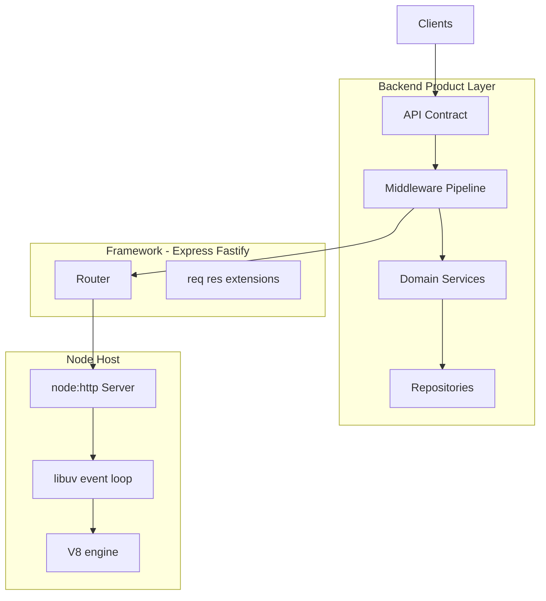
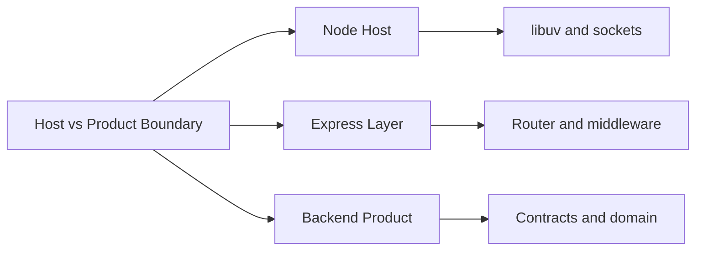
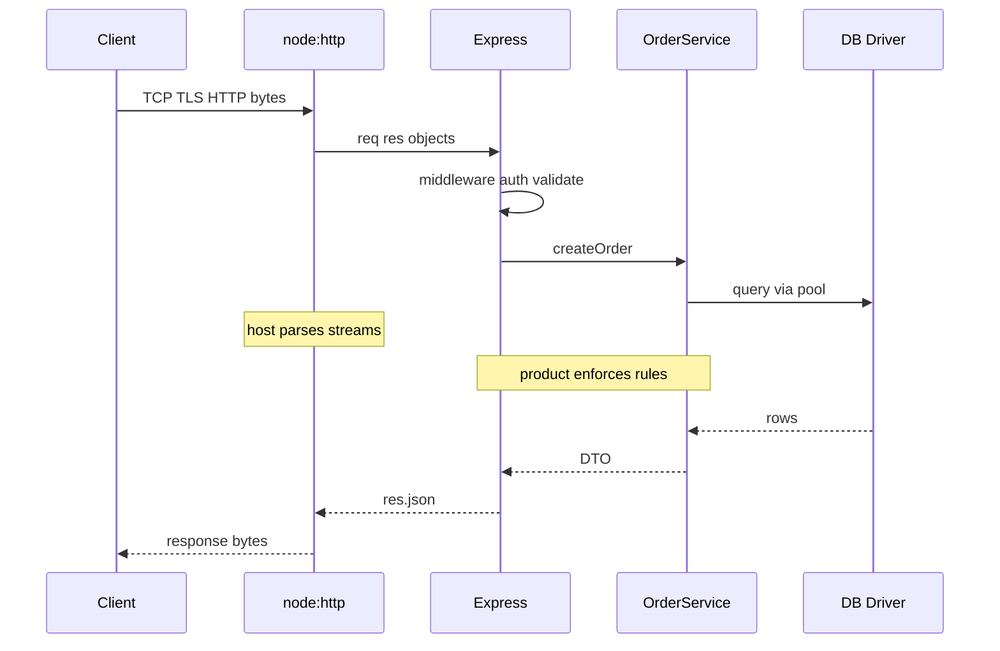

# Node Host vs Backend Product Boundary

## Overview

**Node** is a **host runtime**: V8, libuv, `process`, streams, and platform modules (`node:http`, `node:fs`). **Backend** is the **product layer** you build on top: routing, middleware, domain services, API contracts, auth, and operational policies.

Confusing the two leads to classic production pain: fixing event-loop stalls when the real bug is unbounded handler work; or reimplementing HTTP parsing in middleware when the issue is a missing authorization check. This note draws a sharp line—what Node guarantees, what your service must guarantee, and where frameworks sit.

## Learning Objectives

- Map Node platform APIs to host responsibilities vs. product responsibilities
- Explain what Express adds on top of `node:http` and what it does not
- Identify bugs that belong in Node diagnostics vs. Backend design reviews
- Apply the boundary when splitting modules across tracks (Node, Backend, Databases, System Design)
- Design handlers that respect host constraints (non-blocking, backpressure) while enforcing product contracts

## Prerequisites

- [[06-NodeJS/00-Orientation/V8 libuv and the Node Host|V8 libuv and the Node Host]]
- [[07-Backend/00-Orientation/Why Backend Services Exist|Why Backend Services Exist]]
- [[06-NodeJS/05-Networking/http and https Platform Servers|http and https Platform Servers]]

## Difficulty

`beginner`

## Estimated Time

- Reading: 1 hour
- Exercises: 1.5 hours
- Mini project: 2 hours

## History

Early Node tutorials conflated `http.createServer` callbacks with "the app." Express (2010) introduced **middleware** and **routers**, establishing a de facto product layer. As services grew, teams split **SRE/runtime** concerns (GC, event-loop delay, graceful shutdown) from **API/product** concerns (OpenAPI, RBAC, idempotency). This track formalizes that split so the Software Engineering Bible does not duplicate Node internals in Backend notes—or teach product auth inside libuv chapters.

## Problem It Solves

| Symptom | Often misattributed to | Actual layer |
| --- | --- | --- |
| Event loop blocked 30s | "Node is slow" | Sync CPU or unbounded JSON parse in handler (Backend + host discipline) |
| Connection reset under load | "Express bug" | Missing timeouts / keep-alive limits ([[06-NodeJS/05-Networking/Keep-Alive Timeouts and Connection Limits|Keep-Alive Timeouts]]) |
| User sees another tenant's data | "Database bug" | Missing app-level authZ (Backend) |
| Duplicate charges on retry | "Postgres issue" | Missing idempotency contract (Backend) |
| TLS certificate expired | "API design" | Infra / DevOps (hand off) |

Clear boundaries shorten incident response and study paths.

## Internal Implementation

### Layer stack



### Responsibility matrix

| Concern | Node host | Backend product |
| --- | --- | --- |
| Parse HTTP/1.1 line and headers | Yes | No |
| Route `/v1/orders/:id` | No | Yes |
| Stream body with backpressure | Platform streams | Handler discipline |
| JWT verification policy | No | Yes |
| `process.on('SIGTERM')` drain | Yes ([[06-NodeJS/10-Production-Node/Graceful Shutdown and Drain|Graceful Shutdown]]) | In-flight request policy above drain |
| Connection pool to Postgres | Driver (host-adjacent) | Repository patterns and transactions |
| Multi-region active-active | No | Hand off to [[09-System-Design/07-Multi-Region-and-Geo/Multi-Region Active-Passive Active-Active Patterns|Multi-Region Active-Passive Active-Active Patterns]] |

## Mermaid Diagrams

### Structure



### Sequence / Lifecycle — where time is spent



## Examples

### Minimal Example — raw host vs Express product

```typescript
// HOST ONLY — no product contract
import { createServer } from "node:http";

createServer((req, res) => {
  res.writeHead(200, { "content-type": "application/json" });
  res.end(JSON.stringify({ ok: true }));
}).listen(3000);
```

```typescript
// PRODUCT LAYER — versioned resource + error policy
import express from "express";

const app = express();
app.use(express.json());

app.get("/v1/ping", (_req, res) => {
  res.status(200).json({ status: "ok" });
});

app.use((_req, res) => {
  res.status(404).json({ error: "not_found" });
});

app.listen(3000);
```

Same host (`node:http` under Express); different **product promises**.

### Production-Shaped Example — respect host limits in product code

```typescript
import express from "express";
import { performance } from "node:perf_hooks";

const app = express();

// Product: bound body size (abuse). Host: avoids huge buffer alloc on loop.
app.use(express.json({ limit: "256kb" }));

app.use((req, res, next) => {
  const start = performance.now();
  res.on("finish", () => {
    const ms = performance.now() - start;
    if (ms > 500) {
      console.warn(JSON.stringify({ path: req.path, durationMs: ms, requestId: req.header("x-request-id") }));
    }
  });
  next();
});

// Product: never sync bcrypt 14 rounds on hot path without worker offload
// Host: would block all clients — see Node concurrency notes
app.post("/v1/login", async (_req, res) => {
  res.status(501).json({ error: "use_auth_service" });
});

export { app };
```

## Trade-offs

| Dimension | Upside | Downside | When it matters |
| --- | --- | --- | --- |
| Sharp boundary | Faster debugging and clearer docs | Requires discipline when writing notes/code | Multi-track curriculum |
| Thin handlers | Better testability | More files and indirection | Teams > 3 engineers |
| Framework on host | Productivity | Hidden magic if internals ignored | Express-heavy shops |
| Direct `node:http` | Control and learning | Reinvent middleware poorly | Sidecars, health probes |

### When to Use

- Always—when deciding where a topic lives and where to fix a bug
- When onboarding: teach host first ([[06-NodeJS/README|Node.js]]), then Backend contracts

### When Not to Use

- Never blur boundaries in production postmortems—name the layer explicitly even if fix spans both

## Exercises

1. For each item, label **Host**, **Framework**, or **Product**: TLS termination, RBAC check, `express.json()`, DNS lookup, OpenAPI validation, `pipeline()` backpressure, idempotency store.
2. Add a 2s busy loop to an Express handler; measure event-loop delay with `perf_hooks`. Write which layer owns the fix.
3. Read [[06-NodeJS/10-Production-Node/Graceful Shutdown and Drain|Graceful Shutdown]] and list three shutdown steps that are host vs. product.
4. Diagram your last project using the three-layer stack; mark one leak across boundaries.
5. Explain why connection pooling is neither purely host nor purely product.

## Mini Project

Implement the same `GET /v1/items/:id` twice: once with raw `node:http` (manual path parse) and once with Express (router + JSON error envelope). Document lines of code and which layer owns 404 vs. 500 semantics.

## Portfolio Project

In [[07-Backend/projects/Express Clone/README|Express Clone]], write an ADR stating which features reimplement host behavior vs. orchestrate it.

## Interview Questions

1. What does Express provide that `node:http` does not?
2. Where would you fix a memory leak from unclosed DB connections—driver, repository, or middleware?
3. Is rate limiting a host or product concern? Argue both sides.
4. How does graceful shutdown split between Node and your API layer?
5. Why should Backend notes not re-teach libuv phases?

### Stretch / Staff-Level

1. Your p99 latency regressed after adding middleware—how do you profile host vs. product time?
2. Design guidelines for when a team may bypass Express and use `node:http` in production.

## Common Mistakes

- Putting business rules in middleware that should live in domain services
- Ignoring `express.json` limits because "Node handles streams"
- Fixing auth bugs by tuning the thread pool
- Duplicating Node shutdown docs inside Backend production chapters verbatim

## Best Practices

- Default path: Node for I/O mechanics, Backend for contracts and rules
- Log at product boundaries with request IDs; correlate with host metrics (event-loop lag)
- Keep CPU-heavy work off the main thread per Node guidance
- Cross-link handoffs explicitly in design docs and postmortems

## Summary

The **Node host** moves bytes, schedules callbacks, and exposes platform APIs. The **backend product** defines what those bytes *mean*: who may call, what is valid, what is stored, and how failures appear to clients. Express sits between them as framework glue. Production excellence requires fluency in both—and clarity about which layer owns each failure mode.

## Further Reading

- [[06-NodeJS/README|Node.js track]]
- [[07-Backend/02-Frameworks-and-Middleware/Express Application and Router Internals|Express Application and Router Internals]]
- [[06-NodeJS/00-Orientation/Deno Bun and WinterCG Portability|Deno Bun and WinterCG Portability]]

## Related Notes

- [[06-NodeJS/00-Orientation/Why Node.js Exists|Why Node.js Exists]]
- [[06-NodeJS/02-Event-Loop-and-libuv/Event Loop Phases|Event Loop Phases]]
- [[07-Backend/02-Frameworks-and-Middleware/Middleware Pipeline and Error Middleware|Middleware Pipeline and Error Middleware]]
- [[02-JavaScript/05-Async-and-Concurrency/Run to Completion and Event Loop|Run to Completion and Event Loop]]
- [[08-Databases/README|Databases]]
- [[09-System-Design/README|System Design]]

## Progress Checklist

- [ ] Explained from first principles
- [ ] Drew at least one Mermaid diagram
- [ ] Implemented a minimal version
- [ ] Documented trade-offs and non-goals
- [ ] Completed exercises
- [ ] Practiced interview questions aloud
- [ ] Linked prerequisites and dependents
