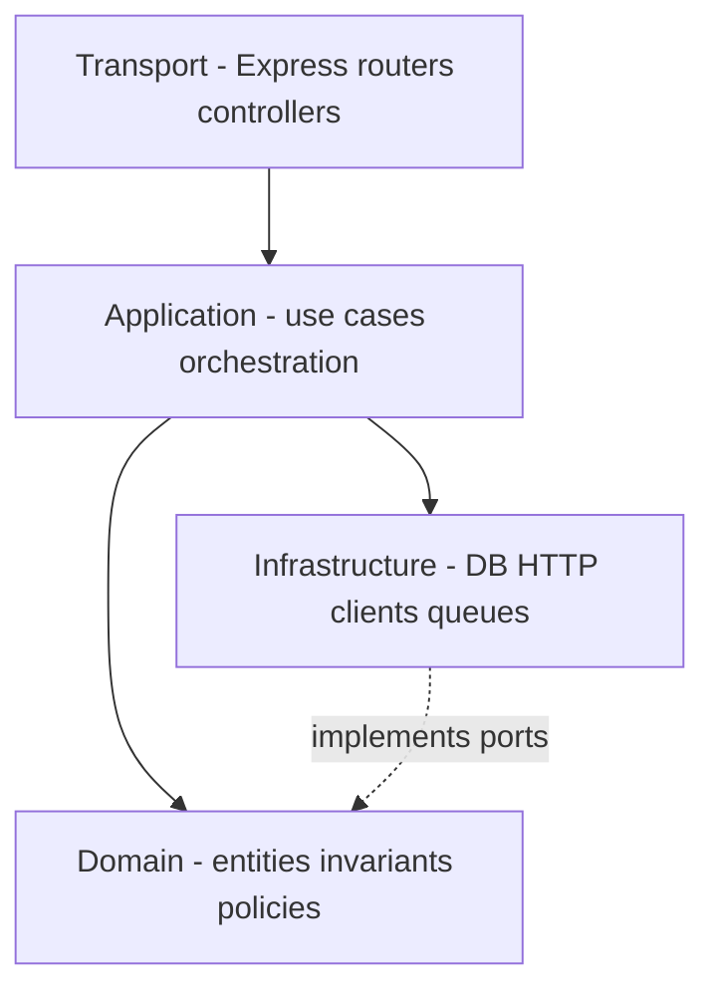
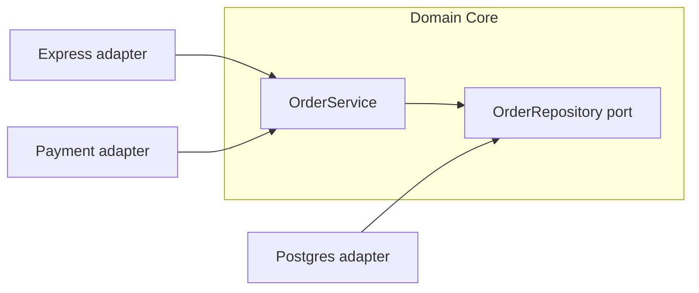
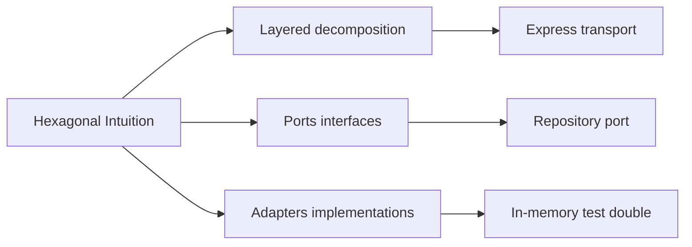
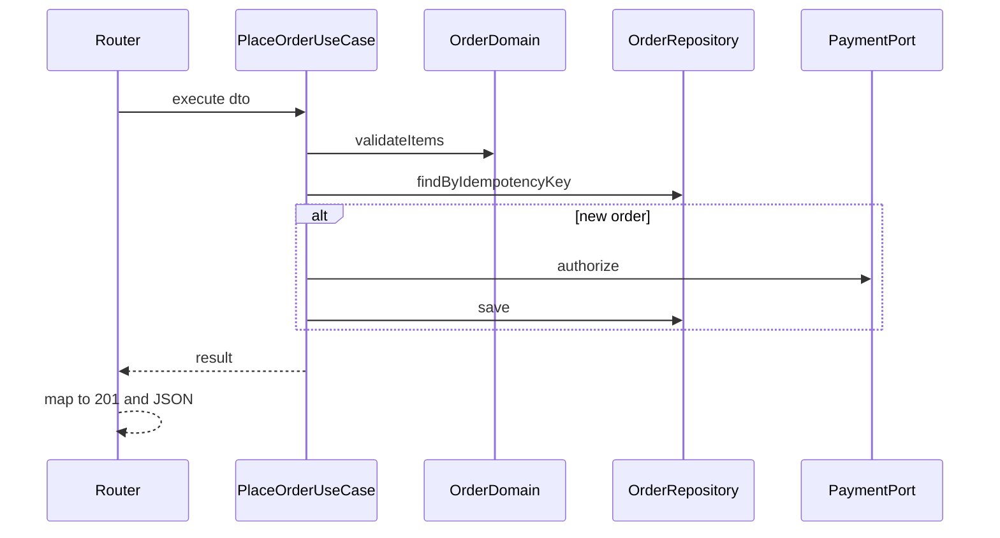

# Service Layering and Hexagonal Intuition

## Overview

**Service layering** organizes backend code so **domain rules** stay independent of HTTP, databases, and third-party SDKs. **Hexagonal architecture** (ports and adapters) makes that independence explicit: the domain defines **ports** (interfaces); infrastructure provides **adapters** (Express routers, Postgres repositories, Stripe clients).

You do not need a framework to apply hexagonal intuition. You need **testable boundaries**: handlers parse HTTP; services enforce invariants; repositories persist entities. When layers leak—SQL in route handlers, Express `req` in domain code—tests become integration-only and refactors become risky.

## Learning Objectives

- Draw classic layers (transport, application, domain, infrastructure) for an Express service
- Define ports (interfaces) and adapters for persistence and external APIs
- Keep domain services free of `Request`/`Response` and ORM entities where possible
- Recognize when layering is overkill vs. essential
- Connect layering to test doubles, contract tests, and migration safety

## Prerequisites

- [[07-Backend/00-Orientation/Why Backend Services Exist|Why Backend Services Exist]]
- [[07-Backend/00-Orientation/Node Host vs Backend Product Boundary|Node Host vs Backend Product Boundary]]
- [[02-JavaScript/07-Production-JavaScript/Testing JavaScript|Testing JavaScript]]

## Difficulty

`intermediate`

## Estimated Time

- Reading: 2 hours
- Exercises: 2 hours
- Mini project: 4 hours

## History

Layered architectures date to enterprise Java (presentation → business → data). **Hexagonal architecture** (Alistair Cockburn, 2005) reframed layers as a **core** with plug-in sides—same idea, clearer test story. DDD bounded contexts added vocabulary for splitting domains. Node/Express culture often skipped layers for speed; microservice extraction then punished that debt. This note gives a **pragmatic** subset: enough structure for production, not ceremony for its own sake.

## Problem It Solves

| Failure mode | Layering response |
| --- | --- |
| Cannot unit test pricing rules without spinning HTTP + DB | Domain service + fake repository |
| Swapping Postgres for Dynamo requires rewriting routes | Repository port behind stable interface |
| Handler grows to 400 lines | Split transport mapping from application logic |
| Third-party API shape infects every module | Anti-corruption adapter at infrastructure edge |

## Internal Implementation

### Pragmatic layers for Express backends



**Transport** knows HTTP status mapping. **Application** coordinates transactions and calls domain + ports. **Domain** holds pure rules. **Infrastructure** implements repositories and external clients.

### Hexagonal view



## Mermaid Diagrams

### Structure



### Sequence / Lifecycle — place order use case



## Examples

### Minimal Example — port and adapter

```typescript
// domain/ports.ts
export type Order = { id: string; sku: string; quantity: number };

export interface OrderRepository {
  save(order: Order): Promise<void>;
  findById(id: string): Promise<Order | null>;
}

// domain/orderService.ts
export class OrderService {
  constructor(private readonly repo: OrderRepository) {}

  async getOrder(id: string): Promise<Order | null> {
    if (!id) throw new Error("invalid_id");
    return this.repo.findById(id);
  }
}

// infra/memoryOrders.ts — test adapter
export class InMemoryOrderRepository implements OrderRepository {
  private store = new Map<string, Order>();
  async save(order: Order) { this.store.set(order.id, order); }
  async findById(id: string) { return this.store.get(id) ?? null; }
}
```

### Production-Shaped Example — Express transport stays thin

```typescript
import express from "express";
import { OrderService } from "./domain/orderService.js";
import type { OrderRepository } from "./domain/ports.js";

export function orderRouter(service: OrderService) {
  const router = express.Router();

  router.get("/:id", async (req, res, next) => {
    try {
      const order = await service.getOrder(req.params.id);
      if (!order) return res.status(404).json({ error: "not_found" });
      res.status(200).json(order);
    } catch (err) {
      if (err instanceof Error && err.message === "invalid_id") {
        return res.status(400).json({ error: "invalid_id" });
      }
      next(err);
    }
  });

  return router;
}

export function createApp(repo: OrderRepository) {
  const app = express();
  app.use(express.json());
  const service = new OrderService(repo);
  app.use("/v1/orders", orderRouter(service));
  return app;
}
```

Persistence transaction boundaries: [[07-Backend/08-Data-Access-and-Persistence-Patterns/Repository and Unit of Work|Repository and Unit of Work]]. DB engine details: [[08-Databases/README|Databases]].

## Trade-offs

| Dimension | Upside | Downside | When it matters |
| --- | --- | --- | --- |
| Strict layers | Testability, swap infrastructure | More boilerplate | Long-lived domains |
| Anemic domain | Faster CRUD shipping | Rules scatter in services/SQL | MVPs with clear exit plan |
| Rich domain models | Invariants enforced in one place | Mapping overhead to DTOs | Finance, inventory, billing |
| Many small ports | Clear boundaries | Interface proliferation | Large teams |

### When to Use

- Business rules outlive storage or framework choices
- You need unit tests without Docker for core logic
- Multiple transports (HTTP + jobs + CLI) share behavior

### When Not to Use

- Throwaway prototypes (still isolate the one rule you are testing)
- Read-only aggregations with no mutation rules (thin query layer may suffice)

## Exercises

1. Refactor a monolithic route handler into transport + service + repository; count lines moved per layer.
2. Draw hexagonal diagram for "user signup" with email port and user repository port.
3. Write a unit test for a discount policy using an in-memory adapter—no Express import.
4. Identify one **leak** in a real codebase (e.g., `req.user` in a service) and propose a fix.
5. When would a **use case class** help vs. a plain function module?

## Mini Project

Build `PlaceOrderUseCase` with ports for `OrderRepository` and `PaymentGateway`. Provide in-memory fakes and one Express router. Assert domain rejects `quantity <= 0` without HTTP.

## Portfolio Project

Document layering in [[07-Backend/projects/Backend Service Toolkit/README|Backend Service Toolkit]] Architecture.md with ports listed per bounded context.

## Interview Questions

1. What problem does hexagonal architecture solve?
2. Where should HTTP status code mapping live?
3. How do you test a service that calls Stripe without calling Stripe?
4. What is an anti-corruption layer?
5. When is layered architecture over-engineering?

### Stretch / Staff-Level

1. Compare hexagonal vs. vertical slice architecture for a 20-engineer org.
2. How do you prevent "domain" from becoming a dumping ground for unrelated helpers?

## Common Mistakes

- Passing `express.Request` into domain services
- Repository methods that return ORM models with lazy-loaded relations everywhere
- No port for email/payment—direct SDK imports in use cases
- Layering folders without enforcing import direction (domain importing infra)

## Best Practices

- Enforce dependency direction: outer layers depend on inner abstractions
- Map to DTOs at transport boundaries; never expose internal entity graphs blindly
- Co-locate use cases with the aggregate they mutate
- Use fakes in unit tests; reserve integration tests for adapter correctness

## Summary

Service layering and hexagonal intuition keep **product rules** at the center and push HTTP, databases, and vendors to the edges. Express handlers become thin adapters; domain services become testable; repositories hide storage engines you hand off to the Databases track. The goal is not UML—it is **change resilience** when contracts, stores, or frameworks shift.

## Further Reading

- [[07-Backend/02-Frameworks-and-Middleware/Dependency Injection for Services|Dependency Injection for Services]]
- [[07-Backend/08-Data-Access-and-Persistence-Patterns/Repository and Unit of Work|Repository and Unit of Work]]
- Ports and Adapters (Alistair Cockburn)

## Related Notes

- [[07-Backend/02-Frameworks-and-Middleware/Dependency Injection for Services|Dependency Injection for Services]]
- [[07-Backend/02-Frameworks-and-Middleware/Middleware Pipeline and Error Middleware|Middleware Pipeline and Error Middleware]]
- [[06-NodeJS/03-Modules-and-Loading/ES Modules|ES Modules]]
- [[02-JavaScript/07-Production-JavaScript/Testing JavaScript|Testing JavaScript]]
- [[08-Databases/README|Databases]]
- [[09-System-Design/README|System Design]]

## Progress Checklist

- [ ] Explained from first principles
- [ ] Drew at least one Mermaid diagram
- [ ] Implemented a minimal version
- [ ] Documented trade-offs and non-goals
- [ ] Completed exercises
- [ ] Practiced interview questions aloud
- [ ] Linked prerequisites and dependents
