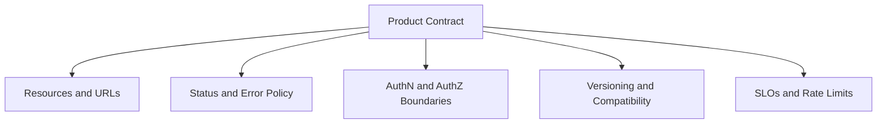
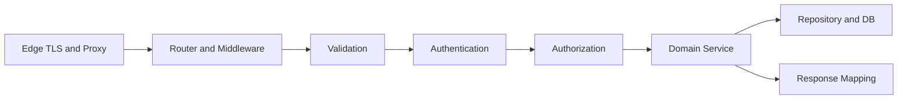
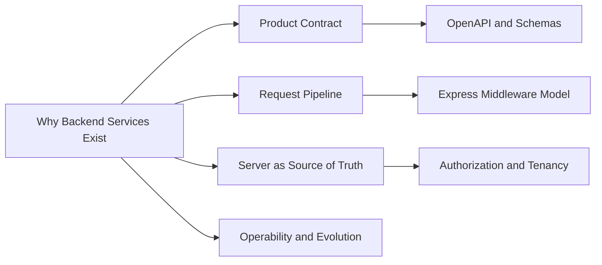
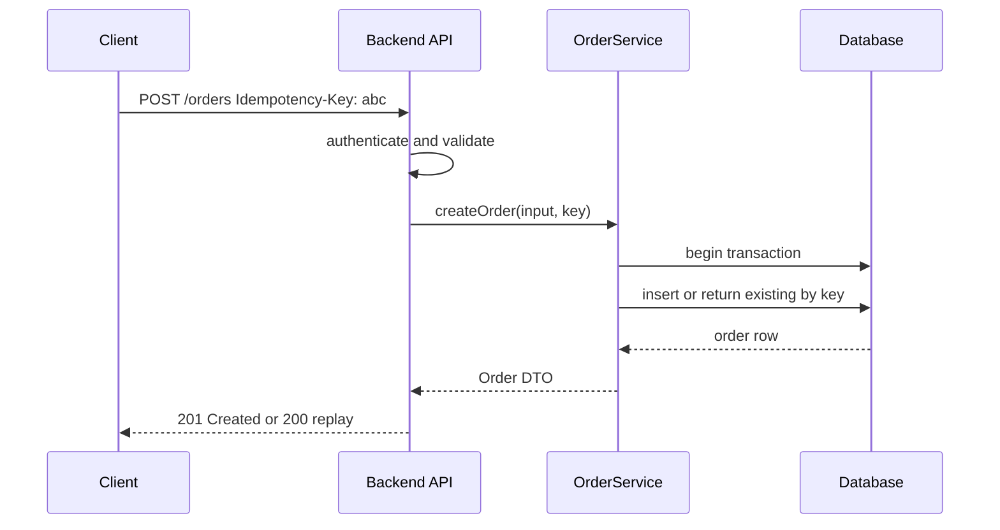

# Why Backend Services Exist

## Overview

A **backend service** is a long-lived program that exposes a **product contract** over the network: stable resources, status semantics, error envelopes, auth boundaries, and evolution rules. It sits above the **host runtime** (Node, libuv, sockets) and below clients (browsers, mobile apps, other services).

Backend engineering is not "writing server code." It is **enforcing invariants** that clients cannot be trusted to enforce: identity, authorization, monetary correctness, audit trails, rate limits, and data consistency across concurrent requests. The runtime gives you bytes on a wire; the backend gives you a **trustworthy product surface**.

## Learning Objectives

- Distinguish host/runtime concerns from product/service concerns
- Articulate why clients cannot be the source of truth for business rules
- Map backend responsibilities to HTTP contracts, not framework tutorials
- Identify failure modes when backend boundaries are missing or blurred
- Connect backend design to observability, security, and operability from day one

## Prerequisites

- [[06-NodeJS/00-Orientation/Why Node.js Exists|Why Node.js Exists]]
- [[01-Computer-Science/07-Networking-Fundamentals/HTTP as a Protocol|HTTP as a Protocol]]
- [[02-JavaScript/07-Production-JavaScript/Error Design and Exception Safety|Error Design and Exception Safety]]

## Difficulty

`beginner`

## Estimated Time

- Reading: 1.5 hours
- Exercises: 1 hour
- Mini project: 3 hours

## History

Early web applications were **monoliths**: server-rendered HTML, session cookies, and database queries in the same process. As clients diversified (mobile, SPAs, partner integrations), teams split **presentation** from **product logic** and exposed **HTTP APIs** as the integration seam.

Microservices (2010s) pushed the idea further: bounded contexts with independent deployability. The pendulum swung back toward **modular monoliths** and **BFFs** when operational cost exceeded benefit—but the **contract-first API layer** remained. Today, "backend" usually means: stateless(ish) HTTP/gRPC services, explicit schemas, and production discipline (timeouts, idempotency, tracing)—regardless of deployment topology.

## Problem It Solves

| Failure mode without a deliberate backend layer | Backend service response |
| --- | --- |
| Business rules duplicated in web, iOS, Android | Single authoritative implementation behind an API |
| Clients forge prices, roles, or tenant IDs | Server-side validation, authZ, and resource ownership checks |
| Inconsistent error shapes break client UX | Standard status codes and problem envelopes |
| Retries double-charge or duplicate writes | Idempotency keys and safe-retry semantics |
| Incidents are undebuggable | Request IDs, structured logs, RED metrics |

Node answers *how* to multiplex I/O; backend answers *what promise* you make to callers and *how* you keep it under failure.

## Internal Implementation

### Product contract (what you ship)



### Request pipeline (how a call is honored)



Thin socket parsing and event-loop behavior belong to [[06-NodeJS/05-Networking/http and https Platform Servers|http and https Platform Servers]]. Index selection and WAL semantics belong to [[08-Databases/README|Databases]]. Multi-region failover belongs to [[09-System-Design/07-Multi-Region-and-Geo/Failover RPO RTO and Split-Brain Product Policy|Failover RPO RTO and Split-Brain Product Policy]].

## Mermaid Diagrams

### Structure



### Sequence / Lifecycle — create order with idempotency



## Examples

### Minimal Example — contract as code

```typescript
// Express 4 + TypeScript 5 — minimal product surface
import express, { Request, Response } from "express";

const app = express();
app.use(express.json({ limit: "64kb" }));

app.get("/health", (_req, res) => {
  res.status(200).json({ status: "ok" });
});

app.get("/v1/users/:id", (req: Request, res: Response) => {
  const id = req.params.id;
  if (!/^\d+$/.test(id)) {
    return res.status(400).json({ error: "invalid_id", message: "User id must be numeric" });
  }
  // Domain lookup would live in a service layer — shown inline for brevity
  res.status(200).json({ id, email: "user@example.com" });
});

app.listen(3000);
```

The handler encodes **policy**: URL version prefix, input shape, error shape, success shape.

### Production-Shaped Example — service boundary with observability

```typescript
import express from "express";
import { randomUUID } from "node:crypto";

type OrderInput = { sku: string; quantity: number };

interface OrderRepository {
  create(input: OrderInput, idempotencyKey: string): Promise<{ id: string; status: string }>;
}

export function createApp(orders: OrderRepository) {
  const app = express();
  app.use(express.json({ limit: "64kb" }));

  app.use((req, res, next) => {
    const requestId = (req.header("x-request-id") ?? randomUUID()) as string;
    res.setHeader("x-request-id", requestId);
    (req as express.Request & { requestId: string }).requestId = requestId;
    next();
  });

  app.post("/v1/orders", async (req, res, next) => {
    try {
      const key = req.header("idempotency-key");
      if (!key) return res.status(400).json({ error: "missing_idempotency_key" });

      const body = req.body as OrderInput;
      if (!body?.sku || typeof body.quantity !== "number" || body.quantity < 1) {
        return res.status(422).json({ error: "validation_failed" });
      }

      const order = await orders.create(body, key);
      res.status(201).json(order);
    } catch (err) {
      next(err);
    }
  });

  app.use((err: unknown, _req: express.Request, res: express.Response, _next: express.NextFunction) => {
    console.error("unhandled", err);
    res.status(500).json({ error: "internal_error" });
  });

  return app;
}
```

Failure modes addressed: missing idempotency key (400), invalid payload (422), correlation ID propagation, centralized 500 mapping. Database transaction details defer to [[07-Backend/08-Data-Access-and-Persistence-Patterns/Transactions as Used by Services|Transactions as Used by Services]].

## Trade-offs

| Dimension | Upside | Downside | When it matters |
| --- | --- | --- | --- |
| Centralized rules | One truth for business logic | Network latency and availability coupling | Multi-client products |
| HTTP/JSON APIs | Universal integration | Schema drift without contracts | Public and partner APIs |
| Stateless handlers | Horizontal scale | Session/state externalization | High traffic services |
| Strict contracts | Predictable clients | Slower iteration if versioning weak | Long-lived mobile apps |

### When to Use

- Multiple clients need the same product capabilities
- Rules involve money, identity, compliance, or shared mutable state
- You need independent deployment, scaling, or team ownership of domains

### When Not to Use

- Pure static sites with no server-side secrets or mutations
- Prototypes where contract cost exceeds learning value (still document exit criteria)
- CPU/streaming workloads better served by specialized pipelines (hand off topology to System Design)

## Exercises

1. List five invariants for an e-commerce checkout that **must not** live only in the browser. For each, name the HTTP status you would return when violated.
2. Sketch a request pipeline diagram for `POST /v1/transfers` including auth, idempotency, and ledger write. Mark where you would emit spans and logs.
3. Compare "backend as CRUD over tables" vs. "backend as domain services." Give one example where CRUD leaks business rules.
4. Write a one-paragraph **product contract** for a URL shortener API: resources, errors, rate limits, and versioning.
5. Identify three responsibilities in your current project that belong in Node host docs vs. Backend docs vs. Databases docs.

## Mini Project

**Contract-first health and metadata API.** Implement an Express service with `GET /health`, `GET /v1/meta` (version, build sha, uptime), and a enforced `x-request-id` on all responses. Document the contract in a README table (method, path, status, body). No database required.

## Portfolio Project

Extend [[07-Backend/projects/URL Shortener API/README|URL Shortener API]] with a one-page "Product Contract" section covering resources, idempotency for creates, and error envelope—before writing handlers.

## Interview Questions

1. Why can't you rely on the client to enforce authorization?
2. What is the difference between a Node HTTP server and a backend service?
3. How do idempotency keys change your retry story?
4. What belongs in an API contract vs. OpenAPI vs. internal service code?
5. When would you choose a BFF vs. exposing domain services directly to mobile?

### Stretch / Staff-Level

1. Design backend boundaries for a marketplace with buyers, sellers, and admin—what services share a database vs. enforce contracts via APIs?
2. How do you evolve a public API when web and mobile clients lag by six months?

## Common Mistakes

- Treating Express routes as the architecture (no domain layer)
- Returning 200 with `{ success: false }` instead of meaningful HTTP status
- Logging stack traces to clients in production
- Skipping request correlation IDs and wondering why incidents are opaque
- Duplicating validation in frontend and backend with no shared schema story

## Best Practices

- Start from the **contract**: resources, statuses, errors, auth—then implement
- Keep handlers thin; push rules into testable domain services
- Propagate `x-request-id` / trace context from edge to database queries
- Document non-goals (what the API explicitly does not guarantee)
- Hand off socket/stream details to Node; hand off query plans to Databases

## Summary

Backend services exist because networked products need a **trustworthy, centralized place** to enforce business rules, identity, authorization, and consistency—expressed as stable HTTP (or RPC) contracts clients can rely on across versions and failures. The runtime moves bytes; the backend **makes promises** and keeps them observable and evolvable. Everything else in this track—middleware, validation, auth, reliability—is machinery in service of that contract.

## Further Reading

- [[00-References/Backend/README|Backend References]]
- [[01-Computer-Science/07-Networking-Fundamentals/HTTP as a Protocol|HTTP as a Protocol]]
- [[09-System-Design/README|System Design]] — deployment and scaling context

## Related Notes

- [[07-Backend/00-Orientation/Node Host vs Backend Product Boundary|Node Host vs Backend Product Boundary]]
- [[07-Backend/00-Orientation/Service Layering and Hexagonal Intuition|Service Layering and Hexagonal Intuition]]
- [[07-Backend/01-HTTP-APIs-and-Contracts/Resource Modeling and REST Semantics|Resource Modeling and REST Semantics]]
- [[06-NodeJS/05-Networking/http and https Platform Servers|http and https Platform Servers]]
- [[02-JavaScript/07-Production-JavaScript/Observability and Operational Readiness|Observability and Operational Readiness]]
- [[08-Databases/README|Databases]]
- [[09-System-Design/README|System Design]]

## Progress Checklist

- [ ] Explained from first principles
- [ ] Drew at least one Mermaid diagram
- [ ] Implemented a minimal version
- [ ] Documented trade-offs and non-goals
- [ ] Completed exercises
- [ ] Practiced interview questions aloud
- [ ] Linked prerequisites and dependents
