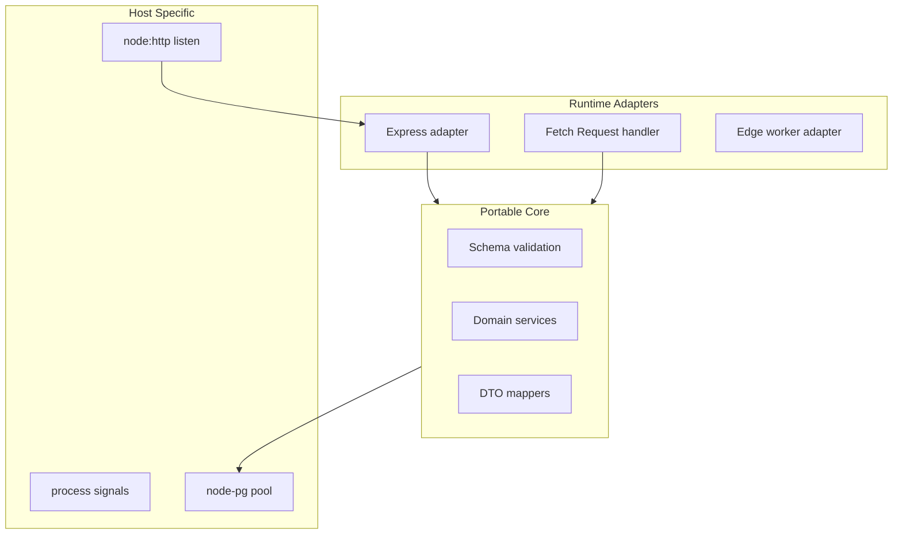
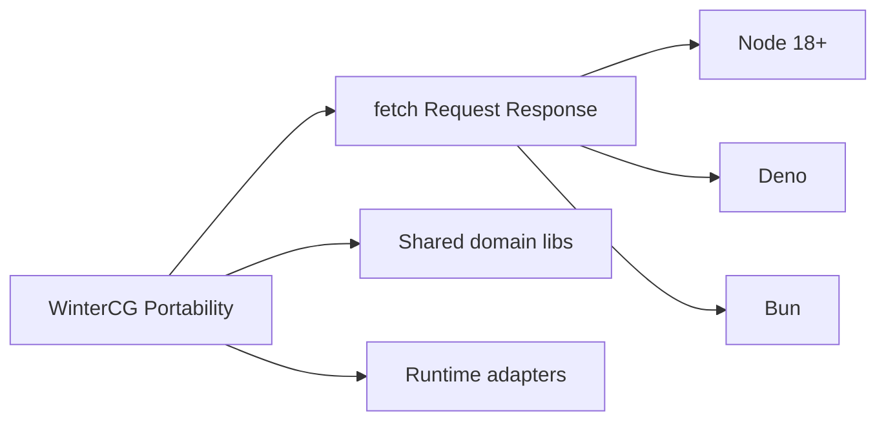
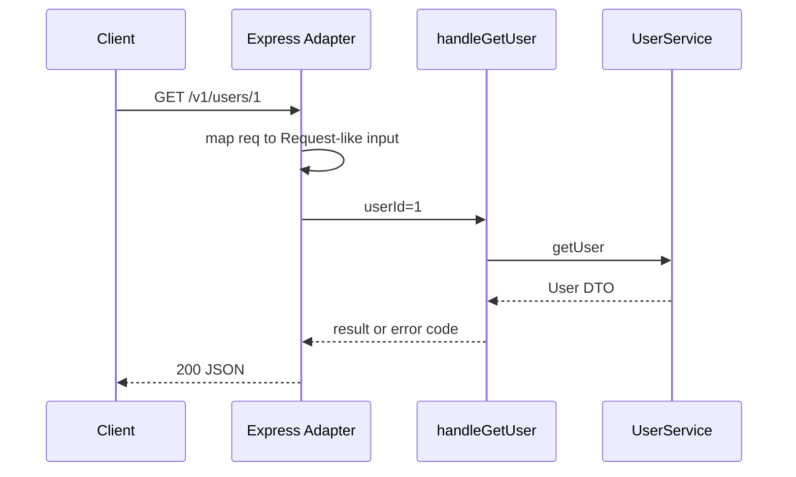

# WinterCG and Multi-Runtime API Portability

## Overview

**WinterCG** (Web-interoperable Runtimes Community Group) aligns server runtimes on a **shared minimum API surface**: `fetch`, `Request`, `Response`, `Headers`, `URL`, streams, and related web-standard types. For backend engineers, portability means writing **product logic** against stable web APIs where possible—while accepting that **Express**, **process lifecycle**, and **database drivers** remain runtime- and deployment-specific.

This note explains what you can port across Node, Deno, and Bun; what stays host-specific; and how to structure backends so framework and runtime swaps do not rewrite domain rules.

## Learning Objectives

- List WinterCG-aligned APIs available in modern Node (18+)
- Compare Express/`node:http` handlers vs. `fetch` handler style (Hono, native servers)
- Identify backend code that should be runtime-agnostic vs. adapter-specific
- Evaluate trade-offs of "web-standard first" for production services
- Plan migration paths without breaking API contracts

## Prerequisites

- [[06-NodeJS/00-Orientation/Deno Bun and WinterCG Portability|Deno Bun and WinterCG Portability]]
- [[07-Backend/00-Orientation/Node Host vs Backend Product Boundary|Node Host vs Backend Product Boundary]]
- [[02-JavaScript/04-Engines-and-Memory/Host Environments and Web APIs|Host Environments and Web APIs]]

## Difficulty

`intermediate`

## Estimated Time

- Reading: 1.5 hours
- Exercises: 2 hours
- Mini project: 3 hours

## History

Browsers standardized `fetch` and web streams; Node added undici-backed `fetch` (v18+). Deno and Bun marketed **web-standard APIs** as the primary server interface. WinterCG formalized cross-runtime expectations so libraries (Hono, hono/node-server, edge workers) could target multiple deploy targets. Express remains dominant in enterprise Node—but **contract handlers** that accept `Request` and return `Response` increasingly appear at edges and in portable middleware.

## Problem It Solves

| Pain | Portability approach |
| --- | --- |
| Vendor lock-in to Express request shape | Core logic accepts plain DTOs; adapters map Request/req |
| Edge + Node duplicate business rules | Shared validation module + thin runtime adapters |
| Different global objects per runtime | Prefer `node:` imports and standard web types in shared libs |
| Testing requires full Express app | Test handlers with `new Request()` without listening on port |

Full runtime parity is a **non-goal**—WinterCG defines a floor, not identical deployment models.

## Internal Implementation

### Portable vs host-specific split



Node libuv and thread pool details: [[06-NodeJS/02-Event-Loop-and-libuv/libuv Architecture Overview|libuv Architecture Overview]]. Multi-region edge routing: [[09-System-Design/02-Load-Balancing-and-Edge-Entry/Edge Admission Control and Global Traffic Steering|Edge Admission Control and Global Traffic Steering]].

## Mermaid Diagrams

### Structure



### Sequence / Lifecycle — same handler two adapters



## Examples

### Minimal Example — web Request in tests

```typescript
// portable/handler.ts — no Express import
export async function handleGetUser(
  userId: string,
  getUser: (id: string) => Promise<{ id: string; email: string } | null>
): Promise<{ status: number; body: unknown }> {
  if (!/^\d+$/.test(userId)) {
    return { status: 400, body: { error: "invalid_id" } };
  }
  const user = await getUser(userId);
  if (!user) return { status: 404, body: { error: "not_found" } };
  return { status: 200, body: user };
}
```

```typescript
// adapters/express.ts
import express from "express";
import { handleGetUser } from "../portable/handler.js";

export function mountUserRoutes(getUser: (id: string) => Promise<{ id: string; email: string } | null>) {
  const router = express.Router();
  router.get("/:id", async (req, res) => {
    const { status, body } = await handleGetUser(req.params.id, getUser);
    res.status(status).json(body);
  });
  return router;
}
```

### Production-Shaped Example — fetch-style handler (Node 20+)

```typescript
// adapters/nodeFetchServer.ts
import http from "node:http";

type FetchHandler = (req: Request) => Promise<Response>;

export function serve(handler: FetchHandler, port: number) {
  const server = http.createServer(async (nodeReq, nodeRes) => {
    const url = `http://localhost${nodeReq.url ?? "/"}`;
    const headers = new Headers();
    for (const [k, v] of Object.entries(nodeReq.headers)) {
      if (v) headers.set(k, Array.isArray(v) ? v.join(",") : v);
    }
    const body =
      nodeReq.method === "GET" || nodeReq.method === "HEAD"
        ? undefined
        : nodeReq;
    const request = new Request(url, { method: nodeReq.method, headers, body: body as BodyInit });
    const response = await handler(request);
    nodeRes.writeHead(response.status, Object.fromEntries(response.headers));
    const buf = Buffer.from(await response.arrayBuffer());
    nodeRes.end(buf);
  });
  server.listen(port);
  return server;
}
```

Use libraries like `@whatwg-node/server` in real projects—this sketch shows the adapter boundary. Express remains valid for mature middleware ecosystems ([[07-Backend/02-Frameworks-and-Middleware/Express Application and Router Internals|Express Router Internals]]).

## Trade-offs

| Dimension | Upside | Downside | When it matters |
| --- | --- | --- | --- |
| Web-standard handlers | Portable tests and edge deploy | Ecosystem gaps vs Express | Multi-target products |
| Express-first | Middleware, hiring, tooling | Harder edge port | Enterprise APIs |
| Shared validation lib | One schema everywhere | Build pipeline coordination | Mobile + web + API |
| Runtime abstraction | Future optionality | Premature if single deploy | Startup vs scale-up |

### When to Use

- Libraries shared across Node and edge workers
- Products targeting Deno/Bun or serverless `fetch` handlers
- Contract tests using `Request` without TCP

### When Not to Use

- Single-runtime Express monolith with no edge plans—portability tax may not pay
- Low-level streaming pipelines needing Node-specific stream APIs without adapters

## Exercises

1. List ten APIs from [[06-NodeJS/00-Orientation/Deno Bun and WinterCG Portability|Deno Bun note]] and mark portable vs Node-only.
2. Rewrite one Express route to `handleX(dto)` + adapter; run unit tests without `supertest`.
3. Compare Hono vs Express plugin models—one paragraph each.
4. What breaks if you `import fs from "fs"` in shared domain code?
5. Design folder layout for portable core + Node adapter + future worker adapter.

## Mini Project

Implement `POST /v1/echo` twice: Express mount and `fetch` handler behind a shared `echoBody(json)` function. Same Vitest tests for core; one integration test per adapter.

## Portfolio Project

Document portability strategy in [[07-Backend/projects/Backend Service Toolkit/README|Backend Service Toolkit]]—what runs on edge vs Node region.

## Interview Questions

1. What is WinterCG trying to standardize?
2. Can you run Express unchanged on Deno? Why or why not?
3. How do you test API handlers without binding a port?
4. What backend code should never be in a portable module?
5. Trade-offs of fetch-handler frameworks vs Express?

### Stretch / Staff-Level

1. Design a backend that serves Node regions and Cloudflare Workers with shared validation—where do sessions live?
2. How does WinterCG relate to Service Workers and edge compute limits?

## Common Mistakes

- Assuming 100% API parity across runtimes
- Putting `process.env` reads inside domain services without injection
- Using Express-specific types in shared packages
- Ignoring Node-specific stream backpressure when "going web standard"

## Best Practices

- Keep domain free of runtime globals; inject config and clocks
- Use `node:` specifiers in Node adapters
- Publish OpenAPI as the contract anchor—not the framework
- Cross-link host deep dives to Node track; do not duplicate libuv chapters here

## Summary

WinterCG and multi-runtime portability push backend **product logic** toward web-standard `Request`/`Response` and shared libraries—while Express, process signals, and database drivers stay in runtime adapters. Structure code as portable core plus thin edges so contracts survive runtime fashion; hand off socket/thread details to Node and geo-routing to System Design.

## Further Reading

- [[06-NodeJS/00-Orientation/Deno Bun and WinterCG Portability|Deno Bun and WinterCG Portability]]
- WinterCG minimum common API drafts
- [[07-Backend/02-Frameworks-and-Middleware/Fastify Contrast and Plugin Model Concepts|Fastify Contrast]]

## Related Notes

- [[06-NodeJS/00-Orientation/V8 libuv and the Node Host|V8 libuv and the Node Host]]
- [[07-Backend/00-Orientation/Node Host vs Backend Product Boundary|Node Host vs Backend Product Boundary]]
- [[07-Backend/02-Frameworks-and-Middleware/Fastify Contrast and Plugin Model Concepts|Fastify Contrast and Plugin Model Concepts]]
- [[02-JavaScript/04-Engines-and-Memory/Host Environments and Web APIs|Host Environments and Web APIs]]
- [[08-Databases/README|Databases]]
- [[09-System-Design/README|System Design]]

## Progress Checklist

- [ ] Explained from first principles
- [ ] Drew at least one Mermaid diagram
- [ ] Implemented a minimal version
- [ ] Documented trade-offs and non-goals
- [ ] Completed exercises
- [ ] Practiced interview questions aloud
- [ ] Linked prerequisites and dependents
