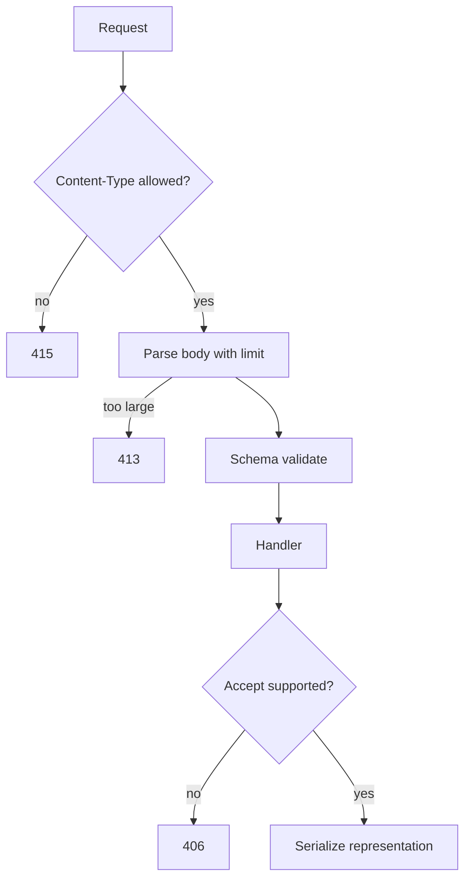
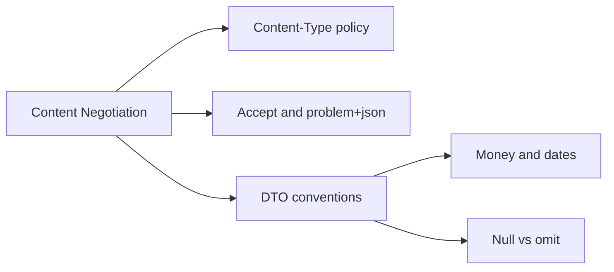
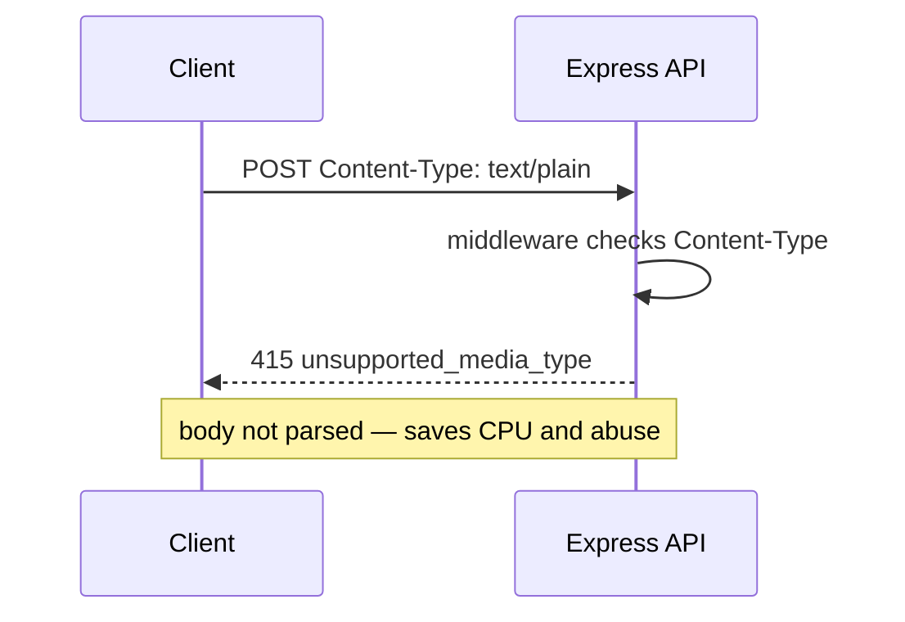

# Content Negotiation and Payload Design

## Overview

**Content negotiation** selects **representations**—JSON vs JSON:API vs protobuf, charset, compression—via `Accept`, `Content-Type`, and related headers. **Payload design** defines the JSON (or other) shapes clients can rely on: field naming, null semantics, dates, money, enums, and error envelopes.

Most product APIs standardize on `application/json; charset=utf-8` and negotiate little beyond that—but **explicit policy** prevents drift: camelCase vs snake_case, integer cents vs decimal strings, and whether `PATCH` accepts sparse objects. Abuse surfaces include giant payloads, zip bombs, and parser differentials.

## Learning Objectives

- Enforce Content-Type on mutating routes
- Design stable JSON field conventions and versioning hooks
- Handle charset, compression, and payload size at the edge/middleware
- Apply negotiation patterns when supporting multiple representations
- Connect payload limits to security and Node host streaming behavior

## Prerequisites

- [[07-Backend/01-HTTP-APIs-and-Contracts/Resource Modeling and REST Semantics|Resource Modeling and REST Semantics]]
- [[01-Computer-Science/07-Networking-Fundamentals/HTTP as a Protocol|HTTP as a Protocol]]
- [[06-NodeJS/04-Buffers-Streams-and-IO/Backpressure and HighWaterMark|Backpressure and HighWaterMark]]

## Difficulty

`intermediate`

## Estimated Time

- Reading: 1.5 hours
- Exercises: 2 hours
- Mini project: 3 hours

## History

HTTP content negotiation was designed for multi-format resources (HTML, PDF). JSON APIs simplified defaults but reopened debates: HAL, JSON:API, plain DTOs. GraphQL sidesteps URL representation but not payload shape discipline. Today teams document **JSON Schema/OpenAPI** as the real negotiation contract; Accept headers matter mainly for errors (`application/problem+json`) and occasional CSV exports.

## Problem It Solves

| Failure | Payload/negotiation fix |
| --- | --- |
| Client sends form body to JSON-only API | 415 Unsupported Media Type |
| 50 MB JSON stalls event loop | `limit` + 413 |
| Float money rounding bugs | String cents or integer minor units |
| Breaking rename `userName` → `user_name` | Versioned DTO + OpenAPI |

## Internal Implementation

### Request pipeline for representation



Thin body parsing mechanics cross-link to [[06-NodeJS/05-Networking/Request Response Lifecycle and Headers|Request Response Lifecycle]]; this note owns **policy**.

## Mermaid Diagrams

### Structure



### Sequence / Lifecycle — reject wrong media type



## Examples

### Minimal Example — Content-Type gate

```typescript
import express from "express";

export function requireJson(req: express.Request, res: express.Response, next: express.NextFunction) {
  if (req.method === "GET" || req.method === "HEAD" || req.method === "DELETE") {
    return next();
  }
  const ct = req.header("content-type") ?? "";
  if (!ct.startsWith("application/json")) {
    return res.status(415).json({ error: "unsupported_media_type", expected: "application/json" });
  }
  next();
}

const app = express();
app.use(requireJson);
app.use(express.json({ limit: "128kb" }));
```

### Production-Shaped Example — response shaping and problem+json

```typescript
import express from "express";

type PublicUser = {
  id: string;
  email: string;
  createdAt: string; // ISO-8601 UTC — policy documented in OpenAPI
};

function toPublicUser(row: { id: string; email: string; created_at: Date }): PublicUser {
  return {
    id: row.id,
    email: row.email,
    createdAt: row.created_at.toISOString(),
  };
}

export function userRoutes() {
  const router = express.Router();

  router.get("/:id", async (req, res) => {
    const accept = req.header("accept") ?? "application/json";
    if (!accept.includes("application/json") && !accept.includes("*/*")) {
      return res.status(406).json({ error: "not_acceptable" });
    }

    const row = { id: req.params.id, email: "a@b.c", created_at: new Date() };
    res.status(200).type("application/json; charset=utf-8").json(toPublicUser(row));
  });

  return router;
}
```

Upload limits and multipart: [[07-Backend/03-Validation-Errors-and-Versioning/Input Limits Uploads and Content-Type Enforcement|Input Limits Uploads]].

## Trade-offs

| Dimension | Upside | Downside | When it matters |
| --- | --- | --- | --- |
| JSON-only | Simplicity | No CSV/XML without work | Mobile-first APIs |
| snake_case in wire format | Matches SQL | JS camelCase mapping layer | Analytics pipelines |
| Strict 415 early | Blocks abuse | Stricter clients | Public APIs |
| problem+json errors | Standard tooling | Second serializer path | Enterprise clients |

### When to Use

- All mutating endpoints: Content-Type + size limits
- Documented DTO conventions in OpenAPI

### When Not to Use

- Full q-value negotiation when you only ship one JSON shape—document instead

## Exercises

1. Define policy for dates (ISO string vs epoch ms) and money (integer cents vs decimal string).
2. When should API return 406 vs ignore Accept and return JSON?
3. Add middleware returning 413 before parser on Content-Length > limit.
4. List three abuse cases for unbounded JSON parsing on Node.
5. Design error body for 415 and 406 using problem+json fields.

## Mini Project

Build middleware stack: requireJson, json limit, Accept check for `GET /export` supporting `text/csv` and `application/json`.

## Portfolio Project

Payload conventions section in [[07-Backend/projects/URL Shortener API/README|URL Shortener API]] OpenAPI components.

## Interview Questions

1. Difference between Content-Type and Accept?
2. Why set charset=utf-8 explicitly?
3. How do payload limits relate to DoS resistance?
4. Nullable vs omitted fields in PATCH—pick a policy.
5. When would you support multiple representations?

### Stretch / Staff-Level

1. Design versioning when adding a new representation (v2 DTO) without breaking v1 clients.
2. Compare JSON parsing in middleware vs streaming parser for NDJSON ingest.

## Common Mistakes

- Parsing body before checking Content-Type
- Returning DB column names directly in JSON
- Using JavaScript `number` for currency
- No limit on `express.json()` — event-loop host risk

## Best Practices

- Publish wire format rules in OpenAPI `components.schemas`
- Map DB → public DTO at boundary
- Use `application/problem+json` for errors where clients support it
- Stream large downloads; do not buffer entire exports in memory ([[06-NodeJS/04-Buffers-Streams-and-IO/Readable Writable and Duplex Streams|Streams]])

## Summary

Content negotiation and payload design define **what bytes mean** on the wire: allowed media types, charset, size limits, and stable field semantics. Express middleware enforces policy before domain logic; OpenAPI documents the contract. Hand off raw stream mechanics to Node and storage encoding to Databases—Backend owns the client-facing representation promise.

## Further Reading

- RFC 9110 content negotiation
- [[07-Backend/01-HTTP-APIs-and-Contracts/OpenAPI as Executable Contract|OpenAPI as Executable Contract]]

## Related Notes

- [[07-Backend/03-Validation-Errors-and-Versioning/Input Limits Uploads and Content-Type Enforcement|Input Limits Uploads and Content-Type Enforcement]]
- [[07-Backend/01-HTTP-APIs-and-Contracts/Status Codes as Product Policy|Status Codes as Product Policy]]
- [[06-NodeJS/04-Buffers-Streams-and-IO/Backpressure and HighWaterMark|Backpressure and HighWaterMark]]
- [[02-JavaScript/01-Values-and-Types/Numbers Precision and BigInt|Numbers Precision and BigInt]]
- [[08-Databases/README|Databases]]
- [[09-System-Design/README|System Design]]

## Progress Checklist

- [ ] Explained from first principles
- [ ] Drew at least one Mermaid diagram
- [ ] Implemented a minimal version
- [ ] Documented trade-offs and non-goals
- [ ] Completed exercises
- [ ] Practiced interview questions aloud
- [ ] Linked prerequisites and dependents
