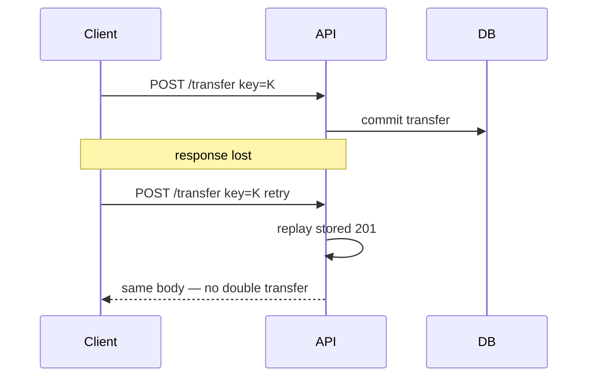
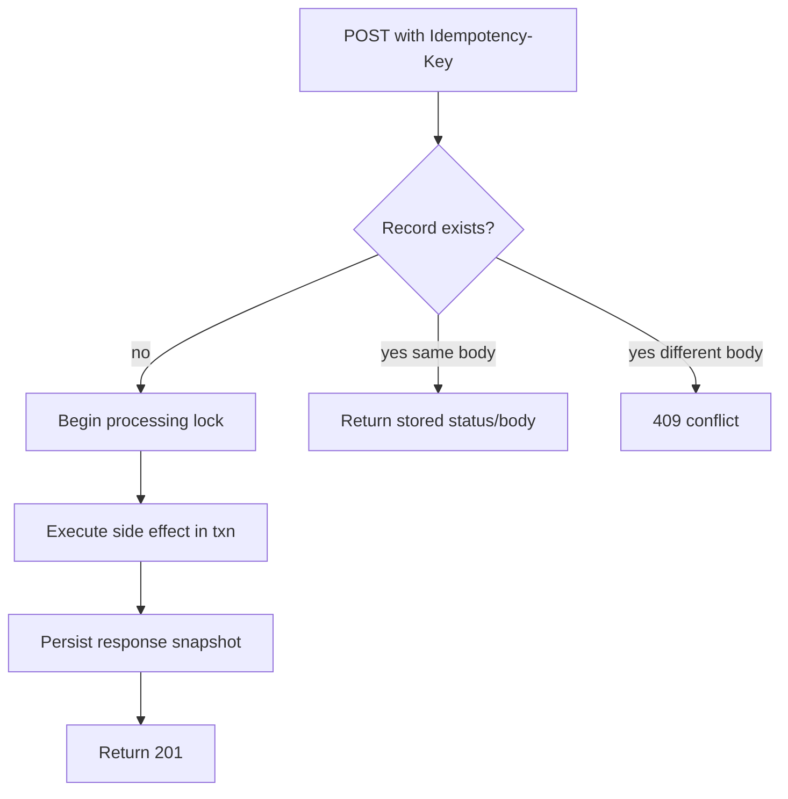
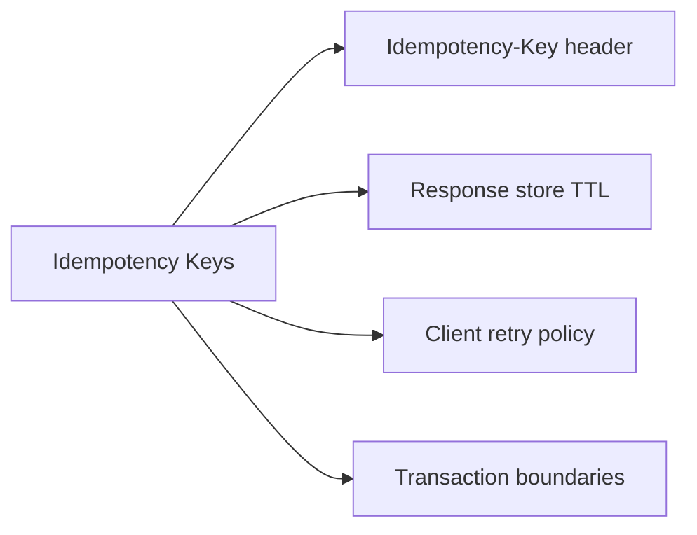
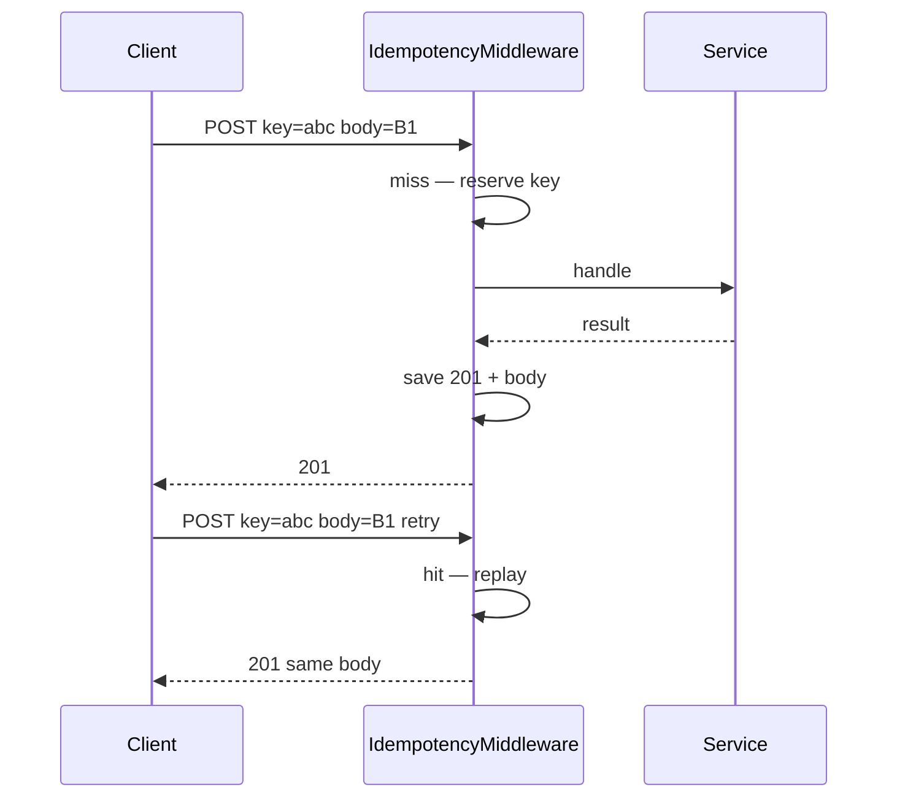

# Idempotency Keys and Safe Retries

## Overview

**Idempotency keys** let clients safely **retry** mutating requests (`POST`, sometimes `PATCH`) when networks time out or gateways return ambiguous errors. The server stores `(key, request fingerprint) → response` for a TTL and **replays** the same outcome on duplicate keys instead of performing the side effect twice.

"Exactly-once" is impossible in distributed systems; idempotency delivers **exactly-once intent** from the client's perspective. This is core backend contract design—especially payments, orders, and provisioning—not a database engine feature alone.

## Learning Objectives

- Require and validate `Idempotency-Key` headers on designated routes
- Implement store-and-replay semantics with conflict detection
- Choose HTTP statuses for first success, replay, and payload mismatch
- Combine idempotency with transactions and outbox patterns
- Explain retry rules to API consumers and mobile SDKs

## Prerequisites

- [[07-Backend/01-HTTP-APIs-and-Contracts/Status Codes as Product Policy|Status Codes as Product Policy]]
- [[07-Backend/00-Orientation/Backend Failure Modes in Production|Backend Failure Modes in Production]]
- [[07-Backend/08-Data-Access-and-Persistence-Patterns/Transactions as Used by Services|Transactions as Used by Services]]

## Difficulty

`advanced`

## Estimated Time

- Reading: 2 hours
- Exercises: 3 hours
- Mini project: 5 hours

## History

Payment APIs (Stripe and others) popularized `Idempotency-Key` headers for POST. HTTP already had idempotent methods (PUT, DELETE) but POST create dominates product APIs. Retries from mobile clients, Kubernetes ingresses, and message consumers made **application-level idempotency** standard for SRE-minded backends.

## Problem It Solves



Without keys: duplicate money movement, duplicate emails, duplicate inventory holds.

## Internal Implementation

### Idempotency record lifecycle



Storage can be Redis, Postgres table, or hybrid—engine details in [[08-Databases/README|Databases]]; **semantics** live here.

## Mermaid Diagrams

### Structure



### Sequence / Lifecycle — first vs replay



## Examples

### Minimal Example — in-memory store

```typescript
type Stored = { status: number; body: unknown; fingerprint: string };

export class IdempotencyStore {
  private map = new Map<string, Stored>();

  get(key: string): Stored | undefined {
    return this.map.get(key);
  }

  save(key: string, value: Stored) {
    this.map.set(key, value);
  }
}

function fingerprint(body: unknown): string {
  return JSON.stringify(body);
}
```

### Production-Shaped Example — Express middleware sketch

```typescript
import express from "express";
import { createHash } from "node:crypto";

type IdempotencyRecord = {
  status: number;
  body: string;
  requestHash: string;
};

export function idempotencyMiddleware(store: {
  get: (key: string) => Promise<IdempotencyRecord | null>;
  put: (key: string, rec: IdempotencyRecord) => Promise<void>;
}) {
  return async (req: express.Request, res: express.Response, next: express.NextFunction) => {
    if (req.method !== "POST") return next();

    const key = req.header("idempotency-key");
    if (!key || key.length < 8 || key.length > 128) {
      return res.status(400).json({ error: "invalid_idempotency_key" });
    }

    const hash = createHash("sha256").update(JSON.stringify(req.body ?? {})).digest("hex");
    const existing = await store.get(key);

    if (existing) {
      if (existing.requestHash !== hash) {
        return res.status(409).json({ error: "idempotency_key_conflict" });
      }
      res.status(existing.status).type("application/json").send(existing.body);
      return;
    }

    const originalJson = res.json.bind(res);
    res.json = (body: unknown) => {
      void store.put(key, {
        status: res.statusCode || 200,
        body: JSON.stringify(body),
        requestHash: hash,
      });
      return originalJson(body);
    };

    next();
  };
}
```

Production adds: TTL, in-flight lock, async completion (202), and transactional insert with business row ([[07-Backend/07-Caching-Jobs-and-Messaging/Transactional Outbox and Inbox Patterns|Transactional Outbox]]). Retry jitter: [[07-Backend/06-Reliability-and-Abuse-Resistance/Retries Jitter and Idempotent Handlers|Retries Jitter]].

## Trade-offs

| Dimension | Upside | Downside | When it matters |
| --- | --- | --- | --- |
| Mandatory keys on POST | Safe mobile retries | Client burden | Payments |
| Long TTL (24–72h) | Survives long offline | Storage growth | Consumer mobile |
| 409 on body mismatch | Detects key reuse bugs | Client must generate new keys | Shared client libs |
| DB-backed store | Durable replay | Latency on hot path | Financial APIs |

### When to Use

- POST that creates billable/stateful resources
- Webhook handlers processing external event IDs (natural idempotency key)

### When Not to Use

- Pure reads; idempotent PUT/DELETE with stable URIs (still document retry behavior)

## Exercises

1. Client retries POST after 503—should server replay or re-execute? Define policy.
2. Design Postgres table schema for idempotency records with TTL cleanup job.
3. What status for in-progress request when second arrives mid-flight?
4. Compare idempotency key vs natural key (`external_id` from partner).
5. Write client documentation paragraph for key generation (UUID v4).

## Mini Project

Add idempotency middleware to order `POST` with in-memory store + tests for replay and 409 conflict.

## Portfolio Project

Idempotency section in [[07-Backend/projects/API Contract and Reliability Harness/README|API Contract and Reliability Harness]] with fault injection timeout scenario.

## Interview Questions

1. Why isn't POST idempotent by default?
2. Difference between idempotency key and request deduplication window?
3. How long should idempotency records live?
4. What happens if store save fails after business commit?
5. How do idempotency keys interact with HTTP 503 retries?

### Stretch / Staff-Level

1. Design idempotency across multiple services (saga) without central store.
2. Compare Stripe-style header vs embedding key in body—trade-offs.

## Common Mistakes

- Keys optional "for now"
- Replaying only 200 but not 201 status
- No fingerprint — same key different body causes silent corruption
- Idempotency store outside transaction with business write

## Best Practices

- Document required routes in OpenAPI `parameters`
- Use cryptographic hash of canonical body for fingerprint
- Return same headers (`Location`) on replay
- Monitor replay rate vs new creates (ops signal)

## Summary

Idempotency keys turn unreliable networks into **safe retries** for POST-style product operations by storing and replaying responses keyed by client-provided identifiers. Express middleware or service-layer guards implement policy; databases provide durable storage; clients must generate unique keys. This is backend contract engineering—not optional sugar for payments-adjacent APIs.

## Further Reading

- [[07-Backend/06-Reliability-and-Abuse-Resistance/Retries Jitter and Idempotent Handlers|Retries Jitter and Idempotent Handlers]]
- Stripe idempotency documentation (industry reference)

## Related Notes

- [[07-Backend/01-HTTP-APIs-and-Contracts/Status Codes as Product Policy|Status Codes as Product Policy]]
- [[07-Backend/00-Orientation/Backend Failure Modes in Production|Backend Failure Modes in Production]]
- [[07-Backend/08-Data-Access-and-Persistence-Patterns/Transactions as Used by Services|Transactions as Used by Services]]
- [[06-NodeJS/05-Networking/Keep-Alive Timeouts and Connection Limits|Keep-Alive Timeouts and Connection Limits]]
- [[08-Databases/README|Databases]]
- [[09-System-Design/README|System Design]]

## Progress Checklist

- [ ] Explained from first principles
- [ ] Drew at least one Mermaid diagram
- [ ] Implemented a minimal version
- [ ] Documented trade-offs and non-goals
- [ ] Completed exercises
- [ ] Practiced interview questions aloud
- [ ] Linked prerequisites and dependents
