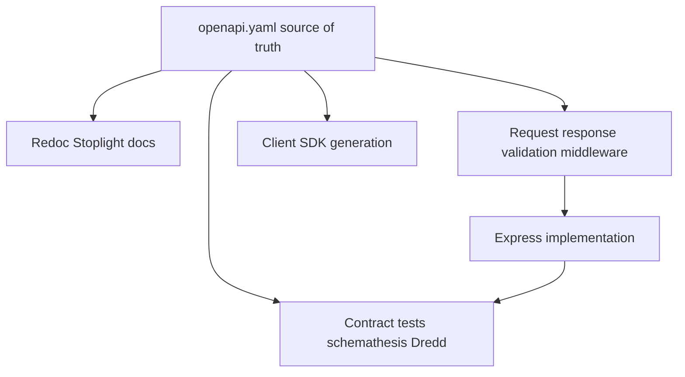
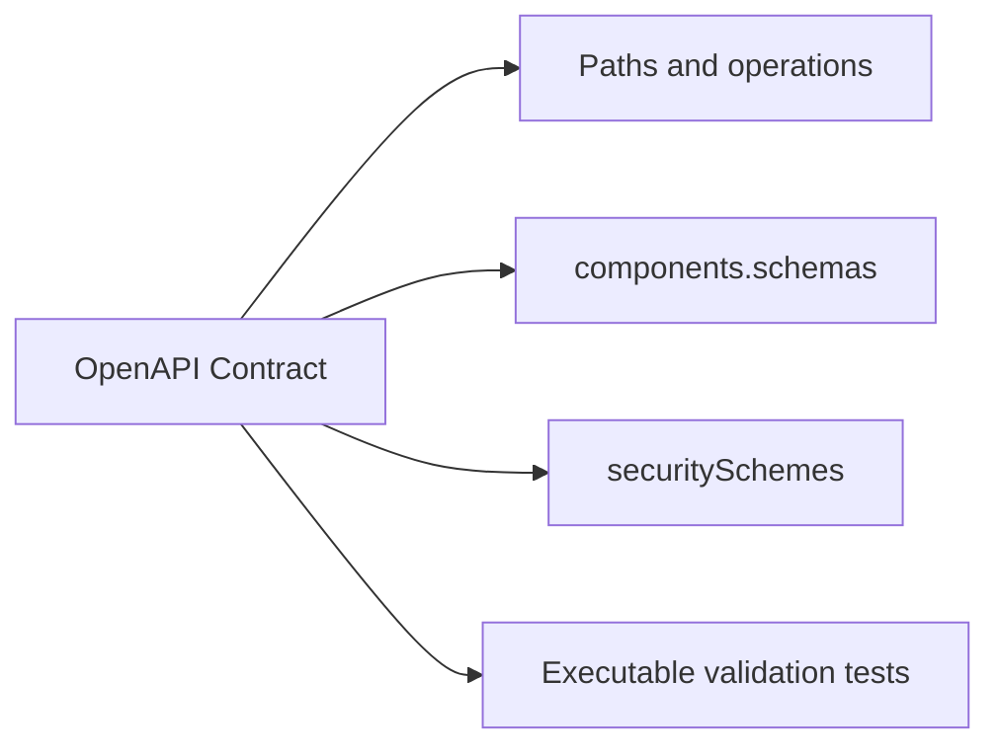
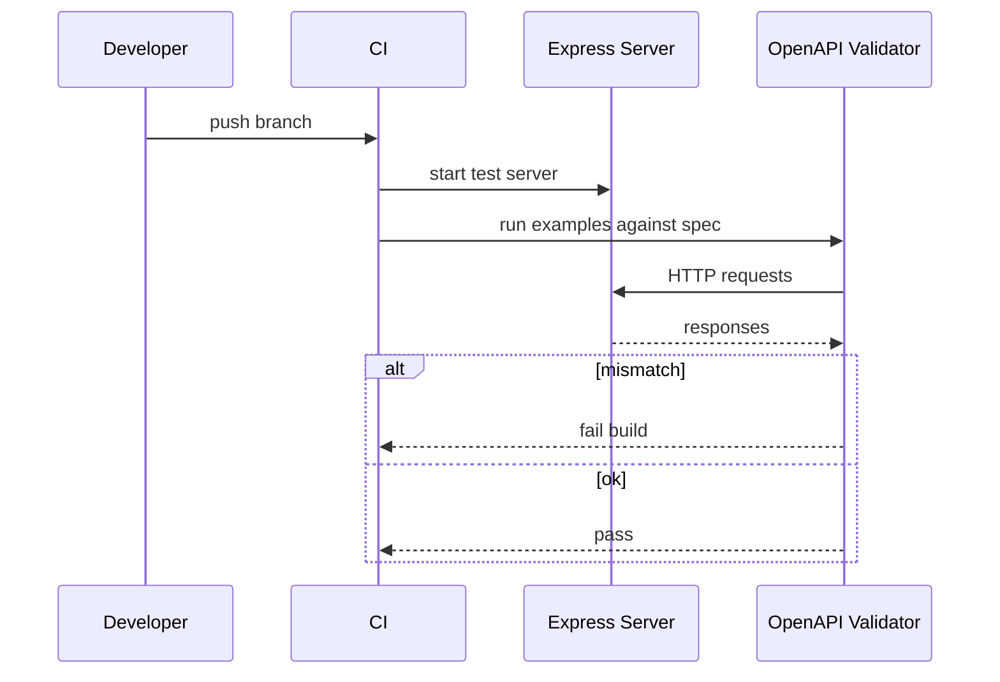

# OpenAPI as Executable Contract

## Overview

**OpenAPI** (formerly Swagger) describes HTTP APIs as machine-readable documents: paths, methods, parameters, request bodies, response schemas, and security schemes. Treating OpenAPI as an **executable contract** means it drives **validation**, **client/server codegen**, **contract tests**, and **documentation**—not a PDF generated after coding finishes.

For Express backends, OpenAPI bridges product policy ([[07-Backend/01-HTTP-APIs-and-Contracts/Status Codes as Product Policy|Status Codes]]) and implementation: drift between spec and behavior becomes a failing CI check.

## Learning Objectives

- Structure OpenAPI 3.1 documents for versioned REST APIs
- Generate or validate Express routes against schemas
- Use contract tests to catch status/body regressions
- Integrate OpenAPI into CI and partner onboarding
- Balance schema-first vs code-first workflows

## Prerequisites

- [[07-Backend/01-HTTP-APIs-and-Contracts/Resource Modeling and REST Semantics|Resource Modeling and REST Semantics]]
- [[07-Backend/01-HTTP-APIs-and-Contracts/Status Codes as Product Policy|Status Codes as Product Policy]]
- [[02-JavaScript/07-Production-JavaScript/Testing JavaScript|Testing JavaScript]]

## Difficulty

`advanced`

## Estimated Time

- Reading: 2 hours
- Exercises: 3 hours
- Mini project: 6 hours

## History

Swagger 1.x/2.0 (2010s) enabled codegen boom. OpenAPI 3.x added components, oneOf, webhooks; 3.1 aligns JSON Schema. Industry moved from "documentation artifact" to **contract gates** in CI—especially for public and partner APIs where breaking changes have legal/support cost.

## Problem It Solves

| Without executable OpenAPI | With executable OpenAPI |
| --- | --- |
| Undocumented query params | Shared parameter components |
| Breaking field rename ships silently | Contract test fails |
| Mock servers diverge from prod | Same schemas for mock and validation |
| Support guesses error shapes | Published response schemas per status |

## Internal Implementation

### Contract in the pipeline



HTTP protocol framing: [[01-Computer-Science/07-Networking-Fundamentals/HTTP as a Protocol|HTTP as a Protocol]]. Multi-team governance: [[09-System-Design/README|System Design]].

## Mermaid Diagrams

### Structure



### Sequence / Lifecycle — contract test in CI



## Examples

### Minimal Example — excerpt

```yaml
openapi: 3.1.0
info:
  title: Orders API
  version: 1.0.0
paths:
  /v1/orders:
    post:
      operationId: createOrder
      parameters:
        - in: header
          name: Idempotency-Key
          required: true
          schema:
            type: string
            minLength: 8
      requestBody:
        required: true
        content:
          application/json:
            schema:
              $ref: "#/components/schemas/CreateOrderRequest"
      responses:
        "201":
          description: Created
          content:
            application/json:
              schema:
                $ref: "#/components/schemas/Order"
        "422":
          description: Validation failed
          content:
            application/json:
              schema:
                $ref: "#/components/schemas/Error"
components:
  schemas:
    CreateOrderRequest:
      type: object
      required: [sku, quantity]
      properties:
        sku: { type: string }
        quantity: { type: integer, minimum: 1 }
    Order:
      type: object
      required: [id, status]
      properties:
        id: { type: string }
        status: { type: string }
    Error:
      type: object
      required: [error]
      properties:
        error: { type: string }
```

### Production-Shaped Example — validate with express-openapi-validator

```typescript
import express from "express";
import path from "node:path";
import { fileURLToPath } from "node:url";
import * as OpenApiValidator from "express-openapi-validator";

const __dirname = path.dirname(fileURLToPath(import.meta.url));

export function createValidatedApp() {
  const app = express();
  app.use(express.json());

  app.use(
    OpenApiValidator.middleware({
      apiSpec: path.join(__dirname, "../openapi.yaml"),
      validateRequests: true,
      validateResponses: process.env.NODE_ENV !== "production",
    })
  );

  app.post("/v1/orders", (req, res) => {
    res.status(201).json({ id: "ord_1", status: "pending" });
  });

  app.use((err: unknown, _req: express.Request, res: express.Response, _next: express.NextFunction) => {
    if (err && typeof err === "object" && "status" in err && "message" in err) {
      const e = err as { status: number; message: string };
      return res.status(e.status).json({ error: "validation_failed", message: e.message });
    }
    res.status(500).json({ error: "internal_error" });
  });

  return app;
}
```

Disable response validation in prod (latency); keep request validation at edge or selectively. Deeper validation module: [[07-Backend/03-Validation-Errors-and-Versioning/Schema Validation at the Edge|Schema Validation at the Edge]].

## Trade-offs

| Dimension | Upside | Downside | When it matters |
| --- | --- | --- | --- |
| Schema-first | Parallel client/server work | Upfront design cost | Partner APIs |
| Code-first + generate | Faster spike | Spec lags reality | Internal tools |
| Response validation | Catches handler bugs | CPU in prod if misused | CI/staging |
| Strict additionalProperties: false | Prevents drift | Breaking on unknown fields | Public APIs |

### When to Use

- Public, partner, and mobile-facing APIs
- Regulated change management (semver + compatibility windows)

### When Not to Use

- Throwaway prototypes—still add exit criterion to produce spec before GA

## Exercises

1. Write OpenAPI for `GET /v1/orders` with cursor pagination parameters and list envelope schema.
2. Add `problem+json` error response component referenced by 4xx/5xx.
3. Configure one contract test (Vitest + supertest) asserting 201 matches schema.
4. Document breaking vs non-breaking OpenAPI diff rules for your team.
5. When does codegen help vs hurt for TypeScript Express projects?

## Mini Project

Maintain `openapi.yaml` for 3-endpoint Orders API; CI script validates requests against spec using express-openapi-validator.

## Portfolio Project

[[07-Backend/projects/API Contract and Reliability Harness/README|API Contract and Reliability Harness]] — OpenAPI as single source of truth with smoke tests.

## Interview Questions

1. What makes OpenAPI "executable" vs documentation?
2. Schema-first vs code-first—trade-offs?
3. How do you test backward compatibility between spec versions?
4. Where should request validation live—gateway or Express?
5. How does OpenAPI relate to JSON Schema?

### Stretch / Staff-Level

1. Design CI gates for openapi diff on pull requests (oasdiff, optic).
2. Multi-file OpenAPI monorepo layout for 20 microservices—without duplicating components.

## Common Mistakes

- Spec never updated after code change
- Response schemas only document 200—omit 4xx/5xx
- Using examples instead of schemas for validation
- `any`/`object` schemas that validate nothing

## Best Practices

- `$ref` shared components for Error, Pagination, Money
- Pin spec version to API `/v1` prefix
- Contract tests on every PR; publish spec to portal on release
- Link operations to idempotency and status policy docs

## Summary

OpenAPI turns HTTP API design into an **executable contract**: schemas, statuses, and parameters that validators and tests enforce against Express implementations. Schema-first or code-first, the spec must stay authoritative for partners and CI—Backend product policy written for machines and humans alike.

## Further Reading

- OpenAPI 3.1 specification
- [[07-Backend/09-API-Observability-and-Testing/Contract Integration and Load Testing|Contract Integration and Load Testing]]

## Related Notes

- [[07-Backend/03-Validation-Errors-and-Versioning/Schema Validation at the Edge|Schema Validation at the Edge]]
- [[07-Backend/01-HTTP-APIs-and-Contracts/Idempotency Keys and Safe Retries|Idempotency Keys and Safe Retries]]
- [[07-Backend/01-HTTP-APIs-and-Contracts/Pagination Filtering and Sorting Contracts|Pagination Filtering and Sorting Contracts]]
- [[02-JavaScript/07-Production-JavaScript/Testing JavaScript|Testing JavaScript]]
- [[08-Databases/README|Databases]]
- [[09-System-Design/README|System Design]]

## Progress Checklist

- [ ] Explained from first principles
- [ ] Drew at least one Mermaid diagram
- [ ] Implemented a minimal version
- [ ] Documented trade-offs and non-goals
- [ ] Completed exercises
- [ ] Practiced interview questions aloud
- [ ] Linked prerequisites and dependents
