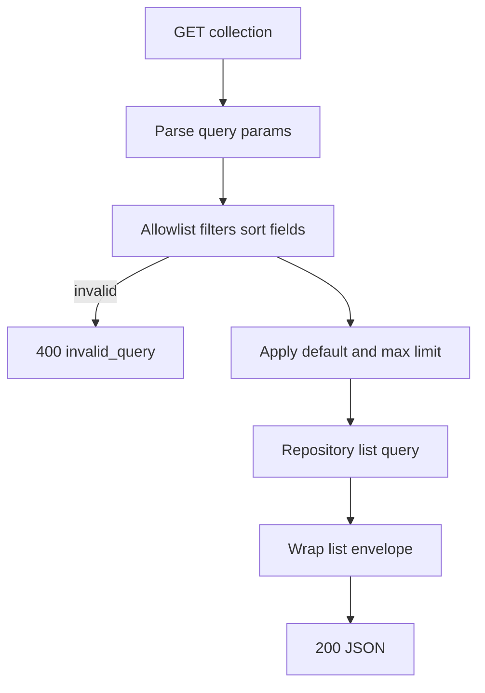
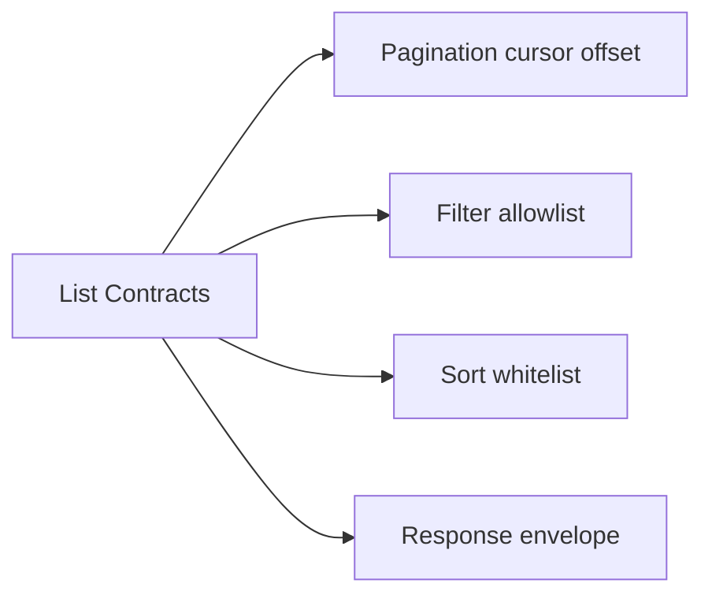
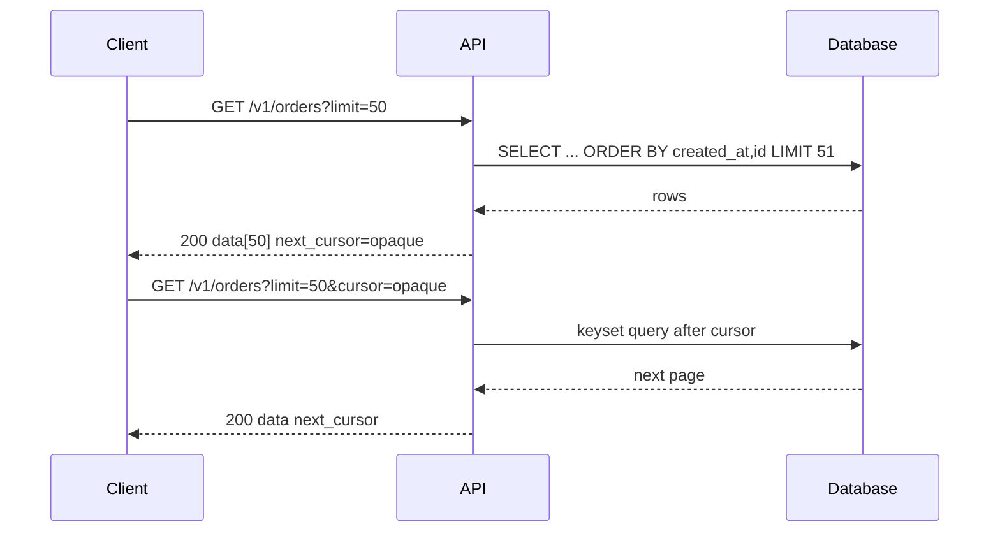

# Pagination Filtering and Sorting Contracts

## Overview

List endpoints (`GET /v1/orders`) need explicit **pagination**, **filtering**, and **sorting** contracts—not ad hoc query parameters per route. Clients depend on stable shapes: `data`, `next_cursor`, `total` (optional), filter operators, and sort whitelist. Database engines implement indexes and query plans ([[08-Databases/README|Databases]]); Backend defines **what clients may request** and **how results are bounded**.

Poor list contracts cause unbounded scans, timing attacks via sort injection, and mobile clients that cannot sync incrementally.

## Learning Objectives

- Choose offset vs cursor pagination with trade-offs
- Design filter query syntax with allowlists
- Define sort fields and direction policy
- Return stable list envelopes in JSON
- Connect list APIs to abuse limits and index discipline

## Prerequisites

- [[07-Backend/01-HTTP-APIs-and-Contracts/Resource Modeling and REST Semantics|Resource Modeling and REST Semantics]]
- [[07-Backend/01-HTTP-APIs-and-Contracts/Status Codes as Product Policy|Status Codes as Product Policy]]
- [[08-Databases/README|Databases]] — index concepts (handoff)

## Difficulty

`intermediate`

## Estimated Time

- Reading: 2 hours
- Exercises: 2 hours
- Mini project: 4 hours

## History

Early APIs used `?page=2&limit=20` offset pagination—simple but unstable under concurrent inserts. Twitter/Facebook popularized **cursor** pagination for feeds. OData and JSON:API standardized query patterns; most teams pick a **minimal subset** documented in OpenAPI. Keyset pagination aligns with DB indexes—Backend contract must match what storage can serve efficiently.

## Problem It Solves

| Failure | Contract fix |
| --- | --- |
| `GET /orders` returns 100k rows | Default limit + max limit + 400 on abuse |
| Page 5 skips/duplicates rows during writes | Cursor/keyset pagination |
| `?sort=;DROP TABLE` | Sort field allowlist |
| Filters differ per endpoint | Shared query parameter conventions |

## Internal Implementation

### List request pipeline



### Offset vs cursor

| Style | Pros | Cons |
| --- | --- | --- |
| Offset (`page`, `limit`) | Jump to page N | Slow/deep pages; inconsistent under churn |
| Cursor (opaque token) | Stable iteration; index-friendly | No random access; token design required |
| Keyset (`created_at,id`) | Efficient with composite index | Expose or encode tuple in cursor |

## Mermaid Diagrams

### Structure



### Sequence / Lifecycle — cursor page



## Examples

### Minimal Example — offset with envelope

```typescript
type ListResult<T> = {
  data: T[];
  page: number;
  limit: number;
  hasMore: boolean;
};

export function listEnvelope<T>(rows: T[], page: number, limit: number, fetched: number): ListResult<T> {
  const hasMore = fetched > limit;
  return {
    data: rows.slice(0, limit),
    page,
    limit,
    hasMore,
  };
}
```

### Production-Shaped Example — cursor + allowlists

```typescript
import express from "express";

const ALLOWED_SORT = new Set(["created_at", "-created_at", "id"]);
const MAX_LIMIT = 100;

export function parseListQuery(q: express.Request["query"]) {
  const limitRaw = Number(q.limit ?? 20);
  const limit = Number.isFinite(limitRaw) ? Math.min(Math.max(1, limitRaw), MAX_LIMIT) : 20;
  const sort = String(q.sort ?? "-created_at");
  if (!ALLOWED_SORT.has(sort)) {
    throw new ListQueryError("invalid_sort");
  }
  const status = q.status ? String(q.status) : undefined;
  const cursor = q.cursor ? String(q.cursor) : undefined;
  return { limit, sort, status, cursor };
}

class ListQueryError extends Error {
  constructor(readonly code: string) {
    super(code);
  }
}

export function ordersRouter(repo: {
  list: (opts: ReturnType<typeof parseListQuery>) => Promise<{ items: unknown[]; nextCursor?: string }>;
}) {
  const router = express.Router();
  router.get("/", async (req, res, next) => {
    try {
      const opts = parseListQuery(req.query);
      const { items, nextCursor } = await repo.list(opts);
      res.status(200).json({ data: items, next_cursor: nextCursor ?? null });
    } catch (err) {
      if (err instanceof ListQueryError) {
        return res.status(400).json({ error: err.code });
      }
      next(err);
    }
  });
  return router;
}
```

Index design for `created_at, id` belongs in Databases notes—not duplicated here.

## Trade-offs

| Dimension | Upside | Downside | When it matters |
| --- | --- | --- | --- |
| Cursor pagination | Stable, scalable lists | Harder "jump to page" UX | Feeds, logs, sync |
| Offset pagination | Simple mental model | DB cost at depth | Admin tables, small data |
| Total count in response | UX progress bars | Expensive COUNT(*) | Catalog browse |
| Rich filter DSL | Power users | Parse bugs, injection | Internal APIs only |

### When to Use

- Any collection GET that can grow beyond one screen
- Mobile delta sync (cursor + `updated_since` filter)

### When Not to Use

- Tiny fixed enumerations—return full set with short cache TTL

## Exercises

1. Design cursor encoding for `(created_at, id)`—opaque base64 vs signed token.
2. Write OpenAPI parameters for `limit`, `cursor`, `sort`, `status`.
3. Explain duplicate/skipped rows with offset pagination under concurrent inserts.
4. Add max limit middleware returning 400 when `limit=10000`.
5. Which filters require composite indexes? Hand off example to Databases study.

## Mini Project

Implement in-memory order list with cursor pagination and sort allowlist. Vitest: walk all pages without duplicates.

## Portfolio Project

List contract for [[07-Backend/projects/URL Shortener API/README|URL Shortener API]] `/v1/links` with cursor and `q` search filter.

## Interview Questions

1. Offset vs cursor pagination trade-offs?
2. How do you prevent sort parameter SQL injection?
3. Should list endpoints include total count?
4. How does pagination interact with caching?
5. Design list API for real-time changing data.

### Stretch / Staff-Level

1. Bi-directional cursor pagination for chat history—contract design.
2. GraphQL connections vs REST list contracts—when to choose which.

## Common Mistakes

- Unbounded `limit` defaulting to all rows
- Different envelope shapes per resource
- Exposing internal sort column names without allowlist
- Offset pagination on million-row tables without warning in docs

## Best Practices

- Document defaults and maxima in OpenAPI
- Use keyset cursors aligned with indexes (coordinate with DBAs)
- Return `null` vs omit for `next_cursor` consistently
- Rate-limit expensive list endpoints ([[07-Backend/06-Reliability-and-Abuse-Resistance/Rate Limiting and Quotas|Rate Limiting]])

## Summary

Pagination, filtering, and sorting are **list endpoint contracts**—how clients walk large collections safely and predictably. Backend defines envelopes, allowlists, and limits; repositories translate to queries; database engines own index efficiency. Express handlers stay thin; abuse and stability concerns drive cursor-first designs for production feeds.

## Further Reading

- [[07-Backend/01-HTTP-APIs-and-Contracts/OpenAPI as Executable Contract|OpenAPI as Executable Contract]]
- [[08-Databases/README|Databases]] — indexes and query planning

## Related Notes

- [[07-Backend/01-HTTP-APIs-and-Contracts/Resource Modeling and REST Semantics|Resource Modeling and REST Semantics]]
- [[07-Backend/08-Data-Access-and-Persistence-Patterns/N-plus-1 and Query Shape Discipline|N-plus-1 and Query Shape Discipline]]
- [[01-Computer-Science/07-Networking-Fundamentals/HTTP as a Protocol|HTTP as a Protocol]]
- [[06-NodeJS/05-Networking/Request Response Lifecycle and Headers|Request Response Lifecycle and Headers]]
- [[08-Databases/README|Databases]]
- [[09-System-Design/README|System Design]]

## Progress Checklist

- [ ] Explained from first principles
- [ ] Drew at least one Mermaid diagram
- [ ] Implemented a minimal version
- [ ] Documented trade-offs and non-goals
- [ ] Completed exercises
- [ ] Practiced interview questions aloud
- [ ] Linked prerequisites and dependents
