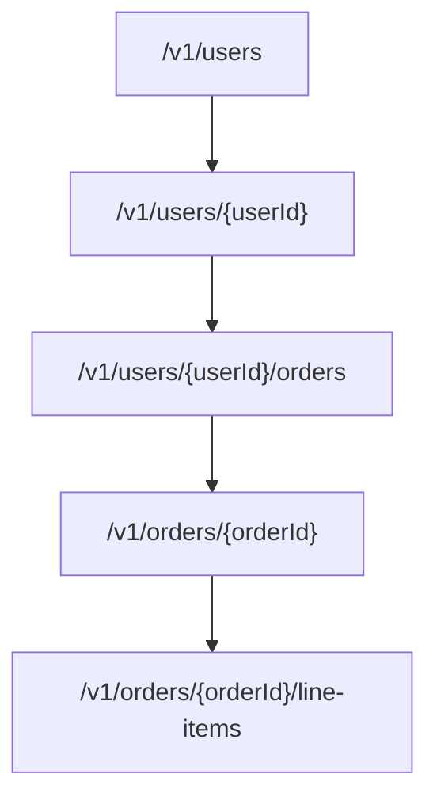
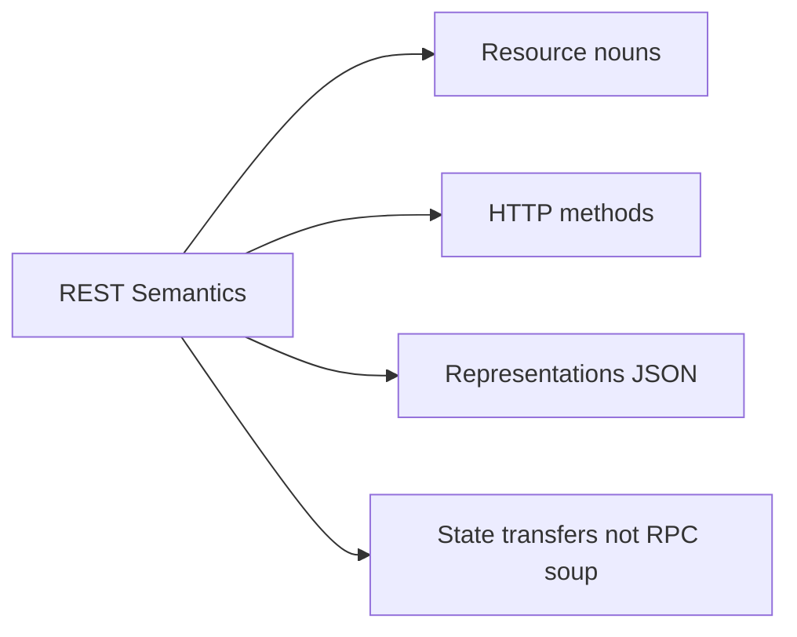
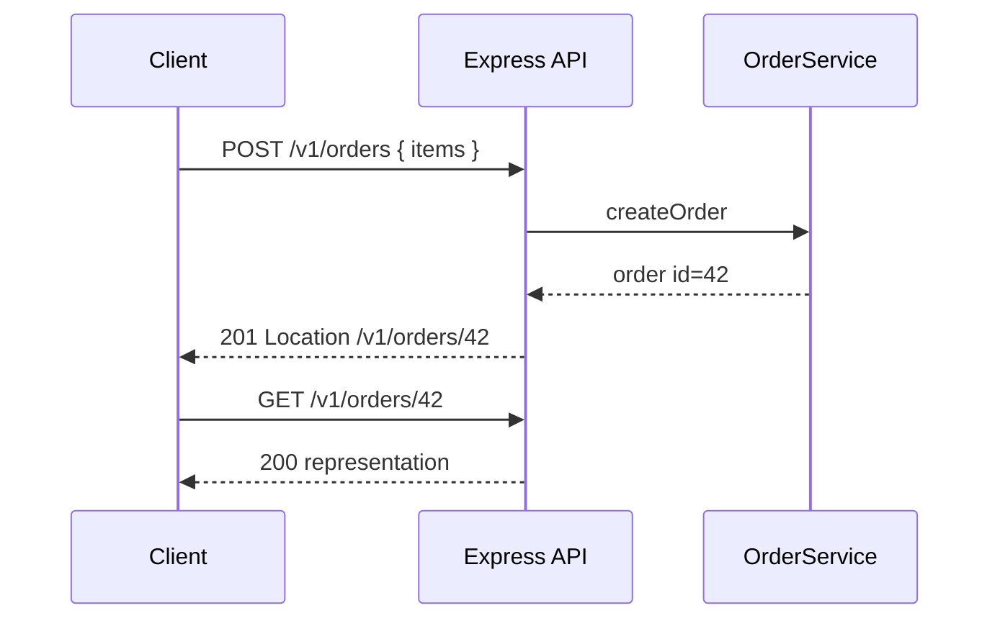

# Resource Modeling and REST Semantics

## Overview

**Resource modeling** names the nouns your API exposes—users, orders, invoices—and maps them to **URIs**, **HTTP methods**, and **representations**. REST is not "CRUD on tables"; it is a **contract discipline**: identifiers are stable, methods have semantics, and state changes prefer safe/idempotent verbs where possible.

Production APIs fail when URLs encode actions (`/createOrder`), leak implementation (`/getUserByEmail`), or mix collection and singleton rules inconsistently. This note teaches resource-first design for Express services, with clear handoffs to status policy, pagination, and OpenAPI modules.

## Learning Objectives

- Model collections vs singletons vs sub-resources
- Apply HTTP method semantics (GET safe, PUT idempotent, POST non-idempotent by default)
- Design URIs for versioning, tenancy, and evolution
- Map domain aggregates to public resources without 1:1 table exposure
- Recognize when RPC-style endpoints are justified

## Prerequisites

- [[01-Computer-Science/07-Networking-Fundamentals/HTTP as a Protocol|HTTP as a Protocol]]
- [[07-Backend/00-Orientation/Why Backend Services Exist|Why Backend Services Exist]]
- [[06-NodeJS/05-Networking/Request Response Lifecycle and Headers|Request Response Lifecycle and Headers]]

## Difficulty

`intermediate`

## Estimated Time

- Reading: 2 hours
- Exercises: 2 hours
- Mini project: 4 hours

## History

Roy Fielding's dissertation (2000) described architectural constraints—stateless communication, uniform interface—not a JSON style guide. Industry reduced REST to "HTTP + JSON + nouns," often correctly for product APIs. GraphQL and gRPC later challenged over-fetching and typing gaps, but **resource URLs** remain the lingua franca for public HTTP APIs, cache semantics, and CDN integration.

## Problem It Solves

| Bad pattern | Resource-oriented fix |
| --- | --- |
| `POST /deleteUser` | `DELETE /v1/users/{id}` |
| `GET /searchOrders?...` as only entry | `GET /v1/orders?status=...` collection filter |
| Exposing internal join IDs | Sub-resource: `/v1/orders/{id}/line-items` |
| Ambiguous pluralization | Consistent `/users`, `/orders` collections |

## Internal Implementation

### Resource graph (example commerce API)



Prefer **canonical** URLs for primary resources (`/v1/orders/{id}`) even when nested routes exist for discovery.

### Method semantics

| Method | Safe | Idempotent | Typical use |
| --- | --- | --- | --- |
| GET | Yes | Yes | Read representation |
| HEAD | Yes | Yes | Metadata only |
| PUT | No | Yes | Replace resource at URI |
| PATCH | No | No* | Partial update |
| POST | No | No | Create, actions, searches |
| DELETE | No | Yes | Remove resource |

*PATCH idempotency depends on patch semantics—document yours.

## Mermaid Diagrams

### Structure



### Sequence / Lifecycle — create sub-resource



## Examples

### Minimal Example — collection + item routes

```typescript
import express from "express";

export function createOrderRoutes(service: {
  list: (q: { status?: string }) => Promise<unknown[]>;
  get: (id: string) => Promise<unknown | null>;
  create: (body: unknown) => Promise<{ id: string }>;
}) {
  const router = express.Router();

  router.get("/", async (req, res) => {
    const orders = await service.list({ status: req.query.status as string | undefined });
    res.status(200).json({ data: orders });
  });

  router.get("/:orderId", async (req, res) => {
    const order = await service.get(req.params.orderId);
    if (!order) return res.status(404).json({ error: "not_found" });
    res.status(200).json(order);
  });

  router.post("/", async (req, res) => {
    const created = await service.create(req.body);
    res.status(201).location(`/v1/orders/${created.id}`).json(created);
  });

  return router;
}
```

Mount at `/v1/orders`—version prefix is part of the contract ([[07-Backend/03-Validation-Errors-and-Versioning/API Versioning Strategies|API Versioning Strategies]]).

### Production-Shaped Example — action as sub-resource

When an operation is not a CRUD fit, model a **resource** for the action:

```typescript
// POST /v1/orders/{id}/cancellations  — creates a cancellation request resource
router.post("/:orderId/cancellations", async (req, res, next) => {
  try {
    const result = await orderService.requestCancellation(req.params.orderId, req.body);
    res.status(202).json(result); // async processing
  } catch (err) {
    next(err);
  }
});
```

Prefer this over `POST /v1/cancelOrder` RPC when you need audit trails, idempotency keys, and consistent polling (`GET /v1/cancellations/{id}`).

## Trade-offs

| Dimension | Upside | Downside | When it matters |
| --- | --- | --- | --- |
| Strict REST | Predictable caching and verbs | Awkward for complex searches | Public APIs |
| RPC endpoints | Expressive for batch jobs | Harder standard tooling | Internal admin |
| Nested URLs | Discoverability | Coupling to parent existence | User-scoped lists |
| Flat canonical IDs | Stable links | More authZ checks | Partner integrations |

### When to Use

- Public and partner HTTP APIs
- Resources with clear lifecycle and CRUD + a few state transitions

### When Not to Use

- High-volume read models needing arbitrary client queries—consider GraphQL/BFF (System Design handoff)
- Streaming/event APIs where HTTP resources are the wrong abstraction

## Exercises

1. Redesign `POST /api/doCheckout` as resource-oriented routes; list methods and paths.
2. For a blog API, model posts, comments, tags—draw resource graph.
3. When is `PUT /users/1` vs `PATCH /users/1` appropriate? Give JSON examples.
4. Argue for or against `GET /users/me` as alias for authenticated user.
5. Map three database tables to public resources—what do you hide?

## Mini Project

Implement `/v1/projects` and `/v1/projects/:id/tasks` with in-memory store. Enforce that tasks cannot be fetched across projects without 404.

## Portfolio Project

Resource model section for [[07-Backend/projects/URL Shortener API/README|URL Shortener API]]: links, aliases, analytics events as resources or not—with justification.

## Interview Questions

1. Difference between safe and idempotent HTTP methods?
2. When would you use POST for an update?
3. How do you model "search" in REST?
4. What is wrong with verb-based URLs?
5. How does resource design affect caching?

### Stretch / Staff-Level

1. Design resources for a multi-step onboarding workflow with async steps.
2. Compare REST resources to gRPC services for the same domain—integration trade-offs.

## Common Mistakes

- Mirror database tables 1:1 in public API
- Use GET for mutations via query string
- Omit `Location` header on 201
- Inconsistent pluralization and version prefixes across routes

## Best Practices

- Document resource catalog in OpenAPI before coding
- Use nouns, plural collections, stable IDs in paths
- Keep RPC escape hatches rare and named as sub-resources
- Align with status policy ([[07-Backend/01-HTTP-APIs-and-Contracts/Status Codes as Product Policy|Status Codes as Product Policy]])

## Summary

Resource modeling turns your product into addressable HTTP nouns with method semantics clients and caches can rely on. Express routers express the graph; domain services enforce invariants beneath. REST is a discipline for **evolvable contracts**—not an excuse to expose every table or encode verbs in URLs.

## Further Reading

- [[01-Computer-Science/07-Networking-Fundamentals/HTTP as a Protocol|HTTP as a Protocol]]
- [[07-Backend/01-HTTP-APIs-and-Contracts/OpenAPI as Executable Contract|OpenAPI as Executable Contract]]

## Related Notes

- [[07-Backend/01-HTTP-APIs-and-Contracts/Status Codes as Product Policy|Status Codes as Product Policy]]
- [[07-Backend/01-HTTP-APIs-and-Contracts/Pagination Filtering and Sorting Contracts|Pagination Filtering and Sorting Contracts]]
- [[06-NodeJS/05-Networking/http and https Platform Servers|http and https Platform Servers]]
- [[02-JavaScript/06-Modules-and-Tooling/ES Modules|ES Modules]]
- [[08-Databases/README|Databases]]
- [[09-System-Design/README|System Design]]

## Progress Checklist

- [ ] Explained from first principles
- [ ] Drew at least one Mermaid diagram
- [ ] Implemented a minimal version
- [ ] Documented trade-offs and non-goals
- [ ] Completed exercises
- [ ] Practiced interview questions aloud
- [ ] Linked prerequisites and dependents
