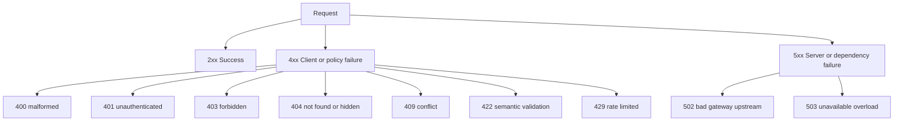
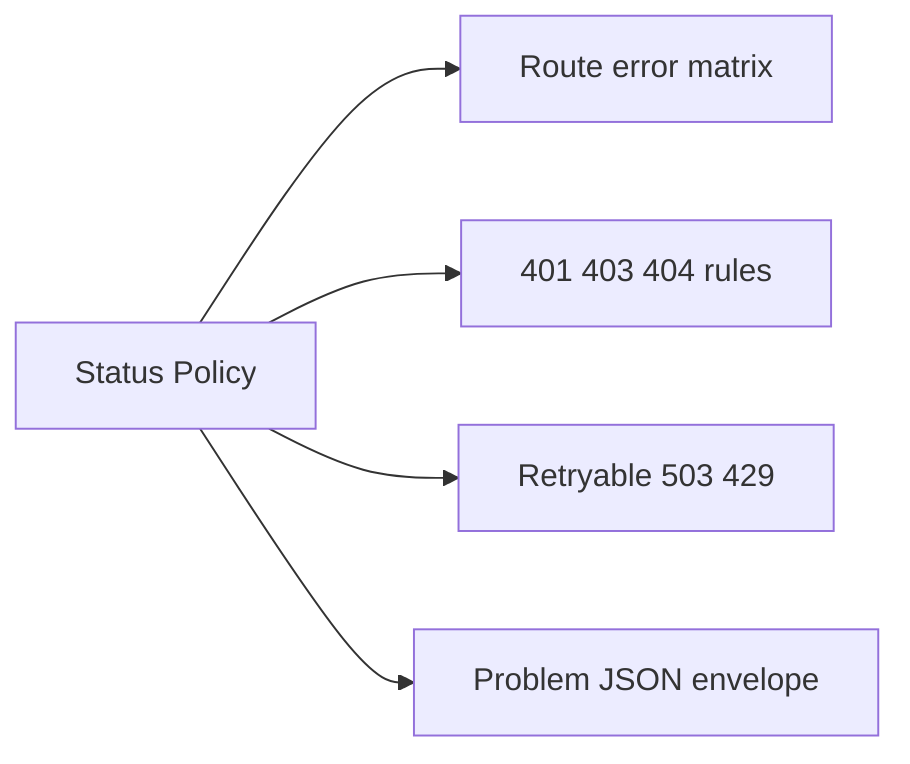
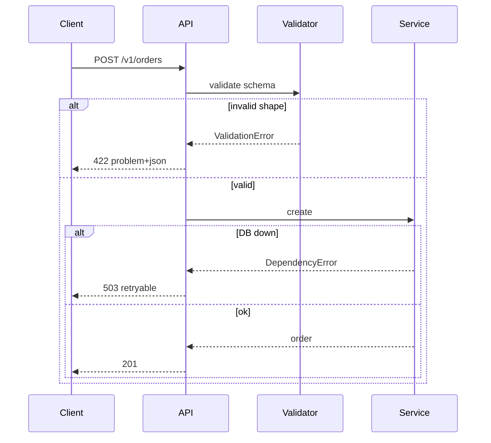

# Status Codes as Product Policy

## Overview

HTTP **status codes** are not implementation details—they are **product policy** communicated to clients, caches, proxies, and retry logic. A backend team publishes a **status matrix**: which codes mean "retry," which mean "fix the request," which mean "user lacks permission," and which mean "our fault."

Returning 200 for failures, 500 for validation bugs, or 404 vs 403 inconsistently breaks mobile offline queues, CDN behavior, and SLO dashboards. This note defines how Express services map domain outcomes to statuses deliberately.

## Learning Objectives

- Build a status/error matrix for a resource API
- Distinguish 400 vs 422 vs 409 in product terms
- Apply 401 vs 403 vs 404 for auth failures (including IDOR policy)
- Choose 503 vs 429 vs 502 for dependency and overload failures
- Align status policy with client retry and observability

## Prerequisites

- [[07-Backend/01-HTTP-APIs-and-Contracts/Resource Modeling and REST Semantics|Resource Modeling and REST Semantics]]
- [[01-Computer-Science/07-Networking-Fundamentals/HTTP as a Protocol|HTTP as a Protocol]]
- [[07-Backend/00-Orientation/Backend Failure Modes in Production|Backend Failure Modes in Production]]

## Difficulty

`intermediate`

## Estimated Time

- Reading: 1.5 hours
- Exercises: 1.5 hours
- Mini project: 3 hours

## History

HTTP/1.0 and RFC 7231 codified status classes (1xx–5xx). Browsers treated codes simply; API clients and intermediaries grew sophisticated—retry only idempotent methods on certain codes, treat 429 as backoff signal. Problem Details (RFC 9457) standardized machine-readable error bodies. Modern API teams treat the matrix as **versioned contract** alongside OpenAPI.

## Problem It Solves

| Client behavior | Requires consistent status policy |
| --- | --- |
| Automatic retry on timeout | 503 + Retry-After vs ambiguous 500 |
| Form validation UX | 422 with field errors, not 400 soup |
| Security scanners | 404 vs 403 policy for missing vs forbidden resources |
| RED metrics | 4xx product vs 5xx server classification |

## Internal Implementation

### Status class policy (default backend stance)



### Mapping layer in Express

Domain throws typed errors → error middleware maps to status + body. Never map in random catch blocks per route.

## Mermaid Diagrams

### Structure



### Sequence / Lifecycle — validation vs server error



## Examples

### Minimal Example — typed error mapping

```typescript
import express from "express";

export class AppError extends Error {
  constructor(
    readonly status: number,
    readonly code: string,
    message?: string
  ) {
    super(message ?? code);
  }
}

export function errorMiddleware(err: unknown, _req: express.Request, res: express.Response, _next: express.NextFunction) {
  if (err instanceof AppError) {
    return res.status(err.status).json({
      error: err.code,
      message: err.message,
    });
  }
  console.error(err);
  res.status(500).json({ error: "internal_error" });
}

// usage in route
// throw new AppError(409, "duplicate_email");
```

### Production-Shaped Example — policy table in code comments + middleware

```typescript
/**
 * Status policy (v1):
 * 400 — malformed JSON, missing required headers (Idempotency-Key)
 * 401 — missing/invalid credentials
 * 403 — authenticated but not permitted
 * 404 — resource not found OR not visible (IDOR policy)
 * 409 — idempotency replay conflict, version mismatch
 * 422 — schema-valid JSON but business validation failed
 * 429 — rate limit exceeded
 * 502 — upstream returned invalid response
 * 503 — dependency timeout/overload (retryable)
 */
import express from "express";

export function createApp() {
  const app = express();
  app.use(express.json());

  app.get("/v1/invoices/:id", async (req, res, next) => {
    try {
      const invoice = await invoiceService.getForCaller(req.params.id, callerFrom(req));
      if (!invoice) {
        // Policy: return 404 whether missing or cross-tenant (no enumeration)
        return res.status(404).json({ error: "not_found" });
      }
      res.status(200).json(invoice);
    } catch (err) {
      next(err);
    }
  });

  app.use(errorMiddleware);
  return app;
}

function callerFrom(_req: express.Request) {
  return { userId: "demo" };
}

const invoiceService = {
  async getForCaller(_id: string, _caller: { userId: string }) {
    return null;
  },
};
```

Problem Details depth: [[07-Backend/03-Validation-Errors-and-Versioning/Problem Details and Error Envelopes|Problem Details and Error Envelopes]].

## Trade-offs

| Dimension | Upside | Downside | When it matters |
| --- | --- | --- | --- |
| Strict 404 for IDOR | Prevents enumeration | Harder support debugging | Multi-tenant SaaS |
| 422 for validation | Clear client fix path | Must stabilize field error shape | Mobile forms |
| 503 for deps | Signals retry | Clients may amplify load | Outage storms |
| Minimal 4xx bodies | Less leakage | Poor DX | Public APIs |

### When to Use

- Every public and partner API from v1 onward
- Error middleware centralization in Express apps

### When Not to Use

- Never use 200 with error payload for HTTP APIs (non-HTTP protocols differ)

## Exercises

1. Write status matrix for `DELETE /v1/sessions/{id}` including auth and not-found cases.
2. Should duplicate idempotency replay return 200 or 409? Defend for mobile clients.
3. Convert five `{ success: false }` 200 responses to proper statuses.
4. Which codes should trigger retry on GET? on POST with idempotency key?
5. Map each status to RED metrics bucket (success vs client vs server).

## Mini Project

Implement centralized `AppError` hierarchy and Express error middleware for a 3-route API. Document matrix in README.

## Portfolio Project

Add status policy appendix to OpenAPI in [[07-Backend/projects/API Contract and Reliability Harness/README|API Contract and Reliability Harness]].

## Interview Questions

1. 400 vs 422 vs 409?
2. When do you return 404 instead of 403?
3. What makes a 503 retryable?
4. Why is 500 on validation bugs harmful?
5. How do proxies use status codes differently than browsers?

### Stretch / Staff-Level

1. Design status policy for partial success batch APIs (207 Multi-Status vs 422).
2. How should webhooks map internal failures to delivery retry schedules?

## Common Mistakes

- 500 for `if (!user) return ...`
- Different routes using different error JSON shapes
- Omitting `Retry-After` on 503/429 when policy says retry
- Logging 401 as ERROR (noise in SLOs)

## Best Practices

- Publish matrix in OpenAPI descriptions
- One error middleware; typed domain errors
- Align with idempotency replay semantics
- Test status codes in contract tests—not only JSON bodies

## Summary

Status codes are the API's **machine-readable policy** for success, client mistakes, authorization, conflicts, and server failure. Express services should map domain outcomes through a single, documented matrix so clients, caches, and metrics interpret responses consistently—never as an afterthought in each route handler.

## Further Reading

- RFC 7231, RFC 9457 Problem Details
- [[07-Backend/03-Validation-Errors-and-Versioning/Problem Details and Error Envelopes|Problem Details and Error Envelopes]]

## Related Notes

- [[07-Backend/01-HTTP-APIs-and-Contracts/Idempotency Keys and Safe Retries|Idempotency Keys and Safe Retries]]
- [[07-Backend/00-Orientation/Backend Failure Modes in Production|Backend Failure Modes in Production]]
- [[01-Computer-Science/07-Networking-Fundamentals/HTTP as a Protocol|HTTP as a Protocol]]
- [[06-NodeJS/05-Networking/Request Response Lifecycle and Headers|Request Response Lifecycle and Headers]]
- [[08-Databases/README|Databases]]
- [[09-System-Design/README|System Design]]

## Progress Checklist

- [ ] Explained from first principles
- [ ] Drew at least one Mermaid diagram
- [ ] Implemented a minimal version
- [ ] Documented trade-offs and non-goals
- [ ] Completed exercises
- [ ] Practiced interview questions aloud
- [ ] Linked prerequisites and dependents
