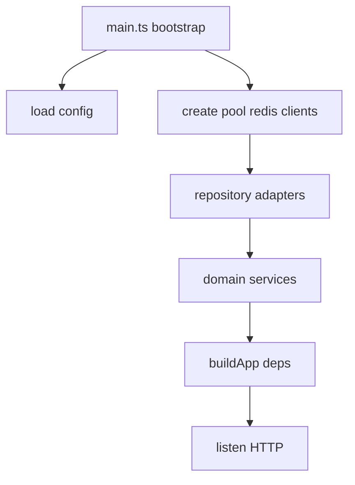
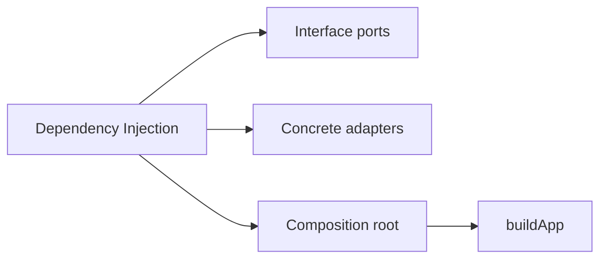
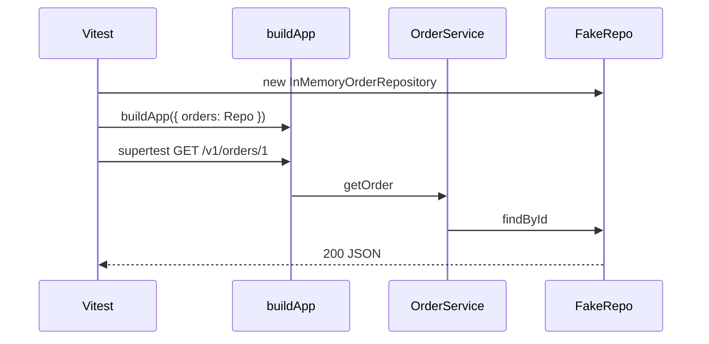

# Dependency Injection for Services

## Overview

**Dependency injection (DI)** supplies a component's collaborators from the outside—constructors or factory parameters—instead of hard-coding `new PostgresOrderRepo()` inside handlers. For Express backends, DI means **`createApp(deps)`** composes routers, domain services, and repository adapters in one bootstrap module, enabling tests to inject fakes without listening on ports.

You do not need a DI container to practice DI. Manual composition roots are preferred until graph complexity justifies tools (tsyringe, awilix). DI supports hexagonal ports ([[07-Backend/00-Orientation/Service Layering and Hexagonal Intuition|Service Layering]])—adapters are injected implementations of interfaces.

## Learning Objectives

- Compose Express apps with explicit dependency records
- Inject repositories, clocks, and config for testability
- Contrast constructor injection vs service locator anti-pattern
- Scope dependencies per-request vs singleton correctly
- Know when a DI container pays for its complexity

## Prerequisites

- [[07-Backend/00-Orientation/Service Layering and Hexagonal Intuition|Service Layering and Hexagonal Intuition]]
- [[07-Backend/02-Frameworks-and-Middleware/Express Application and Router Internals|Express Application and Router Internals]]
- [[02-JavaScript/07-Production-JavaScript/Testing JavaScript|Testing JavaScript]]

## Difficulty

`intermediate`

## Estimated Time

- Reading: 1.5 hours
- Exercises: 2 hours
- Mini project: 4 hours

## History

Enterprise Java popularized Spring-style containers; Node community often favored **manual wiring** for simplicity. As TypeScript backends grew, typed `AppDeps` patterns and lightweight containers returned for large monoliths. NestJS formalized DI for Node—but this track teaches **first principles** applicable with plain Express.

## Problem It Solves

| Hard-coded dependencies | Injected dependencies |
| --- | --- |
| Tests hit real database | In-memory repository in unit/integration tests |
| Cannot swap payment provider | Inject `PaymentPort` adapter |
| Config read via `process.env` everywhere | Inject `Config` object at bootstrap |
| Hidden singletons | Explicit lifetime in composition root |

## Internal Implementation

### Composition root pattern



Only **composition root** imports concrete infra; inner layers see interfaces.

## Mermaid Diagrams

### Structure



### Sequence / Lifecycle — test vs prod wiring



## Examples

### Minimal Example — typed deps bag

```typescript
import express from "express";

export type AppDeps = {
  orders: {
    get: (id: string) => Promise<{ id: string } | null>;
  };
};

export function buildApp(deps: AppDeps) {
  const app = express();
  app.get("/v1/orders/:id", async (req, res) => {
    const order = await deps.orders.get(req.params.id);
    if (!order) return res.status(404).json({ error: "not_found" });
    res.json(order);
  });
  return app;
}
```

### Production-Shaped Example — composition root

```typescript
// composition/root.ts
import { buildApp } from "./app.js";
import { OrderService } from "../domain/orderService.js";
import { PgOrderRepository } from "../infra/pgOrderRepository.js";
import { loadConfig } from "../config.js";

export async function startServer() {
  const config = loadConfig();
  const orderRepo = new PgOrderRepository(config.databaseUrl);
  const orderService = new OrderService(orderRepo);
  const app = buildApp({ orderService, config });
  return app.listen(config.port);
}

// composition/app.ts
import express from "express";
import type { OrderService } from "../domain/orderService.js";
import type { AppConfig } from "../config.js";
import { orderRouter } from "../http/orderRouter.js";

export type AppDeps = {
  orderService: OrderService;
  config: AppConfig;
};

export function buildApp(deps: AppDeps) {
  const app = express();
  app.use(express.json({ limit: "128kb" }));
  app.use("/v1/orders", orderRouter(deps.orderService));
  return app;
}
```

Database pool creation details: [[08-Databases/README|Databases]]—Backend owns **wiring**, not engine internals.

## Trade-offs

| Dimension | Upside | Downside | When it matters |
| --- | --- | --- | --- |
| Manual DI | Explicit, no magic | Verbose bootstrap | Small/medium services |
| DI container | Auto-wiring graphs | Reflection/complexity | Nest-style large apps |
| Singleton repos | Connection pool reuse | Test isolation care | Production wiring |
| Per-request scope | Safe tenant context | Factory overhead | Multi-tenant |

### When to Use

- Any service expecting unit/integration tests without Docker
- Hexagonal ports with multiple adapters (Postgres, in-memory, fake)

### When Not to Use

- Single-file demo—still extract deps when second route appears

## Exercises

1. Refactor route that imports `pg` directly to use injected repository.
2. Write Vitest test for `buildApp` with fake that throws—assert 500 mapping.
3. Inject `Clock` interface for `now()`—test time-based token expiry.
4. List dependencies that must be singleton vs per-request in multi-tenant API.
5. Why is `import config from './config'` inside a service an anti-pattern?

## Mini Project

`buildApp(deps)` for URL shortener with `LinkRepository` port + memory and in-test fake; production root wires Postgres adapter stub.

## Portfolio Project

Document composition root in [[07-Backend/projects/Backend Service Toolkit/README|Backend Service Toolkit]] Architecture.md with dependency graph diagram.

## Interview Questions

1. What problem does DI solve in backend services?
2. Composition root—what is it?
3. DI container vs manual wiring—when to adopt?
4. How does DI interact with Express middleware?
5. Service locator anti-pattern—example?

### Stretch / Staff-Level

1. Design DI for multi-tenant SaaS with per-request database routing.
2. How would you DI OpenTelemetry tracers without coupling domain to OTel?

## Common Mistakes

- `new Repository()` inside route handlers
- Global mutable singletons mutated in tests
- Injecting Express `req` into services instead of DTOs
- Container in every file—only composition root constructs concrete classes

## Best Practices

- TypeScript interfaces for ports; concrete classes only in infra and root
- One `buildApp(deps)` used by tests and production
- Pass config object, not raw `process.env`, into services
- Align with [[07-Backend/00-Orientation/Service Layering and Hexagonal Intuition|hexagonal layering]]

## Summary

Dependency injection composes Express backends from **explicit, replaceable parts**—services, repositories, clocks, config—wired at a composition root. No container required: typed `AppDeps` and constructor injection yield testable product services that honor hexagonal boundaries while Node handles I/O below.

## Further Reading

- [[07-Backend/08-Data-Access-and-Persistence-Patterns/Repository and Unit of Work|Repository and Unit of Work]]
- Mark Seemann — Composition Root pattern

## Related Notes

- [[07-Backend/00-Orientation/Service Layering and Hexagonal Intuition|Service Layering and Hexagonal Intuition]]
- [[07-Backend/02-Frameworks-and-Middleware/Express Application and Router Internals|Express Application and Router Internals]]
- [[07-Backend/08-Data-Access-and-Persistence-Patterns/Repository and Unit of Work|Repository and Unit of Work]]
- [[02-JavaScript/07-Production-JavaScript/Testing JavaScript|Testing JavaScript]]
- [[08-Databases/README|Databases]]
- [[09-System-Design/README|System Design]]

## Progress Checklist

- [ ] Explained from first principles
- [ ] Drew at least one Mermaid diagram
- [ ] Implemented a minimal version
- [ ] Documented trade-offs and non-goals
- [ ] Completed exercises
- [ ] Practiced interview questions aloud
- [ ] Linked prerequisites and dependents
