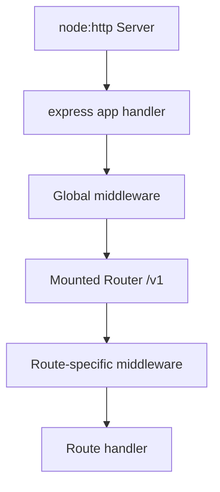
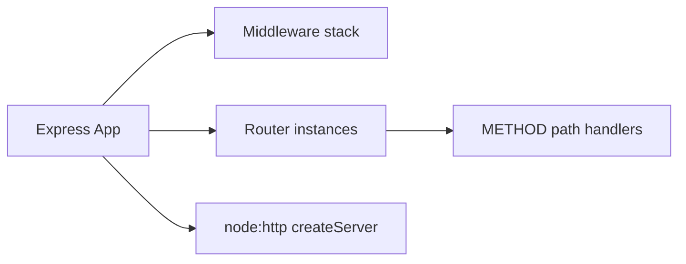
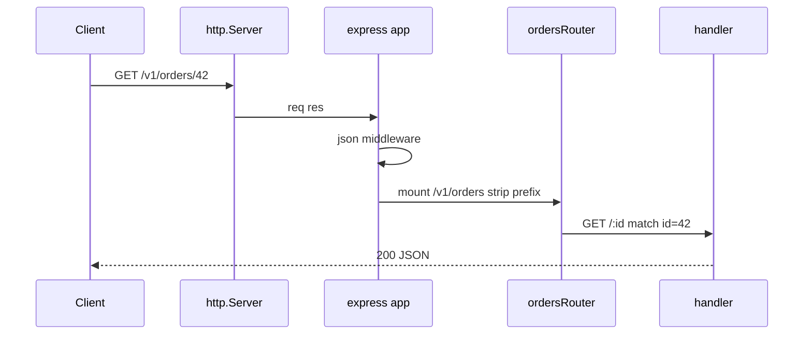

# Express Application and Router Internals

## Overview

An **Express application** (`express()`) is a callable request handler wrapping **`node:http`** with a **middleware stack** and **router** subsystem. **`express.Router()`** creates mountable sub-stacks with their own middleware and route table. Understanding internals—how `app.use` layers, how `req.url` is rewritten on mount, how `next()` advances—lets you debug "why didn't my route run?" without superstition.

Express is not magic; it is a **product-layer orchestrator** on the Node host. Thin HTTP parsing stays in [[06-NodeJS/05-Networking/http and https Platform Servers|platform servers]]; this note covers Express's routing model for backend services.

## Learning Objectives

- Explain `app` vs `Router` vs raw `http.Server` relationship
- Trace middleware and route matching order
- Use `app.param`, `Router.mergeParams`, and mount paths correctly
- Avoid common path/method matching surprises
- Structure large APIs with routers without losing observability

## Prerequisites

- [[06-NodeJS/05-Networking/http and https Platform Servers|http and https Platform Servers]]
- [[07-Backend/00-Orientation/Node Host vs Backend Product Boundary|Node Host vs Backend Product Boundary]]
- [[07-Backend/01-HTTP-APIs-and-Contracts/Resource Modeling and REST Semantics|Resource Modeling and REST Semantics]]

## Difficulty

`intermediate`

## Estimated Time

- Reading: 2 hours
- Exercises: 2 hours
- Mini project: 4 hours

## History

Express 3/4 unified Connect middleware with routing. Express 5 (ongoing) modernizes path matching and Promise rejection handling. Alternatives (Fastify, Hono) expose similar concepts with different performance models—see [[07-Backend/02-Frameworks-and-Middleware/Fastify Contrast and Plugin Model Concepts|Fastify Contrast]].

## Problem It Solves

- Avoid reimplementing routing, params, and middleware chaining on raw `node:http`
- Modularize APIs by domain router (`/v1/orders`, `/v1/users`)
- Share middleware stacks across mounted routers

## Internal Implementation

### Application structure



Express stores layers in order; each layer has a path prefix and match function. **`next()`** passes control to the next matching layer; **`next('route')`** skips to next route in same router.

### Key mechanisms

| API | Behavior |
| --- | --- |
| `app.use(path, fn)` | Middleware for paths starting with `path` |
| `app.METHOD(path, fn)` | Route handler for method + path |
| `router.use` | Middleware on router sub-stack |
| Mount `app.use('/v1', router)` | Strips prefix for router; adjusts `req.baseUrl`, `req.url` |

## Mermaid Diagrams

### Structure



### Sequence / Lifecycle — mount and match



## Examples

### Minimal Example — app and router

```typescript
import express from "express";

const app = express();
const orders = express.Router();

orders.get("/:id", (req, res) => {
  res.json({ id: req.params.id, baseUrl: req.baseUrl });
});

app.use(express.json());
app.use("/v1/orders", orders);

app.listen(3000);
```

`GET /v1/orders/42` → handler sees `req.params.id === "42"`, `req.baseUrl === "/v1/orders"`.

### Production-Shaped Example — modular bootstrap

```typescript
import express from "express";
import type { Server } from "node:http";

export type AppDeps = {
  orderService: { get: (id: string) => Promise<unknown | null> };
};

export function buildApp(deps: AppDeps) {
  const app = express();
  app.disable("x-powered-by");
  app.use(express.json({ limit: "128kb" }));

  const api = express.Router();
  const orders = express.Router({ mergeParams: true });

  orders.get("/:orderId", async (req, res, next) => {
    try {
      const row = await deps.orderService.get(req.params.orderId);
      if (!row) return res.status(404).json({ error: "not_found" });
      res.status(200).json(row);
    } catch (err) {
      next(err);
    }
  });

  api.use("/orders", orders);
  app.use("/v1", api);

  app.use((_req, res) => res.status(404).json({ error: "not_found" }));

  return app;
}

export function listen(app: express.Express, port: number): Server {
  return app.listen(port);
}
```

Separation enables testing with `supertest(app)` without listening—inject `deps` fakes.

## Trade-offs

| Dimension | Upside | Downside | When it matters |
| --- | --- | --- | --- |
| Express routing | Familiar, flexible | Linear scan of routes—large apps need discipline | Most Node APIs |
| Monolithic app | Simple deploy | Router sprawl without modules | Growing teams |
| `mergeParams` | Nested resource params | Easy to confuse param names | Sub-resources |
| Sync route registration | Clear stack at boot | Dynamic routes rare | Feature plugins |

### When to Use

- Default Node backend framework for product HTTP APIs in this track
- Teaching middleware pipeline before building Express Clone

### When Not to Use

- Maximum throughput microservices—evaluate Fastify ([[07-Backend/02-Frameworks-and-Middleware/Fastify Contrast and Plugin Model Concepts|Fastify Contrast]])
- Edge `fetch` handlers—use portable adapter pattern

## Exercises

1. Draw middleware order for `app.use(log); app.use('/v1', r); r.get('/x')` on `GET /v1/x`.
2. What happens with two `app.get('/foo')` handlers? Test with `next()`.
3. Implement `app.use('/v1/users/:userId/orders', ordersRouter)`—which params are visible?
4. Explain `next('route')` vs `next()` with example.
5. List three differences between Express app and raw `createServer` callback.

## Mini Project

Split a 5-route API into three router modules mounted under `/v1`. Add integration test proving 404 JSON for unknown paths.

## Portfolio Project

[[07-Backend/projects/Express Clone/README|Express Clone]] — reimplement layer list and `Router` mount strip prefix.

## Interview Questions

1. How does Express relate to `node:http`?
2. What is the order of middleware execution?
3. How does mounting a Router affect `req.url`?
4. Why call `app.disable('x-powered-by')`?
5. How would you structure routers in a large monolith?

### Stretch / Staff-Level

1. Express 4 vs 5 routing changes—impact on your apps?
2. Profile route matching cost with 500 routes—when to switch frameworks?

## Common Mistakes

- Registering routes after error middleware (404 handler eats everything)
- Forgetting `{ mergeParams: true }` on nested routers
- Async handler without `next(err)` on Express 4
- Mount path missing version prefix inconsistently

## Best Practices

- One `buildApp(deps)` factory for tests and production
- Domain routers colocated with handlers; mount in bootstrap only
- Terminal 404 and error middleware last
- Cross-link host timeouts to Node networking notes

## Summary

Express applications compose **ordered middleware layers** and **routers** on top of Node's HTTP server—turning platform `req`/`res` into a modular product pipeline. Knowing mount semantics, param merging, and stack order prevents subtle routing bugs and supports clean domain splits—foundation for middleware, DI, and Express Clone labs.

## Further Reading

- Express 4.x API guide
- [[07-Backend/02-Frameworks-and-Middleware/Middleware Pipeline and Error Middleware|Middleware Pipeline and Error Middleware]]

## Related Notes

- [[07-Backend/02-Frameworks-and-Middleware/Middleware Pipeline and Error Middleware|Middleware Pipeline and Error Middleware]]
- [[07-Backend/02-Frameworks-and-Middleware/Express Clone Design|Express Clone Design]]
- [[06-NodeJS/05-Networking/http and https Platform Servers|http and https Platform Servers]]
- [[02-JavaScript/05-Async-and-Concurrency/Promises Internals|Promises Internals]]
- [[08-Databases/README|Databases]]
- [[09-System-Design/README|System Design]]

## Progress Checklist

- [ ] Explained from first principles
- [ ] Drew at least one Mermaid diagram
- [ ] Implemented a minimal version
- [ ] Documented trade-offs and non-goals
- [ ] Completed exercises
- [ ] Practiced interview questions aloud
- [ ] Linked prerequisites and dependents
