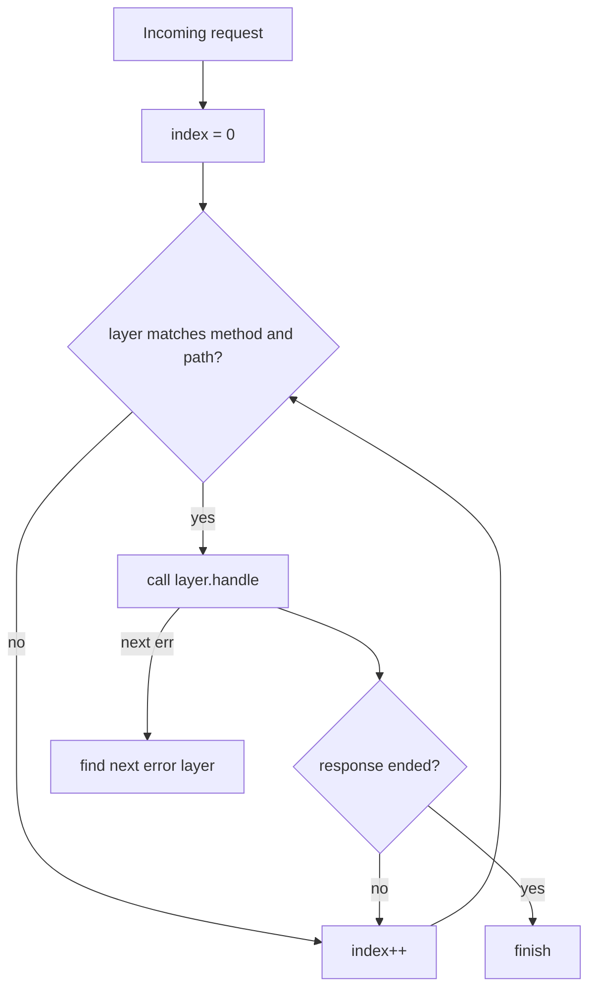
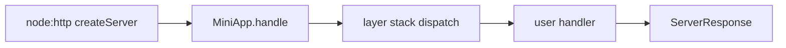
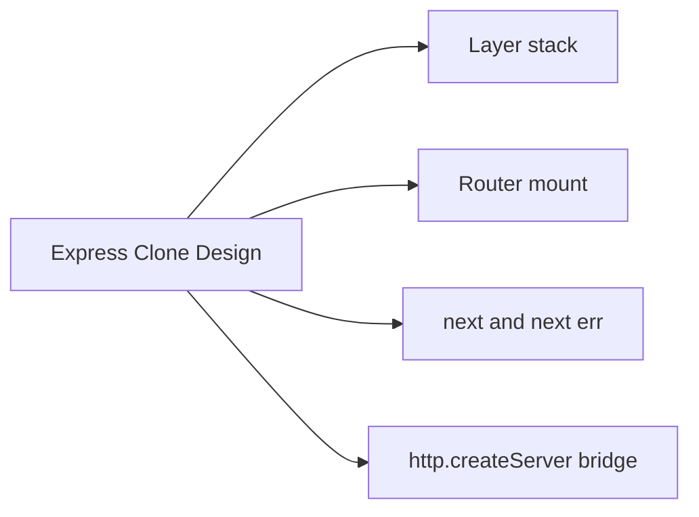
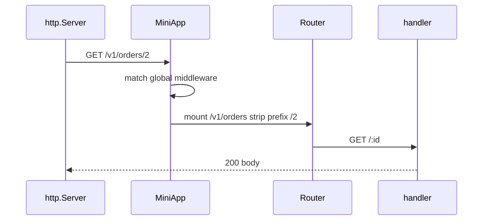

# Express Clone Design

## Overview

Building an **Express clone** forces you to implement what frameworks actually do: maintain an ordered **layer stack**, match method/path, strip mount prefixes, invoke `next`/`next(err)`, and delegate to **`node:http`**. The clone is not for production—it is a **learning instrument** linking Node host mechanics to Backend middleware concepts.

Design goals: minimal but faithful—`use`, `get/post`, `Router`, mount, error middleware, and `listen`—without replicating all of Express 4 edge cases. Compare your design to [[07-Backend/projects/Express Clone/README|Express Clone mini project]].

## Learning Objectives

- Design layer list data structure for middleware and routes
- Implement path matching and mount prefix stripping
- Handle `next`, `next('route')`, and error middleware arity
- Integrate clone app as `http.createServer` callback
- Document deliberate simplifications vs real Express

## Prerequisites

- [[07-Backend/02-Frameworks-and-Middleware/Express Application and Router Internals|Express Application and Router Internals]]
- [[07-Backend/02-Frameworks-and-Middleware/Middleware Pipeline and Error Middleware|Middleware Pipeline and Error Middleware]]
- [[06-NodeJS/05-Networking/http and https Platform Servers|http and https Platform Servers]]

## Difficulty

`advanced`

## Estimated Time

- Reading: 2 hours
- Exercises: 4 hours
- Mini project: 8–12 hours

## History

Connect (2010) popularized stackable middleware; Express refined routing. Educational clones appear in systems courses to demystify frameworks. Understanding clone design clarifies why middleware order bugs happen and why async error handling required evolution in Express 5.

## Problem It Solves

- Framework magic blocks debugging ("why didn't middleware run?")
- Teams cannot reason about performance of route matching
- Interview questions about HTTP frameworks lack hands-on grounding
- Bridges Node track (raw HTTP) to Backend track (product pipelines)

## Internal Implementation

### Core types (design sketch)

```typescript
type Layer = {
  path: string;
  regexp: RegExp;
  method?: string; // undefined = middleware
  handle: RequestHandler | ErrorRequestHandler;
  isError: boolean;
};

type MiniApp = {
  stack: Layer[];
  handle: (req: IncomingMessage, res: ServerResponse, next?: NextFunction) => void;
};
```

### Dispatch algorithm



Real Express uses `path-to-regexp`; clone may use simplified prefix + param regex.

### Host integration



Do **not** reimplement HTTP parsing—delegate to Node ([[06-NodeJS/05-Networking/http and https Platform Servers|platform servers]]).

## Mermaid Diagrams

### Structure



### Sequence / Lifecycle — mounted router



## Examples

### Minimal Example — layer push and dispatch skeleton

```typescript
import http from "node:http";
import type { IncomingMessage, ServerResponse } from "node:http";

type NextFunction = (err?: unknown) => void;
type RequestHandler = (req: IncomingMessage, res: ServerResponse, next: NextFunction) => void;

type Layer = { path: string; method?: string; handle: RequestHandler };

export function createMiniApp() {
  const stack: Layer[] = [];

  function use(pathOrHandler: string | RequestHandler, maybeHandler?: RequestHandler) {
    const path = typeof pathOrHandler === "string" ? pathOrHandler : "";
    const handle = (typeof pathOrHandler === "string" ? maybeHandler : pathOrHandler) as RequestHandler;
    stack.push({ path, handle });
  }

  function get(path: string, handle: RequestHandler) {
    stack.push({ path, method: "GET", handle });
  }

  function handle(req: IncomingMessage, res: ServerResponse) {
    let i = 0;
    const next: NextFunction = (err?: unknown) => {
      if (err) {
        res.statusCode = 500;
        res.end("internal error");
        return;
      }
      const layer = stack[i++];
      if (!layer) {
        res.statusCode = 404;
        return res.end("not found");
      }
      if (layer.method && layer.method !== req.method) return next();
      if (!req.url?.startsWith(layer.path)) return next();
      layer.handle(req, res, next);
    };
    next();
  }

  return { use, get, handle };
}

// usage
const app = createMiniApp();
app.use((req, res, next) => {
  console.log(req.method, req.url);
  next();
});
app.get("/hello", (_req, res) => {
  res.statusCode = 200;
  res.end("hello");
});

http.createServer(app.handle).listen(3000);
```

### Production-Shaped Example — design checklist for full clone

Features to implement in [[07-Backend/projects/Express Clone/README|Express Clone project]]:

1. **Router** as sub-app with own stack
2. **Mount** adjusts `req.url` / `baseUrl` equivalent
3. **Route params** `:id` → `req.params`
4. **Error middleware** — scan stack for `handle.length === 4`
5. **`next('route')`** skip remaining routes in current router
6. **Body parser** — optional separate middleware (or reuse `express.json` in tests for parity)

Security: do not implement own HTTP parser; set header size limits via Node server options ([[06-NodeJS/05-Networking/Request Response Lifecycle and Headers|Request Response Lifecycle]]).

## Trade-offs

| Dimension | Upside | Downside | When it matters |
| --- | --- | --- | --- |
| Full clone fidelity | Deep learning | Time sink | Portfolio project |
| Simplified matching | Faster build | Subtle Express diffs | Teaching labs |
| path-to-regexp dep | Compatible patterns | Dependency | Production-like clone |
| Raw req/res | Host fidelity | No Express extensions | Node integration |

### When to Use

- Learning milestone before advanced Backend modules
- Interview prep explaining middleware internals

### When Not to Use

- Production services—use Express/Fastify

## Exercises

1. Add POST route support and method filtering in dispatch loop.
2. Implement mount prefix stripping for `/v1` router—unit test url rewrite.
3. Support error middleware that maps `AppError` to JSON status.
4. Write failing test for Express behavior your clone lacks—document as non-goal.
5. Compare clone dispatch Big-O vs number of routes—when does routing tree matter?

## Mini Project

Complete [[07-Backend/projects/Express Clone/README|Express Clone]]: Router, mount, params, error MW, supertest parity suite against equivalent Express app for 10 cases.

## Portfolio Project

Publish design doc comparing your clone stack to Express 4 layer source concepts (not line-by-line copy)—include Mermaid dispatch flow.

## Interview Questions

1. How would you implement Express `app.use` internally?
2. What data structure holds middleware layers?
3. How does mounting a router change request path matching?
4. How is error middleware detected?
5. Why shouldn't a clone parse HTTP manually?

### Stretch / Staff-Level

1. Design route matching trie vs linear scan—trade-offs for 10k routes.
2. How would you add async handler support without Express 5 machinery?

## Common Mistakes

- Reimplementing HTTP instead of wrapping `createServer`
- Forgetting to skip method-mismatched layers
- Calling handlers after `res.end`
- Clone without tests comparing behavior to real Express

## Best Practices

- Test-driven parity with Express for core cases
- Keep clone code separate from production app code
- Document non-goals (regex types, subdomains, vhost)
- Link clone milestones to [[07-Backend/02-Frameworks-and-Middleware/Middleware Pipeline and Error Middleware|Middleware Pipeline]]

## Summary

Express Clone design demystifies the **layer stack**, **dispatch loop**, and **host callback bridge** that power real frameworks—without replacing Node's HTTP parser. Building it connects Node host knowledge to Backend middleware mastery and prepares you to debug routing, errors, and mounts in production Express apps—or evaluate alternatives like Fastify from first principles.

## Further Reading

- Express `lib/router` architecture (source reading)
- [[07-Backend/projects/Express Clone/README|Express Clone mini project]]

## Related Notes

- [[07-Backend/02-Frameworks-and-Middleware/Express Application and Router Internals|Express Application and Router Internals]]
- [[07-Backend/02-Frameworks-and-Middleware/Middleware Pipeline and Error Middleware|Middleware Pipeline and Error Middleware]]
- [[07-Backend/02-Frameworks-and-Middleware/Fastify Contrast and Plugin Model Concepts|Fastify Contrast and Plugin Model Concepts]]
- [[06-NodeJS/05-Networking/http and https Platform Servers|http and https Platform Servers]]
- [[02-JavaScript/07-Production-JavaScript/Testing JavaScript|Testing JavaScript]]
- [[08-Databases/README|Databases]]
- [[09-System-Design/README|System Design]]

## Progress Checklist

- [ ] Explained from first principles
- [ ] Drew at least one Mermaid diagram
- [ ] Implemented a minimal version
- [ ] Documented trade-offs and non-goals
- [ ] Completed exercises
- [ ] Practiced interview questions aloud
- [ ] Linked prerequisites and dependents
