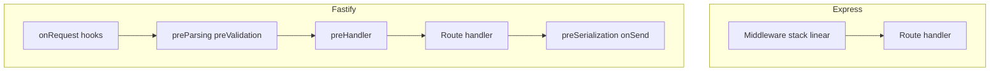
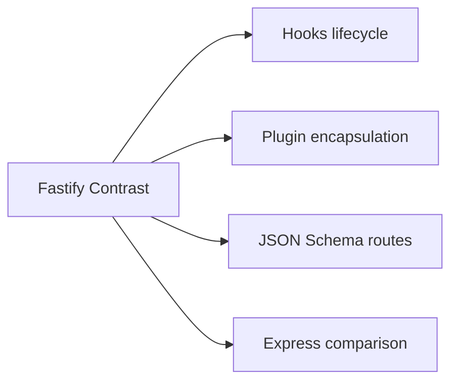
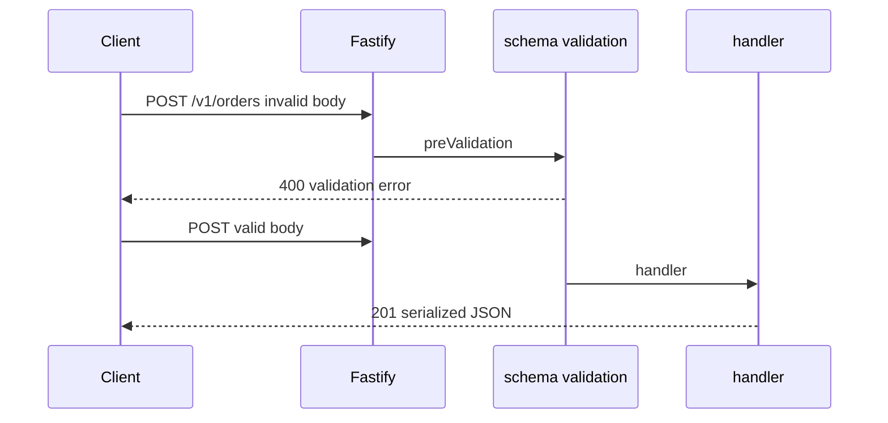

# Fastify Contrast and Plugin Model Concepts

## Overview

**Fastify** is a Node HTTP framework emphasizing **schema-driven validation**, **encapsulated plugins**, and **lower overhead** than Express for many benchmarks. Its **plugin model** wraps routes and hooks in scoped contexts with explicit dependency sharing—contrasting Express's flat middleware stack.

This note is a **contrast chapter**, not a Fastify tutorial: understand what Express optimizes for (ecosystem familiarity) vs Fastify (performance and schema integration)—so you pick frameworks deliberately and port contracts via shared domain layers ([[07-Backend/00-Orientation/WinterCG and Multi-Runtime API Portability|WinterCG portability]]).

## Learning Objectives

- Compare Express middleware vs Fastify hooks lifecycle
- Explain Fastify plugin encapsulation and `fastify-plugin` escape hatch
- Map JSON Schema validation to OpenAPI workflows
- Identify migration boundaries when moving Express → Fastify
- Keep domain services framework-agnostic during framework choice

## Prerequisites

- [[07-Backend/02-Frameworks-and-Middleware/Express Application and Router Internals|Express Application and Router Internals]]
- [[07-Backend/02-Frameworks-and-Middleware/Middleware Pipeline and Error Middleware|Middleware Pipeline and Error Middleware]]
- [[07-Backend/01-HTTP-APIs-and-Contracts/OpenAPI as Executable Contract|OpenAPI as Executable Contract]]

## Difficulty

`intermediate`

## Estimated Time

- Reading: 1.5 hours
- Exercises: 2 hours
- Mini project: 3 hours

## History

Fastify (2016) emerged as Express-alternative focused on JSON APIs and throughput. `@fastify/*` ecosystem grew (cors, jwt, swagger). Express remains default in many enterprises; Fastify common in performance-sensitive APIs and some serverless adapters. Both run on **`node:http`** host—see [[06-NodeJS/05-Networking/http and https Platform Servers|platform servers]].

## Problem It Solves

| Express pain at scale | Fastify approach |
| --- | --- |
| Unvalidated handler inputs | Route schemas validate before handler |
| Global middleware bleed | Plugin encapsulation contexts |
| Manual async error wrappers | async handlers reject to error handler |
| Performance headroom | Optimized routing and serialization (benchmark-dependent) |

## Internal Implementation

### Lifecycle contrast



Fastify validates against route schema in **preValidation**; Express typically uses external middleware ([[07-Backend/03-Validation-Errors-and-Versioning/Schema Validation at the Edge|Schema Validation]]).

### Plugin encapsulation

Plugins register routes/hooks in isolated scope; decorators do not leak unless wrapped with `fastify-plugin` to break encapsulation—prevents accidental cross-plugin pollution.

## Mermaid Diagrams

### Structure



### Sequence / Lifecycle — validated route



## Examples

### Minimal Example — Fastify route with schema

```typescript
import Fastify from "fastify";

const app = Fastify({ logger: true });

app.post(
  "/v1/orders",
  {
    schema: {
      body: {
        type: "object",
        required: ["sku", "quantity"],
        properties: {
          sku: { type: "string" },
          quantity: { type: "integer", minimum: 1 },
        },
      },
      response: {
        201: {
          type: "object",
          properties: {
            id: { type: "string" },
            status: { type: "string" },
          },
        },
      },
    },
  },
  async (request, reply) => {
    return reply.status(201).send({ id: "ord_1", status: "pending" });
  }
);

await app.listen({ port: 3000 });
```

### Production-Shaped Example — shared domain, two transports

```typescript
// domain — framework agnostic
export async function createOrder(
  input: { sku: string; quantity: number },
  repo: { save: (o: { sku: string; quantity: number }) => Promise<{ id: string }> }
) {
  if (input.quantity < 1) throw new Error("invalid_quantity");
  return repo.save(input);
}

// expressAdapter.ts — see Express notes
// fastifyAdapter.ts
import Fastify from "fastify";
import { createOrder } from "./domain/orders.js";

export function buildFastify(deps: { orders: { save: (o: { sku: string; quantity: number }) => Promise<{ id: string }> } }) {
  const app = Fastify();
  app.post("/v1/orders", async (req, reply) => {
    const body = req.body as { sku: string; quantity: number };
    const created = await createOrder(body, deps.orders);
    return reply.status(201).send({ id: created.id, status: "pending" });
  });
  return app;
}
```

OpenAPI can generate Fastify schemas—single contract source ([[07-Backend/01-HTTP-APIs-and-Contracts/OpenAPI as Executable Contract|OpenAPI]]).

## Trade-offs

| Dimension | Upside | Downside | When it matters |
| --- | --- | --- | --- |
| Fastify perf | Lower overhead in many benches | Not free lunch for DB-bound APIs | High RPS JSON APIs |
| Schema routes | Fast fail validation | Schema duplication if no OpenAPI sync | Public APIs |
| Plugin model | Safer composition | Learning curve vs Express | Plugin authors |
| Express ecosystem | Middleware, SO answers, hiring | Older async pitfalls | Enterprise brownfield |

### When to Use Fastify

- Greenfield JSON APIs needing built-in schema validation
- Teams comfortable investing in `@fastify/*` patterns

### When to Use Express

- Existing Express codebases, broad middleware needs, curriculum alignment in this track

## Exercises

1. Map Express middleware (json, auth, error) to Fastify hooks—table format.
2. Implement same `POST /v1/orders` in Express and Fastify; compare lines and validation path.
3. When would `@fastify/helmet` vs custom security middleware?
4. Explain encapsulation—two plugins registering same route path prefix safely?
5. Benchmark hello-world vs DB-bound route—interpret results honestly.

## Mini Project

Dual bootstrap: `buildExpress(deps)` and `buildFastify(deps)` sharing domain module; shared Vitest for domain + one supertest/lightmyrequest test each.

## Portfolio Project

ADR "Express vs Fastify default" in [[07-Backend/projects/Backend Service Toolkit/README|Backend Service Toolkit]] ADR folder.

## Interview Questions

1. Key differences Express vs Fastify?
2. What are Fastify hooks vs middleware?
3. How does schema validation integrate in Fastify?
4. What is plugin encapsulation?
5. Would you migrate production Express to Fastify—decision factors?

### Stretch / Staff-Level

1. Fastify + Pino logging vs Express + Winston—operational trade-offs.
2. Serverless cold start considerations Express vs Fastify vs fetch handlers.

## Common Mistakes

- Rewriting domain logic during framework migration
- Breaking encapsulation with global decorators everywhere
- Trusting benchmark charts for IO-bound workloads
- Duplicating OpenAPI and Fastify schema manually without codegen

## Best Practices

- Shared domain + ports regardless of framework
- Generate schemas from OpenAPI where possible
- Profile production-shaped workloads before switching frameworks
- Keep Node host tuning (timeouts, keep-alive) aligned—[[06-NodeJS/05-Networking/Keep-Alive Timeouts and Connection Limits|Keep-Alive]]

## Summary

Fastify contrasts with Express through **schema-first routes**, **hook lifecycle**, and **encapsulated plugins**—trading ecosystem familiarity for structure and performance headroom in JSON APIs. Backend product contracts remain identical; only transport adapters change. Choose framework based on team, workload, and operability—not benchmark slogans alone.

## Further Reading

- Fastify documentation — Plugins and Hooks
- [[07-Backend/02-Frameworks-and-Middleware/Express Clone Design|Express Clone Design]]

## Related Notes

- [[07-Backend/02-Frameworks-and-Middleware/Express Application and Router Internals|Express Application and Router Internals]]
- [[07-Backend/00-Orientation/WinterCG and Multi-Runtime API Portability|WinterCG and Multi-Runtime API Portability]]
- [[07-Backend/01-HTTP-APIs-and-Contracts/OpenAPI as Executable Contract|OpenAPI as Executable Contract]]
- [[06-NodeJS/05-Networking/http and https Platform Servers|http and https Platform Servers]]
- [[08-Databases/README|Databases]]
- [[09-System-Design/README|System Design]]

## Progress Checklist

- [ ] Explained from first principles
- [ ] Drew at least one Mermaid diagram
- [ ] Implemented a minimal version
- [ ] Documented trade-offs and non-goals
- [ ] Completed exercises
- [ ] Practiced interview questions aloud
- [ ] Linked prerequisites and dependents
