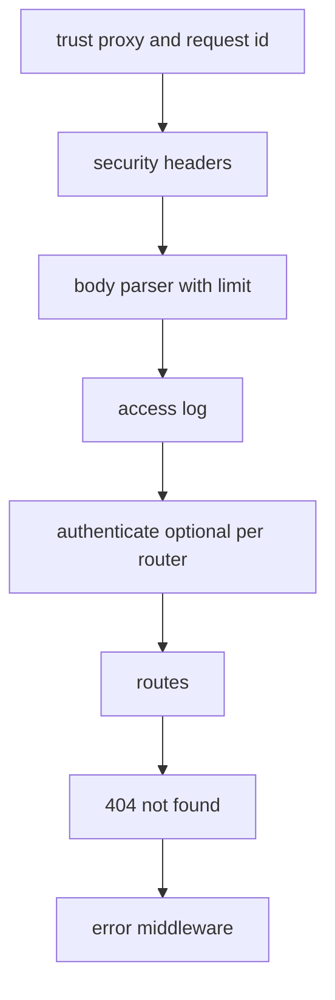
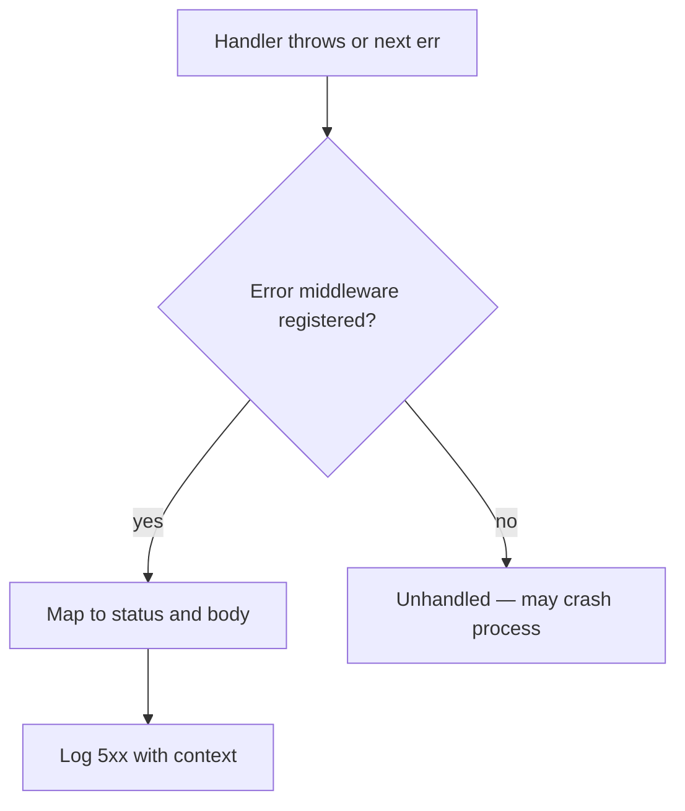
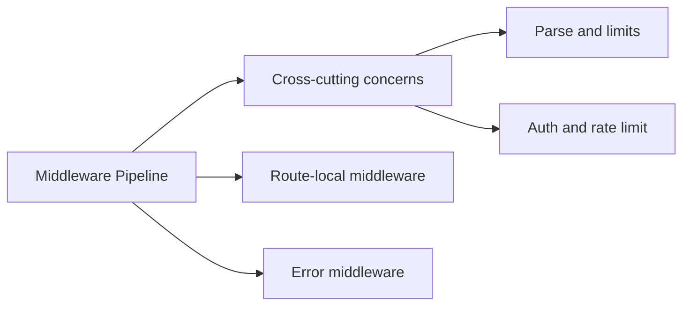
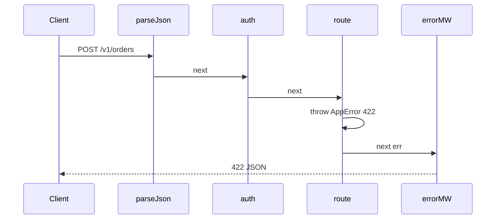

# Middleware Pipeline and Error Middleware

## Overview

Express **middleware** functions form a **pipeline**: each receives `(req, res, next)` and may end the response, call `next()`, or pass errors via `next(err)`. **Error middleware** has arity four `(err, req, res, next)` and runs when the stack forwards an error—central place to map domain failures to HTTP status and log server faults.

The pipeline is the backend **request cross-cutting layer**: parsing, auth, logging, validation, rate limits, and error envelopes. Order matters; mis-ordered middleware is a production failure mode ([[07-Backend/00-Orientation/Backend Failure Modes in Production|Backend Failure Modes]]).

## Learning Objectives

- Order middleware correctly: parse → security → auth → routes → 404 → error
- Distinguish sync errors, async rejections, and thrown exceptions in handlers
- Implement typed error mapping middleware
- Avoid calling `next()` after response sent
- Apply middleware scoping with routers vs global stack

## Prerequisites

- [[07-Backend/02-Frameworks-and-Middleware/Express Application and Router Internals|Express Application and Router Internals]]
- [[07-Backend/01-HTTP-APIs-and-Contracts/Status Codes as Product Policy|Status Codes as Product Policy]]
- [[06-NodeJS/01-Process-and-Runtime/unhandledRejection uncaughtException and Fatal Errors|unhandledRejection uncaughtException and Fatal Errors]]

## Difficulty

`intermediate`

## Estimated Time

- Reading: 2 hours
- Exercises: 2 hours
- Mini project: 4 hours

## History

Connect middleware pattern predates Express; Sinatra-inspired `next` chaining influenced Ruby and Node ecosystems. Express 4 required manual `catch` for async errors; Express 5 improves Promise rejection forwarding. Error middleware centralization aligns with RFC 9457 Problem Details adoption in API products.

## Problem It Solves

| Without pipeline discipline | With middleware pipeline |
| --- | --- |
| Duplicated auth in every route | `authenticate` middleware once |
| Inconsistent error JSON | Single error middleware |
| Body parsed before size check | Ordered limit + parser |
| Leaked stack traces | Error mapper sanitizes 500 bodies |

## Internal Implementation

### Recommended pipeline order



### Error propagation



Express 4 async gap: unhandled rejection if `async` handler rejects without try/catch—use wrapper or Express 5.

## Mermaid Diagrams

### Structure



### Sequence / Lifecycle — error reaches handler



## Examples

### Minimal Example — async wrapper

```typescript
import express, { RequestHandler } from "express";

export const asyncHandler =
  (fn: RequestHandler): RequestHandler =>
  (req, res, next) => {
    Promise.resolve(fn(req, res, next)).catch(next);
  };

const app = express();
app.get("/fail", asyncHandler(async (_req, _res) => {
  throw new Error("boom");
}));
```

### Production-Shaped Example — layered stack

```typescript
import express from "express";
import { randomUUID } from "node:crypto";

export class AppError extends Error {
  constructor(
    readonly status: number,
    readonly code: string,
    message?: string
  ) {
    super(message ?? code);
  }
}

export function createApp() {
  const app = express();
  app.set("trust proxy", 1);

  app.use((req, res, next) => {
    const id = req.header("x-request-id") ?? randomUUID();
    res.setHeader("x-request-id", id);
    (req as express.Request & { requestId: string }).requestId = id;
    next();
  });

  app.use(express.json({ limit: "128kb" }));

  app.use((req, _res, next) => {
    console.log(JSON.stringify({ msg: "access", method: req.method, path: req.path, requestId: (req as express.Request & { requestId: string }).requestId }));
    next();
  });

  app.get("/v1/ping", (_req, res) => res.status(200).json({ ok: true }));

  app.use((_req, res) => {
    res.status(404).json({ error: "not_found" });
  });

  app.use((err: unknown, req: express.Request, res: express.Response, _next: express.NextFunction) => {
    if (err instanceof AppError) {
      return res.status(err.status).json({ error: err.code, message: err.message });
    }
    console.error(JSON.stringify({ msg: "unhandled", requestId: (req as express.Request & { requestId: string }).requestId, err: String(err) }));
    res.status(500).json({ error: "internal_error" });
  });

  return app;
}
```

Rate limiting middleware: [[07-Backend/06-Reliability-and-Abuse-Resistance/Rate Limiting and Quotas|Rate Limiting]]. Host-level fatal errors: [[06-NodeJS/01-Process-and-Runtime/unhandledRejection uncaughtException and Fatal Errors|unhandledRejection]].

## Trade-offs

| Dimension | Upside | Downside | When it matters |
| --- | --- | --- | --- |
| Global middleware | DRY cross-cutting | Hidden order dependencies | All services |
| Router-scoped auth | Least privilege paths | Multiple auth stacks to test | Admin vs public routes |
| Central error MW | Consistent bodies | Must classify errors well | Public APIs |
| asyncHandler wrapper | Express 4 safe | Slight indirection | Async-heavy codebases |

### When to Use

- Every Express product service—non-negotiable baseline
- Error middleware as single mapping to status policy

### When Not to Use

- Do not put heavy domain logic in middleware—keep it transport cross-cutting

## Exercises

1. Reorder middleware deliberately wrong (404 before routes)—observe behavior.
2. Trigger `entity.parse.failed` from malformed JSON—where does Express 4 send error?
3. Implement middleware that rejects requests without `Accept: application/json` on `/v1/*`.
4. Write test asserting 404 JSON shape hits unknown route, not error middleware with 500.
5. Map three middleware concerns to **security/abuse** vs **observability** vs **contract**.

## Mini Project

Build `createApp()` with request ID, json limit, asyncHandler, AppError mapping, and 404—supertest coverage for 200/404/422/500 paths.

## Portfolio Project

Middleware chapter in [[07-Backend/projects/Express Clone/README|Express Clone]] implementing `next` and error arity-4 dispatch.

## Interview Questions

1. Difference between `next()` and `next(err)`?
2. Why must error middleware have four arguments?
3. What happens if you call `res.send` then `next()`?
4. Where should authentication middleware sit?
5. How does Express 5 change async error handling?

### Stretch / Staff-Level

1. Design middleware ordering when some routes need raw body (webhook signature verification).
2. Compare Express middleware to Fastify hooks lifecycle.

## Common Mistakes

- Error middleware registered before routes
- Multiple conflicting `express.json()` parsers
- Logging full body on every request (PII)
- `next(err)` after headers sent—causes ERR_HTTP_HEADERS_SENT

## Best Practices

- Factory `createApp(deps)` with pipeline documented in comment block
- Typed `AppError` hierarchy matching status matrix
- Never expose raw `err.stack` to clients in production
- Use router-level middleware for admin-only routes

## Summary

The middleware pipeline is Express's **request assembly line**—cross-cutting policies applied in deliberate order before route handlers run, with error middleware translating failures into HTTP product policy. Mastering `next`, async wrappers, and terminal 404/error handlers separates prototype servers from operable backend services.

## Further Reading

- [[07-Backend/03-Validation-Errors-and-Versioning/Problem Details and Error Envelopes|Problem Details and Error Envelopes]]
- [[07-Backend/02-Frameworks-and-Middleware/Request Context and Async Local Storage|Request Context and Async Local Storage]]

## Related Notes

- [[07-Backend/02-Frameworks-and-Middleware/Express Application and Router Internals|Express Application and Router Internals]]
- [[07-Backend/02-Frameworks-and-Middleware/Request Context and Async Local Storage|Request Context and Async Local Storage]]
- [[06-NodeJS/01-Process-and-Runtime/unhandledRejection uncaughtException and Fatal Errors|unhandledRejection uncaughtException and Fatal Errors]]
- [[02-JavaScript/07-Production-JavaScript/Error Design and Exception Safety|Error Design and Exception Safety]]
- [[08-Databases/README|Databases]]
- [[09-System-Design/README|System Design]]

## Progress Checklist

- [ ] Explained from first principles
- [ ] Drew at least one Mermaid diagram
- [ ] Implemented a minimal version
- [ ] Documented trade-offs and non-goals
- [ ] Completed exercises
- [ ] Practiced interview questions aloud
- [ ] Linked prerequisites and dependents
