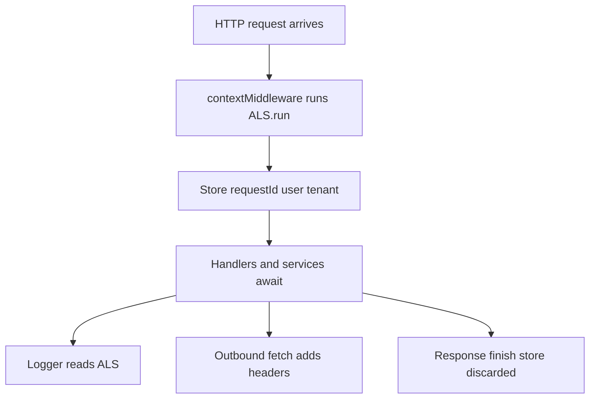
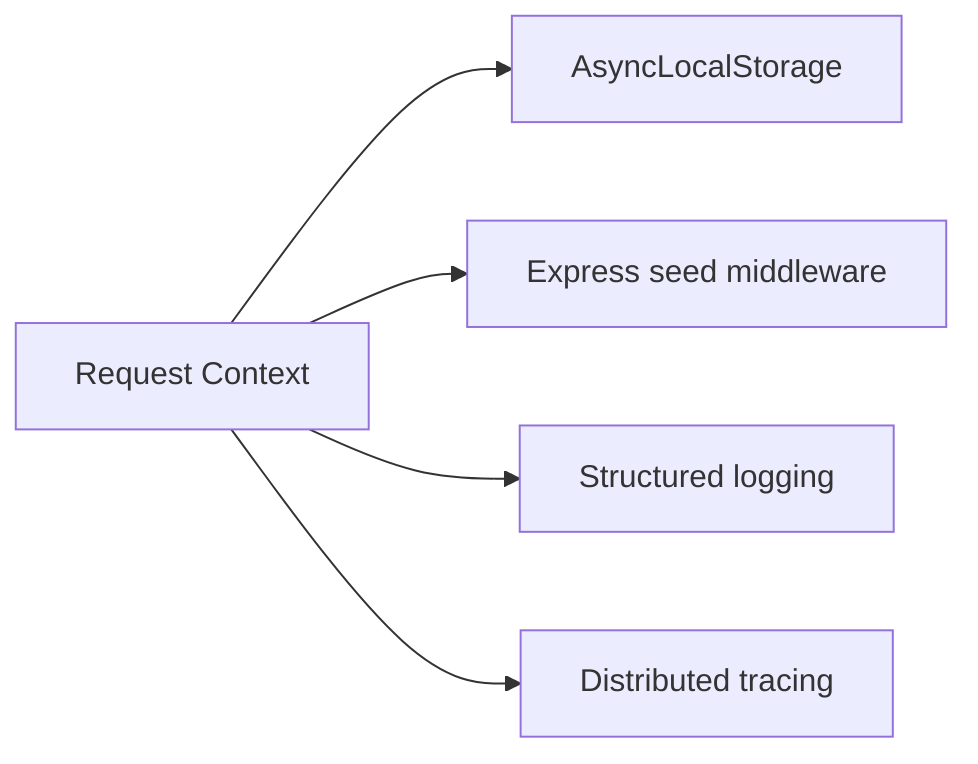
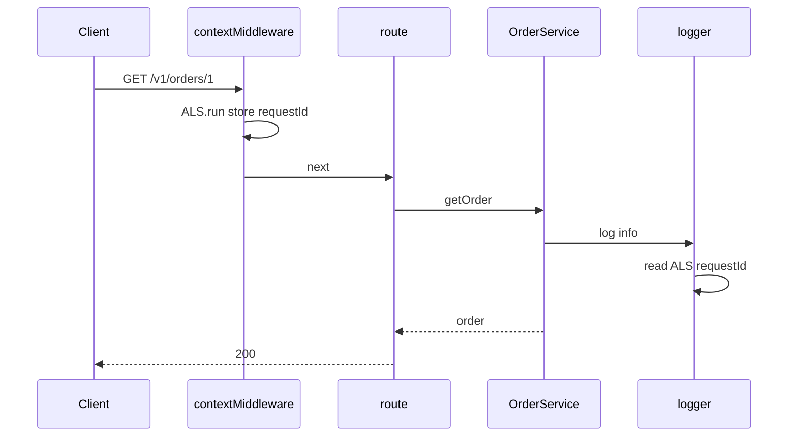

# Request Context and Async Local Storage

## Overview

**Request context** carries per-request data—correlation ID, authenticated user, tenant, feature flags—through async call chains without threading `req` into every function. Node's **`AsyncLocalStorage`** (ALS) stores context for the duration of a request's async continuation tree, similar in spirit to thread-locals in other runtimes.

Express middleware typically seeds context at the edge; domain services read `getRequestContext()` instead of importing `req`. Done wrong, ALS leaks context across tests or loses context after unbounded `setImmediate` chains—production debugging nightmares.

## Learning Objectives

- Implement ALS-backed request context in Express middleware
- Propagate correlation IDs to logs and outbound HTTP calls
- Contrast ALS vs explicit parameter passing vs `req` drilling
- Avoid context loss with some async patterns and worker boundaries
- Connect context to tracing (OpenTelemetry handoff to observability module)

## Prerequisites

- [[07-Backend/02-Frameworks-and-Middleware/Middleware Pipeline and Error Middleware|Middleware Pipeline and Error Middleware]]
- [[06-NodeJS/08-Diagnostics-and-Performance/Diagnostics Channel and Async Context Tracking|Diagnostics Channel and Async Context Tracking]]
- [[02-JavaScript/05-Async-and-Concurrency/Run to Completion and Event Loop|Run to Completion and Event Loop]]

## Difficulty

`advanced`

## Estimated Time

- Reading: 2 hours
- Exercises: 2 hours
- Mini project: 4 hours

## History

Before ALS, Express apps attached data to `req` and passed `req` everywhere—or lost correlation in deep service calls. Node 16+ stabilized `async_hooks`-based ALS; frameworks (Fastify `request.id`, Nest CLS) built patterns atop it. OpenTelemetry uses similar context propagation for distributed traces across services ([[09-System-Design/README|System Design]] for cross-service tracing).

## Problem It Solves

| Without request context | With ALS context |
| --- | --- |
| `logger.log('failed')` — which request? | Structured log includes `requestId` |
| Service signatures cluttered with metadata | `getContext().tenantId` |
| Broken trace across async gaps | Context follows awaited calls in same tree |
| Inconsistent header propagation | Central middleware sets ALS store |

## Internal Implementation

### Context lifecycle



ALS does **not** cross `worker_threads` or separate processes—message passing required ([[06-NodeJS/07-Timers-Events-and-IPC/MessagePort BroadcastChannel and Structured Clone|MessagePort]]).

## Mermaid Diagrams

### Structure



### Sequence / Lifecycle — log in deep service



## Examples

### Minimal Example — ALS store

```typescript
import { AsyncLocalStorage } from "node:async_hooks";

export type RequestContext = {
  requestId: string;
  userId?: string;
};

export const requestContext = new AsyncLocalStorage<RequestContext>();

export function getRequestContext(): RequestContext {
  const ctx = requestContext.getStore();
  if (!ctx) throw new Error("request context missing — called outside HTTP scope");
  return ctx;
}
```

### Production-Shaped Example — Express middleware + logger

```typescript
import express from "express";
import { randomUUID } from "node:crypto";
import { requestContext, getRequestContext, type RequestContext } from "./context.js";

export function contextMiddleware(req: express.Request, res: express.Response, next: express.NextFunction) {
  const store: RequestContext = {
    requestId: req.header("x-request-id") ?? randomUUID(),
    userId: req.header("x-user-id") ?? undefined, // replace with real auth middleware
  };
  res.setHeader("x-request-id", store.requestId);
  requestContext.run(store, () => next());
}

export function logInfo(message: string, extra?: Record<string, unknown>) {
  const ctx = requestContext.getStore();
  console.log(JSON.stringify({ level: "info", message, requestId: ctx?.requestId, ...extra }));
}

export function createApp(orderService: { get: (id: string) => Promise<unknown> }) {
  const app = express();
  app.use(contextMiddleware);

  app.get("/v1/orders/:id", async (req, res, next) => {
    try {
      logInfo("fetch_order", { orderId: req.params.id, userId: getRequestContext().userId });
      const order = await orderService.get(req.params.id);
      res.status(200).json(order);
    } catch (err) {
      next(err);
    }
  });

  return app;
}
```

For OpenTelemetry, prefer official SDK context over homegrown ALS—this note teaches the mechanism Node provides. Node diagnostics depth: [[06-NodeJS/08-Diagnostics-and-Performance/Diagnostics Channel and Async Context Tracking|Diagnostics Channel]].

## Trade-offs

| Dimension | Upside | Downside | When it matters |
| --- | --- | --- | --- |
| ALS implicit context | Cleaner service APIs | Magic—harder for newcomers | Large codebases |
| Explicit ctx parameter | Testability, clarity | Verbose signatures | Libraries |
| req drilling | Simple in small apps | Domain coupled to Express | Prototypes |
| CLS middleware packages | Batteries included | Dependency + perf overhead | Nest-style apps |

### When to Use

- Production services with structured logging and tracing
- Multi-tenant apps needing tenant in deep services

### When Not to Use

- Do not use ALS in CLI scripts without wrapping run()
- Worker offload must pass context explicitly in message payload

## Exercises

1. Write test that fails if `getOrder()` logs without ALS (context missing).
2. What happens to ALS across `Promise.all` parallel tasks in same request?
3. Propagate `x-request-id` to outbound `fetch` in a small helper.
4. Compare attaching data to `req` vs ALS—list three pros/cons each.
5. When does context **not** propagate—name two Node patterns.

## Mini Project

Implement `contextMiddleware`, `logInfo`, and one service call deep—assert logs include same `requestId` in Vitest with supertest.

## Portfolio Project

Request context section in [[07-Backend/projects/Backend Service Toolkit/README|Backend Service Toolkit]] Monitoring.md.

## Interview Questions

1. What is AsyncLocalStorage and why does it exist?
2. ALS vs thread-local storage in Java?
3. How do you pass request ID to database query logs?
4. Can ALS replace explicit auth parameters for authorization checks?
5. How does context interact with worker_threads?

### Stretch / Staff-Level

1. Design context propagation across async message bus consumers (inbox pattern).
2. Performance overhead of ALS—when would you avoid it?

## Common Mistakes

- Calling `getRequestContext()` in module init code at import time
- Forgetting ALS.run in test helpers
- Storing large objects in context store (memory)
- Assuming ALS crosses cluster workers or processes

## Best Practices

- Keep context store small: ids, not full user objects
- Seed context in first middleware after trust proxy
- Fall back gracefully in background jobs with job-level correlation id
- Integrate with [[07-Backend/09-API-Observability-and-Testing/Structured Logs with Request Correlation|Structured Logs]]

## Summary

Request context via **AsyncLocalStorage** propagates correlation and identity through Express async handlers without polluting domain signatures—provided middleware seeds `ALS.run` at the edge and developers respect worker/process boundaries. It bridges middleware pipeline observability and deep service logging—the backend complement to Node's async diagnostics hooks.

## Further Reading

- Node.js AsyncLocalStorage documentation
- [[06-NodeJS/08-Diagnostics-and-Performance/Diagnostics Channel and Async Context Tracking|Diagnostics Channel and Async Context Tracking]]

## Related Notes

- [[07-Backend/02-Frameworks-and-Middleware/Middleware Pipeline and Error Middleware|Middleware Pipeline and Error Middleware]]
- [[07-Backend/09-API-Observability-and-Testing/Distributed Tracing Across Handlers|Distributed Tracing Across Handlers]]
- [[06-NodeJS/08-Diagnostics-and-Performance/Diagnostics Channel and Async Context Tracking|Diagnostics Channel and Async Context Tracking]]
- [[02-JavaScript/05-Async-and-Concurrency/Run to Completion and Event Loop|Run to Completion and Event Loop]]
- [[08-Databases/README|Databases]]
- [[09-System-Design/README|System Design]]

## Progress Checklist

- [ ] Explained from first principles
- [ ] Drew at least one Mermaid diagram
- [ ] Implemented a minimal version
- [ ] Documented trade-offs and non-goals
- [ ] Completed exercises
- [ ] Practiced interview questions aloud
- [ ] Linked prerequisites and dependents
