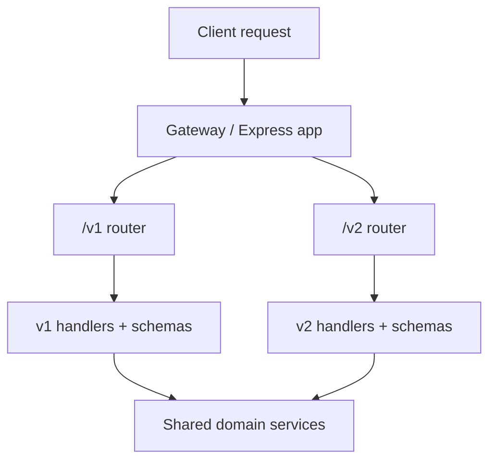
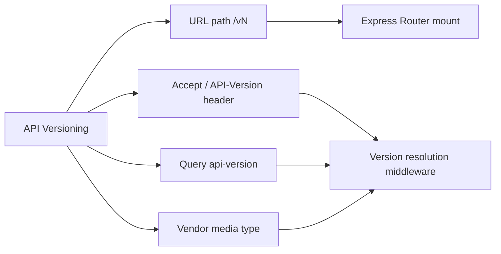
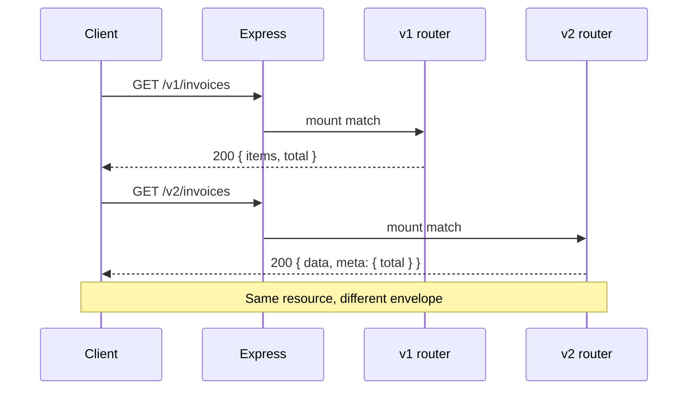

# API Versioning Strategies

## Overview

**API versioning** is how you expose evolving HTTP contracts without breaking existing clients. Strategies include **URL path** (`/v1/invoices`), **header** (`Accept: application/vnd.example.v2+json`), **query** (`?api-version=2`), and **content type** negotiation. The Backend track treats versioning as a **product policy**: where the version lives, how many versions you support concurrently, and how routing, validation, auth, and OpenAPI docs align.

Express implements versioning via **routers mounted at version prefixes**, middleware that reads version headers, or a factory that selects handler implementations per version. The choice affects caching, gateway routing, client ergonomics, and how visibly you communicate breaking change.

## Learning Objectives

- Compare URL, header, query, and media-type versioning with operational trade-offs
- Implement parallel version routers in Express without duplicating entire apps
- Tie each version to distinct OpenAPI documents and validation schemas
- Define a default version policy for clients that omit version signals
- Plan sunset communications independent of routing mechanics

## Prerequisites

- [[07-Backend/01-HTTP-APIs-and-Contracts/Resource Modeling and REST Semantics|Resource Modeling and REST Semantics]]
- [[07-Backend/01-HTTP-APIs-and-Contracts/OpenAPI as Executable Contract|OpenAPI as Executable Contract]]
- [[07-Backend/02-Frameworks-and-Middleware/Express Application and Router Internals|Express Application and Router Internals]]

## Difficulty

`intermediate`

## Estimated Time

- Reading: 1.5 hours
- Exercises: 2 hours
- Mini project: 4 hours

## History

SOAP APIs versioned via new WSDL namespaces. Early REST APIs often shipped unversioned until breaking changes forced `/v2` forks. Stripe and GitHub popularized **path prefixes** for clarity. Microsoft APIs experimented with **`api-version` query** parameters for Azure-style evolution. Hypermedia purists argued URLs should be stable and versions belong in **content negotiation**—works for mature APIs, harder for JSON CRUD clients.

Mobile apps with long upgrade tails pushed **long compatibility windows** and multiple concurrent versions in production—see [[07-Backend/03-Validation-Errors-and-Versioning/Breaking Changes and Compatibility Windows|Breaking Changes and Compatibility Windows]].

## Problem It Solves

| Failure mode | Unversioned breaking change | Explicit versioning |
| --- | --- | --- |
| Mobile app crash | Field removed without notice | v1 stable; v2 adds shape |
| Partner integration break | Silent semantic change | Contract tests per version |
| Routing ambiguity | One handler with if/else | Isolated routers/schemas |
| Doc drift | Single README | OpenAPI per major version |
| Sunset chaos | Kill old code suddenly | Deprecation headers + timeline |

## Internal Implementation

### Path-based versioning (common default)



Shared **domain layer**; versioned **transport adapters** (DTO mapping, validation, response shape). Avoid branching business logic on `if (version === 2)` in services.

### Header-based versioning

Middleware resolves version from `Accept` or custom `API-Version` header, attaches `req.apiVersion`, and dispatches to the same paths with different handlers—URLs stay clean but caching and browser debugging get harder.

## Mermaid Diagrams

### Structure



### Sequence / Lifecycle



## Examples

### Minimal Example

```typescript
import express from "express";

const app = express();
app.use(express.json());

const v1 = express.Router();
v1.get("/invoices", (_req, res) => {
  res.json({ items: [], total: 0 });
});

const v2 = express.Router();
v2.get("/invoices", (_req, res) => {
  res.json({ data: [], meta: { total: 0, page: 1 } });
});

app.use("/v1", v1);
app.use("/v2", v2);

app.listen(3000);
```

### Production-Shaped Example

```typescript
import express, { Request, Response, NextFunction } from "express";

type ApiVersion = 1 | 2;

declare global {
  namespace Express {
    interface Request {
      apiVersion: ApiVersion;
    }
  }
}

const SUPPORTED: ApiVersion[] = [1, 2];
const DEFAULT: ApiVersion = 2;

function resolveVersion(req: Request, _res: Response, next: NextFunction) {
  const header = req.header("api-version");
  const fromPath = req.baseUrl.startsWith("/v1") ? 1 : req.baseUrl.startsWith("/v2") ? 2 : undefined;
  const parsed = header ? Number(header) : fromPath ?? DEFAULT;
  if (!SUPPORTED.includes(parsed as ApiVersion)) {
    return next(Object.assign(new Error("unsupported_version"), { status: 400 }));
  }
  req.apiVersion = parsed as ApiVersion;
  next();
}

function createVersionRouter(version: ApiVersion) {
  const router = express.Router();
  router.use(resolveVersion);

  router.get("/invoices/:id", async (req, res, next) => {
    try {
      const invoice = await getInvoice(req.params.id);
      if (!invoice) return res.status(404).type("application/problem+json").json({
        type: "https://api.example.com/problems/not-found",
        title: "Not found",
        status: 404,
      });

      if (req.apiVersion === 1) {
        return res.json({
          id: invoice.id,
          amount_cents: invoice.amountCents,
          status: invoice.status,
        });
      }
      res.json({
        data: {
          id: invoice.id,
          amount: { cents: invoice.amountCents, currency: invoice.currency },
          status: invoice.status,
        },
        meta: { apiVersion: 2 },
      });
    } catch (err) {
      next(err);
    }
  });

  return router;
}

const app = express();
app.use(express.json());
app.use("/v1", createVersionRouter(1));
app.use("/v2", createVersionRouter(2));

// Deprecation signaling on older version
app.use("/v1", (_req, res, next) => {
  res.setHeader("Deprecation", "true");
  res.setHeader("Sunset", "Sat, 01 Jan 2028 00:00:00 GMT");
  res.setHeader("Link", '</v2/invoices>; rel="successor-version"');
  next();
});

async function getInvoice(id: string) {
  return { id, amountCents: 1000, currency: "USD", status: "draft" as const };
}

app.listen(3000);
```

Prefer separate routers and mappers over giant switch statements. Publish **two OpenAPI files** or one document with `servers` + tags per version.

## Trade-offs

| Dimension | Upside | Downside | When it matters |
| --- | --- | --- | --- |
| URL `/v1` | Visible, easy to route/cache | URLs change on major bump | Public REST, mobile BFFs |
| Header | Clean URLs | Harder to curl; CDN cache keys | Internal service meshes |
| Query param | Easy to add | Easy to forget; log noise | Azure-style cloud APIs |
| Media type | Pure REST | Client library pain | Hypermedia APIs |
| Many versions | Protects slow clients | Code + test matrix explosion | Enterprise SaaS |

### When to Use

- Any API with external clients you do not control
- Mobile or embedded clients with slow upgrade cycles
- Partner integrations with contract tests

### When Not to Use

- Internal-only services deployed lockstep with consumers—compat via additive changes only
- Replacing semver for **server** deployment version (`/health` build sha ≠ API contract version)

## Exercises

1. Implement header `API-Version: 1` routing on `/invoices` without path prefix; document cache implications.
2. Add middleware rejecting mixed signals (`/v1` URL + `API-Version: 2`).
3. Sketch OpenAPI folder layout for v1 and v2 with shared component schemas.
4. Write a client integration test that pins v1 response shape while v2 ships new fields.
5. List three breaking vs additive changes for an `Invoice` resource; which require a new major version under your policy?

## Mini Project

Add **v1 and v2** routes to the URL Shortener API: v1 returns `{ url }`, v2 returns `{ data: { url, createdAt } }`. Share domain logic; version only transport mapping. Document sunset headers on v1.

## Portfolio Project

Backend Service Toolkit: version router factory, deprecation middleware, and compatibility matrix doc linked from OpenAPI.

## Interview Questions

1. Compare URL path versioning vs `Accept` header versioning for a public mobile API.
2. Where should business logic live when v1 and v2 differ in response envelope?
3. What HTTP headers communicate deprecation and successor versions?
4. How many major API versions should run concurrently in production? What drives the limit?
5. Is adding a new optional JSON field a breaking change? Under what conditions does it become breaking?

### Stretch / Staff-Level

1. Design versioning for GraphQL subscriptions vs REST polling—same strategy or not?
2. How do API gateways (Kong, Envoy) influence version routing and canary releases?

## Common Mistakes

- Versioning the deployment, not the contract
- Breaking v1 when fixing bugs because handlers are shared without adapters
- No default version—silent behavior change when header omitted
- Removing v1 without `Sunset` header and metric-driven traffic check
- One mega OpenAPI mixing incompatible schemas under one path

## Best Practices

- Major version = breaking contract; minor = additive in same version (document policy)
- Shared domain services; versioned controllers/DTOs/validators
- Contract tests per version in CI
- Metrics on requests per version before sunset
- Align with [[07-Backend/03-Validation-Errors-and-Versioning/Breaking Changes and Compatibility Windows|Breaking Changes and Compatibility Windows]]

## Summary

API versioning is a product decision encoded in routing: path prefixes are the pragmatic default for Express JSON APIs, but headers and query parameters suit other ecosystems. Implement parallel routers or version-aware middleware, keep domain logic shared, publish per-version OpenAPI and schemas, signal deprecation with standard headers, and govern breaking changes with explicit compatibility windows.

## Further Reading

- [[07-Backend/03-Validation-Errors-and-Versioning/Breaking Changes and Compatibility Windows|Breaking Changes and Compatibility Windows]]
- RFC 8594 — The Sunset HTTP Header Field
- IETF draft on API versioning (vendor media types)

## Related Notes

- [[07-Backend/03-Validation-Errors-and-Versioning/Breaking Changes and Compatibility Windows|Breaking Changes and Compatibility Windows]]
- [[07-Backend/03-Validation-Errors-and-Versioning/Schema Validation at the Edge|Schema Validation at the Edge]]
- [[07-Backend/01-HTTP-APIs-and-Contracts/OpenAPI as Executable Contract|OpenAPI as Executable Contract]]
- [[07-Backend/01-HTTP-APIs-and-Contracts/Resource Modeling and REST Semantics|Resource Modeling and REST Semantics]]
- [[07-Backend/02-Frameworks-and-Middleware/Express Application and Router Internals|Express Application and Router Internals]]

## Progress Checklist

- [ ] Explained from first principles
- [ ] Drew at least one Mermaid diagram
- [ ] Implemented a minimal version
- [ ] Documented trade-offs and non-goals
- [ ] Completed exercises
- [ ] Practiced interview questions aloud
- [ ] Linked prerequisites and dependents
