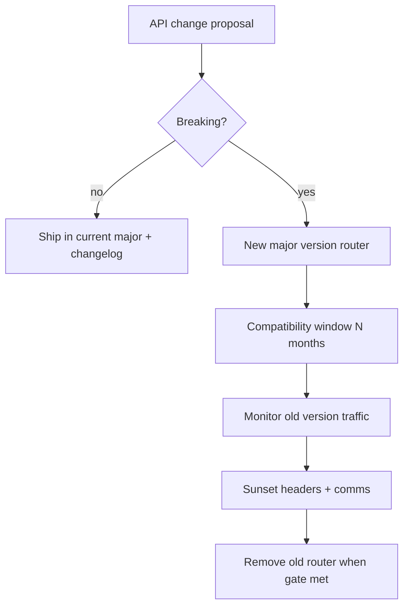
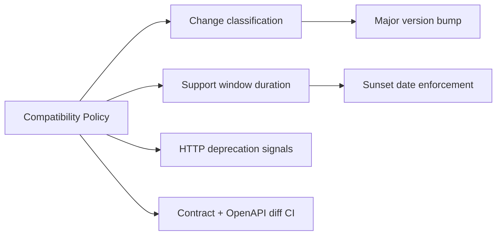
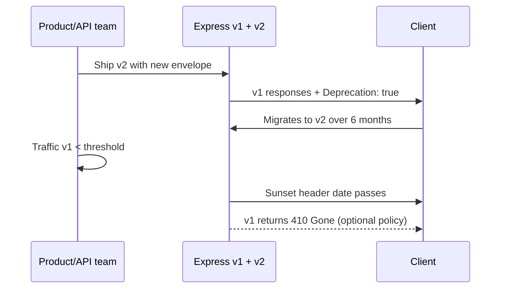

# Breaking Changes and Compatibility Windows

## Overview

A **breaking change** alters the API contract in a way that existing clients fail without modification: removing fields, changing types, renaming paths, tightening validation, or changing error semantics. A **compatibility window** is the agreed period where an old version remains available, documented, monitored, and supported while clients migrate.

Backend teams govern this with explicit **change classification** (additive vs breaking), **semver for API majors**, telemetry on version traffic, and **sunset headers** plus runbooks. Express services implement windows by keeping vN and vN+1 routers live, feature flags for behavioral toggles, and contract tests that fail CI if a breaking diff slips into a non-major release.

## Learning Objectives

- Classify API changes as safe-additive, risky-additive, or breaking with examples
- Define a compatibility window policy (duration, communication, metrics gates)
- Implement deprecation signaling (`Deprecation`, `Sunset`, `Link`) in Express
- Use OpenAPI diff and consumer-driven contract tests to catch accidental breaks
- Plan dual-write/dual-read migration patterns at the application boundary

## Prerequisites

- [[07-Backend/03-Validation-Errors-and-Versioning/API Versioning Strategies|API Versioning Strategies]]
- [[07-Backend/01-HTTP-APIs-and-Contracts/OpenAPI as Executable Contract|OpenAPI as Executable Contract]]
- [[07-Backend/09-API-Observability-and-Testing/Contract Integration and Load Testing|Contract Integration and Load Testing]]

## Difficulty

`advanced`

## Estimated Time

- Reading: 2 hours
- Exercises: 3 hours
- Mini project: 5 hours

## History

SaaS APIs learned painful lessons: Parse shutdowns, Twitter API v1.1 removals, and silent field drops broke ecosystems. Mature platforms (Stripe, Shopify) publish **changelog discipline**, multi-year support, and breaking changes only in new majors. **Consumer-driven contracts** (Pact) inverted testing: clients define expectations; providers verify.

Compatibility windows balance **engineering velocity** against **client trust**—too short windows churn enterprise deals; too long windows multiply security patches and code paths.

## Problem It Solves

| Failure mode | No policy | Compatibility windows |
| --- | --- | --- |
| Friday field removal | Production client outages | Additive release first; break only in v+1 |
| Unknown v1 traffic | Premature sunset | Metrics gate: <1% for 30 days |
| Semantic drift | "Optional" field becomes required | Documented validation change = breaking |
| Partner surprise | Email day-before | RFC-style notice + headers + docs |
| Zombie code | v1 never deleted | Sunset date + removal ticket |

## Internal Implementation

### Change classification matrix

| Change | Usually | Example |
| --- | --- | --- |
| Add optional response field | Safe (same major) | `createdAt` on invoice |
| Add required request field | **Breaking** | `currency` now required on POST |
| Tighten string max length | **Breaking** if clients exceeded old limit | name max 80 → 40 |
| Loosen validation | Safe | accept more enum values |
| Change status code | **Breaking** | 404 → 403 for hidden resources |
| Rename field | **Breaking** | `amount_cents` → `amountCents` (unless alias period) |

**Alias period**: accept both old and new field names for one window, emit deprecation warning in logs.



## Mermaid Diagrams

### Structure



### Sequence / Lifecycle — client migration



## Examples

### Minimal Example — field alias period

```typescript
// v1 still accepts amount_cents; maps to canonical amountCents internally
function normalizeInvoiceInput(body: Record<string, unknown>) {
  const amountCents = body.amountCents ?? body.amount_cents;
  if (amountCents === undefined) {
    throw validationError("amountCents required");
  }
  if (body.amount_cents !== undefined) {
    console.warn("deprecated_field", { field: "amount_cents" });
  }
  return { amountCents: Number(amountCents) };
}
```

### Production-Shaped Example — sunset middleware + 410 policy

```typescript
import express, { Request, Response, NextFunction } from "express";

interface VersionPolicy {
  version: number;
  sunset: Date;          // stop serving after this instant (UTC)
  successorPath: string;
}

const VERSION_POLICIES: VersionPolicy[] = [
  { version: 1, sunset: new Date("2028-01-01T00:00:00Z"), successorPath: "/v2" },
];

function versionLifecycle(version: number) {
  return (req: Request, res: Response, next: NextFunction) => {
    const policy = VERSION_POLICIES.find((p) => p.version === version);
    if (!policy) return next();

    const now = Date.now();
    if (now >= policy.sunset.getTime()) {
      return res.status(410).type("application/problem+json").json({
        type: "https://api.example.com/problems/version-sunset",
        title: "API version no longer available",
        status: 410,
        detail: `v${version} was sunset on ${policy.sunset.toISOString()}`,
      });
    }

    res.setHeader("Deprecation", "true");
    res.setHeader("Sunset", policy.sunset.toUTCString());
    res.setHeader("Link", `<${policy.successorPath}>; rel="successor-version"`);
    next();
  };
}

const app = express();
app.use(express.json());

const v1 = express.Router();
v1.use(versionLifecycle(1));
v1.get("/health", (_req, res) => res.json({ ok: true, version: 1 }));

const v2 = express.Router();
v2.get("/health", (_req, res) => res.json({ ok: true, version: 2 }));

app.use("/v1", v1);
app.use("/v2", v2);

// Metrics: increment http_requests_total{api_version="1"} in real services
app.listen(3000);
```

OpenAPI diff in CI (oasdiff, openapi-diff) should fail builds that remove properties or change types without bumping `info.version` major.

## Trade-offs

| Dimension | Upside | Downside | When it matters |
| --- | --- | --- | --- |
| Long windows | Enterprise trust | Two codepaths, security surface | B2B with slow procurement |
| Short windows | Less maintenance | Client churn | Internal-only APIs |
| Aliasing fields | Smoother migration | Ambiguous canonical model | Renames |
| 410 after sunset | Clear signal | Hard failure for stragglers | Strict compliance |
| Feature flags | Gradual behavior rollout | Hidden contract drift | Risky semantic changes |

### When to Use

- Every public API with external consumers
- Mobile clients with store review delays
- Regulated industries requiring change audit trails

### When Not to Use

- Over-engineering internal sync-deploy services where only additive changes are allowed by convention
- Using compatibility windows to avoid ever removing debt—set hard sunset dates

## Exercises

1. Write a changelog entry classifying five proposed invoice API changes.
2. Configure OpenAPI diff in CI with one intentional breaking change; capture failure output.
3. Define sunset gates: "v1 traffic < 0.1% for 30 days AND no paying customer on v1" — debate edge cases.
4. Implement response that includes both old and new field names for 90 days; log deprecated field usage.
5. Draft customer email template for 6-month v1 sunset with migration checklist.

## Mini Project

Add a **compatibility policy** doc and sunset middleware to URL Shortener API v1 while v2 ships cursor pagination. Track fake metrics JSON showing v1 traffic decline before simulated removal.

## Portfolio Project

Backend Service Toolkit: `COMPATIBILITY.md`, OpenAPI diff CI job, deprecation middleware, and runbook "How to sunset an API version."

## Interview Questions

1. Is making an optional field required always breaking? When might it be acceptable?
2. What metrics would you require before turning off API v1?
3. Explain `Deprecation`, `Sunset`, and `Link: successor-version` headers.
4. How do consumer-driven contracts differ from provider-only OpenAPI tests?
5. Difference between loosening and tightening validation— which is breaking?

### Stretch / Staff-Level

1. Design a blue/green API deployment where behavior changes without URL version bump—is that ever safe?
2. How would you handle breaking changes in webhook payloads vs synchronous REST?

## Common Mistakes

- Breaking changes without major version bump
- Announcing sunset without measuring real traffic
- Removing v1 code while docs still reference it
- Changing error format in-place (breaks client parsers)
- Infinite alias periods—never completing migration

## Best Practices

- Document additive vs breaking rules in CONTRIBUTING/API.md
- Automate OpenAPI diff on every PR touching handlers
- Per-version SLO dashboards and alert on v1 spike after sunset announcement
- Provide migration guides with request/response diffs
- Coordinate with [[07-Backend/03-Validation-Errors-and-Versioning/API Versioning Strategies|API Versioning Strategies]] and support teams

## Summary

Breaking changes are contract changes that force client updates; compatibility windows are the operational discipline that makes majors survivable. Classify every change, ship breaks only in new majors, signal deprecation with standard HTTP headers, gate removal on traffic metrics, and enforce policy with OpenAPI diff and contract tests—not hope.

## Further Reading

- [[07-Backend/03-Validation-Errors-and-Versioning/API Versioning Strategies|API Versioning Strategies]]
- RFC 8594 — Sunset HTTP Header
- Pact consumer-driven contract testing documentation

## Related Notes

- [[07-Backend/03-Validation-Errors-and-Versioning/API Versioning Strategies|API Versioning Strategies]]
- [[07-Backend/01-HTTP-APIs-and-Contracts/OpenAPI as Executable Contract|OpenAPI as Executable Contract]]
- [[07-Backend/09-API-Observability-and-Testing/Contract Integration and Load Testing|Contract Integration and Load Testing]]
- [[07-Backend/03-Validation-Errors-and-Versioning/Problem Details and Error Envelopes|Problem Details and Error Envelopes]]
- [[07-Backend/10-Production-Services/Operational Readiness for Backend Services|Operational Readiness for Backend Services]]

## Progress Checklist

- [ ] Explained from first principles
- [ ] Drew at least one Mermaid diagram
- [ ] Implemented a minimal version
- [ ] Documented trade-offs and non-goals
- [ ] Completed exercises
- [ ] Practiced interview questions aloud
- [ ] Linked prerequisites and dependents
