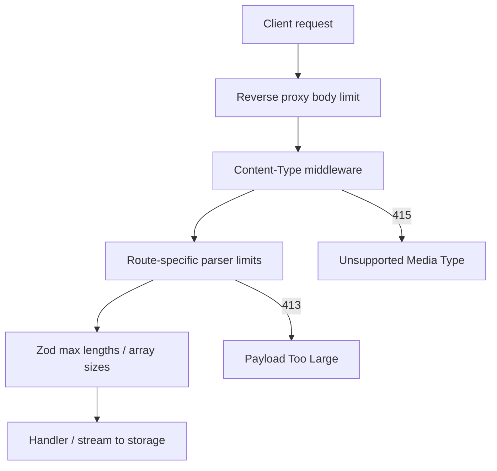
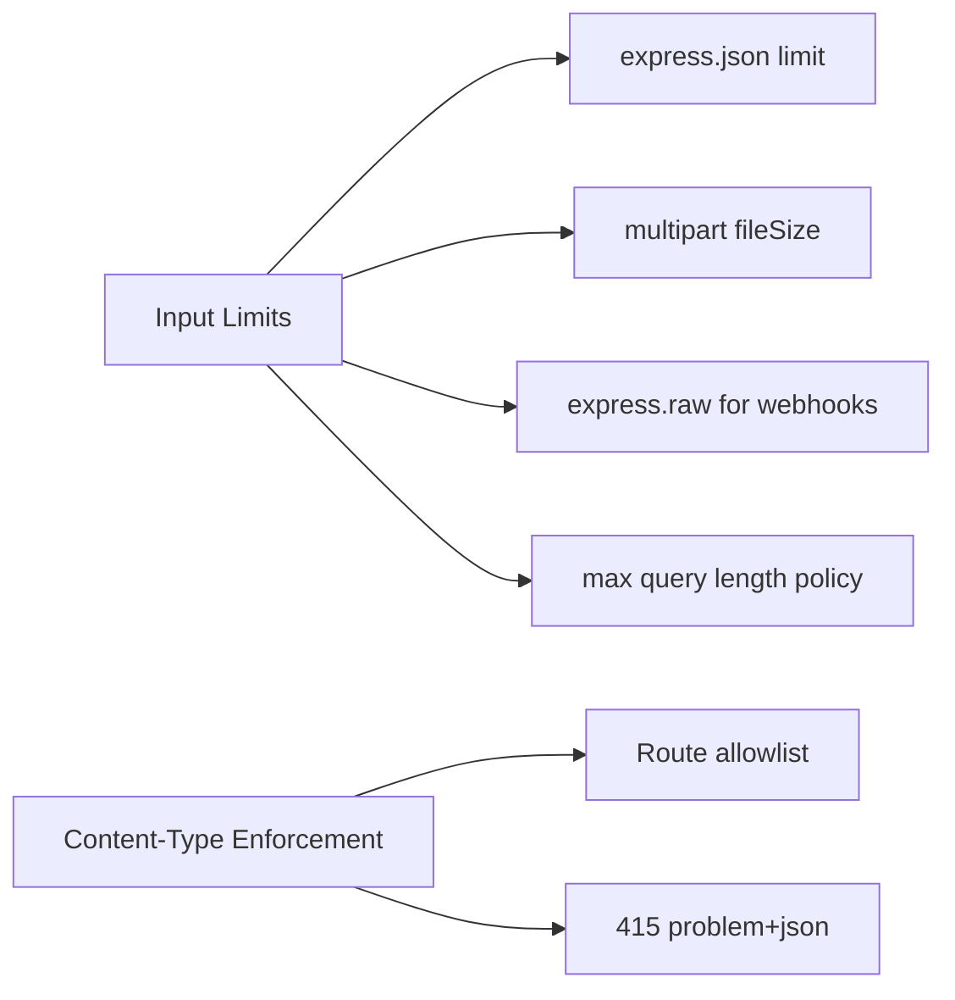
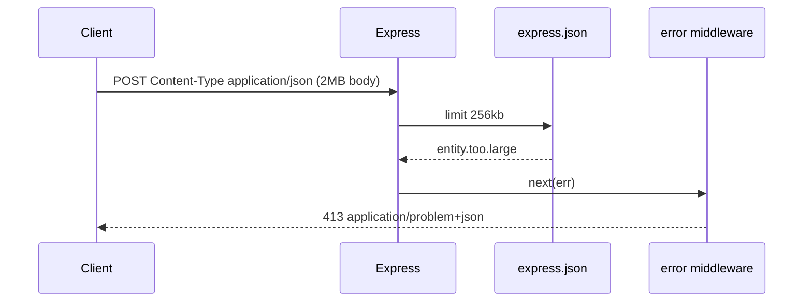

# Input Limits Uploads and Content-Type Enforcement

## Overview

**Input limits** cap how much data a client may send: JSON body size, header counts, field lengths, file upload bytes, and multipart part counts. **Content-Type enforcement** rejects requests whose `Content-Type` does not match what the route accepts—`application/json` for JSON handlers, `multipart/form-data` for file uploads, `application/octet-stream` for raw binary pipelines.

In Express on Node, limits apply at **reverse proxy**, **body parser**, and **stream** layers. Validation schemas add semantic max lengths; they do not replace byte-level guards. Misconfigured limits cause **DoS** (memory exhaustion) or **parser desync** (accepting HTML where JSON expected). This note covers product policy and Express implementation—not CDN/WAF internals (see [[18-Security/README|Security]] for edge WAF depth).

## Learning Objectives

- Configure JSON, urlencoded, and raw body limits appropriately per route
- Handle `multipart/form-data` with streaming and file size caps
- Enforce Content-Type allowlists before parsers run
- Return consistent `413 Payload Too Large` and `415 Unsupported Media Type` problem responses
- Combine limits with rate limiting and auth for abuse resistance

## Prerequisites

- [[06-NodeJS/04-Buffers-Streams-and-IO/Backpressure and HighWaterMark|Backpressure and HighWaterMark]]
- [[07-Backend/03-Validation-Errors-and-Versioning/Schema Validation at the Edge|Schema Validation at the Edge]]
- [[07-Backend/02-Frameworks-and-Middleware/Middleware Pipeline and Error Middleware|Middleware Pipeline and Error Middleware]]

## Difficulty

`intermediate`

## Estimated Time

- Reading: 1.5 hours
- Exercises: 2.5 hours
- Mini project: 4 hours

## History

Early PHP `post_max_size` and Apache `LimitRequestBody` set precedents. Node's `body-parser` made limits explicit via `limit` option. Large file uploads moved to **direct-to-object-storage** presigned URLs to keep API servers off the hot path. **Content-Type sniffing** attacks taught strict typing: never trust client-declared types without validation; for JSON routes, reject `text/plain` bodies with JSON-looking content unless policy allows.

## Problem It Solves

| Failure mode | No limits | Limits + type enforcement |
| --- | --- | --- |
| JSON bomb | 500 MB body OOMs process | 413 at parser |
| Slowloris-style upload | Connection holds memory | Timeout + stream cap |
| Wrong parser | multipart parsed as JSON | 415 before handler |
| Zip bomb in avatar | CPU/disk exhaustion | Magic-byte check + size cap |
| Log injection via huge query | Log pipeline stall | Query string length cap |

## Internal Implementation

Defense in depth layers:



For uploads, prefer **streaming to disk/S3** with `highWaterMark` awareness ([[06-NodeJS/04-Buffers-Streams-and-IO/Backpressure and HighWaterMark|Backpressure and HighWaterMark]]) over buffering entire files in RAM.

## Mermaid Diagrams

### Structure



### Sequence / Lifecycle — oversized JSON



## Examples

### Minimal Example

```typescript
import express from "express";

const app = express();

// Global default — tighten per-router in production
app.use(express.json({ limit: "256kb" }));
app.use(express.urlencoded({ extended: true, limit: "64kb" }));

app.post("/v1/notes", (req, res) => {
  res.status(201).json({ id: "note_1", body: req.body.text });
});

app.listen(3000);
```

### Production-Shaped Example

```typescript
import express, { Request, Response, NextFunction, Router } from "express";
import multer from "multer";
import { z } from "zod";

const ALLOW_JSON = new Set(["application/json"]);
const ALLOW_MULTIPART = new Set(["multipart/form-data"]);

function requireContentType(allowed: Set<string>) {
  return (req: Request, res: Response, next: NextFunction) => {
    const raw = req.header("content-type")?.split(";")[0].trim().toLowerCase();
    if (!raw || !allowed.has(raw)) {
      return res.status(415).type("application/problem+json").json({
        type: "https://api.example.com/problems/unsupported-media-type",
        title: "Unsupported Media Type",
        status: 415,
        detail: `Expected one of: ${[...allowed].join(", ")}`,
      });
    }
    next();
  };
}

const upload = multer({
  storage: multer.memoryStorage(), // production: stream to disk/S3
  limits: {
    fileSize: 5 * 1024 * 1024, // 5 MB
    files: 1,
    fields: 10,
    fieldNameSize: 100,
    fieldSize: 1024,
  },
});

const avatarMeta = z.object({
  displayName: z.string().min(1).max(80),
});

const api = Router();
api.use(express.json({ limit: "128kb" }));

api.post("/v1/users/:id/avatar", requireContentType(ALLOW_MULTIPART), (req, res, next) => {
  upload.single("avatar")(req, res, (err) => {
    if (err?.code === "LIMIT_FILE_SIZE") {
      return res.status(413).type("application/problem+json").json({
        type: "https://api.example.com/problems/payload-too-large",
        title: "Payload Too Large",
        status: 413,
        detail: "Avatar must be at most 5 MB",
      });
    }
    if (err) return next(err);
    if (!req.file) {
      return res.status(400).type("application/problem+json").json({
        type: "https://api.example.com/problems/validation-error",
        title: "Validation failed",
        status: 400,
        detail: "avatar file required",
      });
    }
    // magic-byte sniff, virus scan, presigned offload — production steps
    res.status(201).json({ ok: true, bytes: req.file.size, mime: req.file.mimetype });
  });
});

api.post("/v1/users", requireContentType(ALLOW_JSON), (req, res, next) => {
  const parsed = avatarMeta.safeParse(req.body);
  if (!parsed.success) return next(Object.assign(new Error("validation"), { issues: parsed.error.issues }));
  res.status(201).json(parsed.data);
});

const app = express();
app.use(api);

app.use((err: any, _req: Request, res: Response, _next: NextFunction) => {
  if (err.type === "entity.too.large") {
    return res.status(413).type("application/problem+json").json({
      type: "https://api.example.com/problems/payload-too-large",
      title: "Payload Too Large",
      status: 413,
    });
  }
  res.status(500).type("application/problem+json").json({ title: "Internal error", status: 500 });
});

app.listen(3000);
```

Webhook routes often need **`express.raw({ type: 'application/json', limit: '1mb' })`** to verify HMAC on exact bytes—do not re-serialize parsed JSON.

## Trade-offs

| Dimension | Upside | Downside | When it matters |
| --- | --- | --- | --- |
| Global low limit | Protects all routes | Breaks legitimate large imports | Default safe posture |
| Per-route limits | Flexibility | Config sprawl | Mixed JSON + upload API |
| Memory storage (multer) | Simple | RAM spike under concurrency | Dev only |
| Presigned upload | API server stays thin | More client logic | Mobile/media apps |
| Strict Content-Type | Blocks confusion attacks | Rejects missing charset clients | Public APIs |

### When to Use

- Every production Express app exposing public endpoints
- File upload routes with explicit max bytes and MIME policy
- Webhooks requiring raw body signature verification

### When Not to Use

- Replacing virus scan or content moderation with size limits alone
- Applying JSON parser to file download endpoints (use streams)

## Exercises

1. Add per-router `express.json({ limit: '2mb' })` only on `/imports` while global stays 128kb.
2. Trigger `413` and assert problem+json body; compare with default HTML error from unhandled parser error.
3. Implement middleware rejecting requests with `Content-Length` > N before body read (early reject).
4. Sketch presigned S3 upload flow—what limits move to object storage policy?
5. List three Content-Type values clients send for JSON incorrectly; decide accept vs 415.

## Mini Project

Add avatar upload to Authentication Server mini project with 5 MB cap, MIME allowlist (`image/png`, `image/jpeg`), and metrics counter for rejected uploads.

## Portfolio Project

Document **Input Budget Table** in Backend Service Toolkit: every route, max body, Content-Type, and 413/415 problem types.

## Interview Questions

1. Where should byte limits live: nginx, Express parser, or Zod? Why all three?
2. Why use `express.raw` for Stripe webhooks instead of `express.json`?
3. What happens if multer `fileSize` is exceeded—how should clients learn the limit?
4. Is missing `Content-Type` on POST JSON acceptable? What is your policy?
5. How do streaming uploads interact with Node event-loop health?

### Stretch / Staff-Level

1. Design upload architecture for 5 GB video files without pinning multi-GB buffers in API pods.
2. Compare WAF body inspection vs app-level limits for JSON bomb defense.

## Common Mistakes

- Single global 50 MB JSON limit "for convenience"
- Using `memoryStorage` for production uploads under load
- Validating file type by extension only, not magic bytes
- Parsing JSON before checking Content-Type
- No timeout on slow upload connections

## Best Practices

- Document limits in OpenAPI `maxLength` / description + error responses
- Align proxy `client_max_body_size` with app limits (proxy slightly higher or equal)
- Stream to object storage; return 201 with resource URL
- Combine with [[07-Backend/06-Reliability-and-Abuse-Resistance/Rate Limiting and Quotas|Rate Limiting and Quotas]]
- Log 413/415 rates—spikes indicate abuse or broken clients

## Summary

Input limits and Content-Type enforcement are the first abuse and stability gates on HTTP APIs: cap bytes at proxy and parser, allowlist media types per route, stream large uploads instead of buffering, map parser failures to 413/415 problem documents, and align semantic schema maxes with byte limits. JSON schema validation complements but never replaces transport-level guards.

## Further Reading

- [[06-NodeJS/04-Buffers-Streams-and-IO/Readable Writable and Duplex Streams|Readable Writable and Duplex Streams]]
- [[07-Backend/06-Reliability-and-Abuse-Resistance/Rate Limiting and Quotas|Rate Limiting and Quotas]]
- OWASP — Unrestricted Upload of File with Dangerous Type

## Related Notes

- [[07-Backend/03-Validation-Errors-and-Versioning/Schema Validation at the Edge|Schema Validation at the Edge]]
- [[07-Backend/03-Validation-Errors-and-Versioning/Problem Details and Error Envelopes|Problem Details and Error Envelopes]]
- [[06-NodeJS/04-Buffers-Streams-and-IO/Backpressure and HighWaterMark|Backpressure and HighWaterMark]]
- [[07-Backend/06-Reliability-and-Abuse-Resistance/Rate Limiting and Quotas|Rate Limiting and Quotas]]
- [[07-Backend/09-Security-and-Supply-Chain/Path Traversal and Safe Filesystem Access|Path Traversal and Safe Filesystem Access]]

## Progress Checklist

- [ ] Explained from first principles
- [ ] Drew at least one Mermaid diagram
- [ ] Implemented a minimal version
- [ ] Documented trade-offs and non-goals
- [ ] Completed exercises
- [ ] Practiced interview questions aloud
- [ ] Linked prerequisites and dependents
