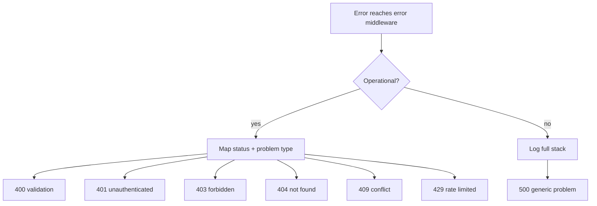
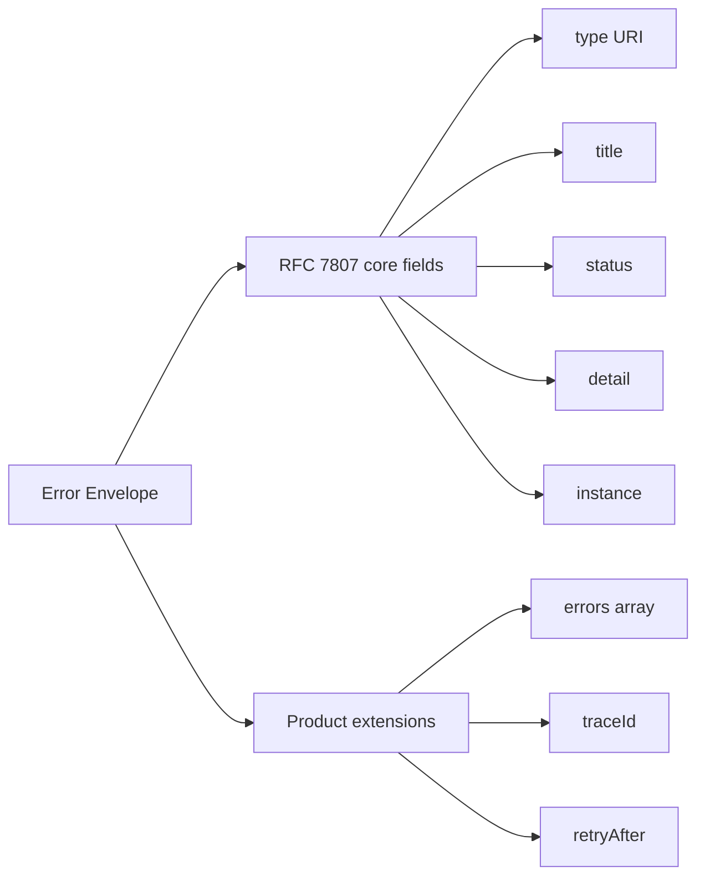
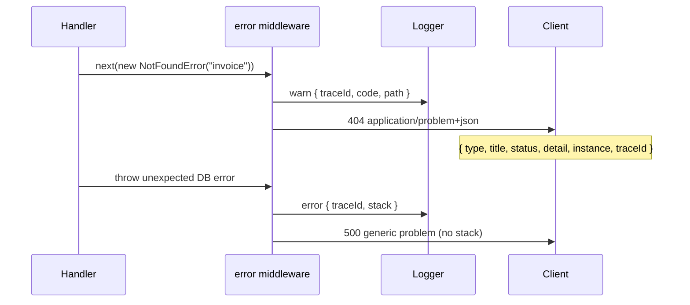

# Problem Details and Error Envelopes

## Overview

An **error envelope** is the stable JSON shape your API returns for failure responses. **RFC 7807 Problem Details for HTTP APIs** defines a standard envelope (`application/problem+json`) with fields like `type`, `title`, `status`, `detail`, and `instance`. Product APIs extend it with machine-readable extensions (`errors[]`, `traceId`, `retryAfter`) while keeping core semantics consistent across routes and versions.

Express services centralize error formatting in **error middleware**—the last middleware with four arguments `(err, req, res, next)`. Handlers and validation layers throw or call `next(err)` with operational errors carrying HTTP status and safe client messages; the error middleware maps them to problem documents and logs rich context server-side.

## Learning Objectives

- Implement RFC 7807-compatible problem responses in Express error middleware
- Distinguish operational errors (expected, client-safe) from programmer/unknown errors
- Design extension fields for validation, rate limits, and conflict without breaking clients
- Avoid leaking stack traces, SQL, and internal IDs in production responses
- Correlate errors with request IDs for support and observability

## Prerequisites

- [[07-Backend/01-HTTP-APIs-and-Contracts/Status Codes as Product Policy|Status Codes as Product Policy]]
- [[07-Backend/02-Frameworks-and-Middleware/Middleware Pipeline and Error Middleware|Middleware Pipeline and Error Middleware]]
- [[02-JavaScript/07-Production-JavaScript/Error Design and Exception Safety|Error Design and Exception Safety]]

## Difficulty

`intermediate`

## Estimated Time

- Reading: 1.5 hours
- Exercises: 2 hours
- Mini project: 3 hours

## History

Before standardization, APIs returned ad-hoc `{ error: "something went wrong" }` or SOAP faults. REST adopters copied varied patterns: GitHub's `message`, Stripe's `error` object, Twitter's `errors` array. **RFC 7807** (2016) gave a media type and minimal schema so clients could branch on `type` URIs instead of parsing English text. **RFC 9457** (2023) obsoletes 7807 with clarifications but preserves the core model.

Problem Details sit at the intersection of **HTTP semantics** (status code is authoritative) and **product UX** (detail string helps humans; type URI helps automation).

## Problem It Solves

| Failure mode | Ad-hoc errors | Problem envelope |
| --- | --- | --- |
| Client parsing | Brittle string matching | Stable `type` URI + extensions |
| Inconsistent 404/403 bodies | Some routes return HTML | Always `application/problem+json` for API routes |
| Leaked internals | Stack in JSON body | Sanitized detail; stack in logs only |
| Support chaos | "What request failed?" | `instance` + `traceId` tie to logs |
| Version skew | New fields break old clients | Extensions optional; core fields stable |

## Internal Implementation

### Operational error taxonomy



Operational errors implement a narrow interface: `statusCode`, `problemType`, `title`, optional `detail`, optional extensions. Unknown errors become `500` with generic detail; never expose `err.message` from third-party libraries verbatim.

### Content negotiation

API routes should set `Accept: application/json` policy. If `Accept` includes `application/problem+json` or `application/json`, emit problem JSON. For browser `Accept: text/html` on API paths, still prefer JSON for XHR/fetch clients—document policy in OpenAPI.

## Mermaid Diagrams

### Structure



### Sequence / Lifecycle



## Examples

### Minimal Example

```typescript
import express, { Request, Response, NextFunction } from "express";

class HttpError extends Error {
  constructor(
    public statusCode: number,
    public problemType: string,
    public title: string,
    public detail?: string,
  ) {
    super(title);
  }
}

const app = express();

app.get("/invoices/:id", (req, res, next) => {
  if (req.params.id === "missing") {
    return next(new HttpError(
      404,
      "https://api.example.com/problems/not-found",
      "Resource not found",
      `Invoice ${req.params.id} does not exist`,
    ));
  }
  res.json({ id: req.params.id });
});

app.use((err: Error, req: Request, res: Response, _next: NextFunction) => {
  const httpErr = err instanceof HttpError ? err : null;
  const status = httpErr?.statusCode ?? 500;
  res.status(status).type("application/problem+json").json({
    type: httpErr?.problemType ?? "https://api.example.com/problems/internal",
    title: httpErr?.title ?? "Internal server error",
    status,
    detail: httpErr?.detail ?? "An unexpected error occurred",
    instance: req.originalUrl,
  });
});

app.listen(3000);
```

### Production-Shaped Example

```typescript
import express, { Request, Response, NextFunction } from "express";
import { randomUUID } from "node:crypto";

interface ProblemDocument {
  type: string;
  title: string;
  status: number;
  detail?: string;
  instance?: string;
  traceId?: string;
  errors?: Array<{ path: string; message: string }>;
  retryAfter?: number;
}

export class AppError extends Error {
  readonly isOperational = true;
  constructor(
    public readonly statusCode: number,
    public readonly problemType: string,
    public readonly title: string,
    public readonly detail?: string,
    public readonly extensions: Record<string, unknown> = {},
  ) {
    super(title);
  }
}

declare global {
  namespace Express {
    interface Request {
      traceId?: string;
    }
  }
}

const PROBLEM_BASE = "https://api.example.com/problems";

function problem(
  status: number,
  slug: string,
  title: string,
  detail?: string,
  extensions?: Record<string, unknown>,
) {
  return new AppError(status, `${PROBLEM_BASE}/${slug}`, title, detail, extensions);
}

export const NotFound = (resource: string, id: string) =>
  problem(404, "not-found", "Resource not found", `${resource} ${id} not found`);

export const ValidationFailed = (errors: Array<{ path: string; message: string }>) =>
  problem(400, "validation-error", "Validation failed", undefined, { errors });

const app = express();
app.use(express.json());

app.use((req, _res, next) => {
  req.traceId = req.header("x-request-id") ?? randomUUID();
  next();
});

app.get("/v1/invoices/:id", async (req, res, next) => {
  try {
    const invoice = await findInvoice(req.params.id);
    if (!invoice) throw NotFound("Invoice", req.params.id);
    res.json(invoice);
  } catch (err) {
    next(err);
  }
});

app.use((err: unknown, req: Request, res: Response, _next: NextFunction) => {
  const traceId = req.traceId ?? randomUUID();
  const op = err instanceof AppError ? err : null;
  const status = op?.statusCode ?? 500;

  const doc: ProblemDocument = {
    type: op?.problemType ?? `${PROBLEM_BASE}/internal`,
    title: op?.title ?? "Internal server error",
    status,
    instance: req.originalUrl,
    traceId,
  };

  if (op?.detail) doc.detail = op.detail;
  if (op?.extensions.errors) doc.errors = op.extensions.errors as ProblemDocument["errors"];
  if (status === 500) {
    console.error(JSON.stringify({ traceId, err, path: req.path }));
    doc.detail = "An unexpected error occurred";
  } else {
    console.warn(JSON.stringify({ traceId, status, type: doc.type, path: req.path }));
  }

  res.status(status).type("application/problem+json").json(doc);
});

async function findInvoice(_id: string) {
  return null;
}

app.listen(3000);
```

## Trade-offs

| Dimension | Upside | Downside | When it matters |
| --- | --- | --- | --- |
| RFC 7807 strictness | Interoperable clients | Verbose for tiny APIs | Public/partner APIs |
| `type` as URI vs URN | Web-fetchable docs | Requires hosting problem catalog | Large orgs |
| Detail string localization | Human-readable | i18n complexity | Consumer apps |
| Trace in body | Support-friendly | Slight info disclosure | B2B SaaS |
| Single vs multi-error | One round trip for forms | Harder generic client | Validation-heavy APIs |

### When to Use

- All JSON API error responses on production services
- Machine clients (mobile, SPA, partners) that branch on error kind
- Services with centralized logging and support workflows

### When Not to Use

- Legacy clients locked to non-standard shapes—use compatibility adapter layer
- Streaming/SSE where errors are event-shaped, not HTTP bodies mid-stream
- Replacing correct HTTP status semantics with 200 + error payload (anti-pattern)

## Exercises

1. Add `429` problem responses with `retryAfter` extension; wire to a token-bucket limiter stub.
2. Write contract tests asserting every documented OpenAPI error response matches problem schema.
3. Implement `instance` as full URL vs path-only—list trade-offs for CDN and multi-tenant routing.
4. Compare exposing `code: "INVOICE_NOT_FOUND"` vs relying on `type` URI—when is a short code justified?
5. Simulate an `AppError` and unknown `Error` in tests; assert 500 never includes stack in body.

## Mini Project

Extend the Express clone error pipeline so thrown `AppError` instances serialize to problem+json and unknown errors log structured JSON with `traceId`. Integrate with validation middleware from [[07-Backend/03-Validation-Errors-and-Versioning/Schema Validation at the Edge|Schema Validation at the Edge]].

## Portfolio Project

Publish a **Problem Type Catalog** markdown page for Backend Service Toolkit listing every `type` URI, HTTP status, retryability, and client action—linked from OpenAPI `description` fields.

## Interview Questions

1. What fields are required in RFC 7807, and which are optional extensions?
2. Why should unknown errors return a generic 500 detail while logging the real message server-side?
3. How do problem details relate to HTTP status codes—which is authoritative?
4. Where should validation field errors live—in `detail`, or an extension array?
5. How does `traceId` differ from `instance`?

### Stretch / Staff-Level

1. Design error envelopes for a GraphQL API vs REST—what breaks if you copy problem+json blindly?
2. How would you migrate thousands of clients from `{ error: string }` to problem+json without a flag day?

## Common Mistakes

- Returning 200 OK with `{ success: false }` for errors
- Different JSON shapes per route (`message` vs `error` vs `errors`)
- Including stack traces or SQL in production JSON
- Using English `title` as the only machine-readable discriminator
- Forgetting to call `next(err)` in async handlers—silent hangs

## Best Practices

- Subclass or factory for operational errors; ban `res.status(400).json({})` in handlers
- Register problem types in OpenAPI components
- Always set `Content-Type: application/problem+json`
- Propagate inbound `X-Request-ID` or generate UUID at edge
- Map domain exceptions once in error middleware—not in every handler

## Summary

Problem Details give HTTP APIs a consistent, machine-readable error envelope: status codes express outcome, problem fields explain why, and extensions carry validation and rate-limit metadata. Express services implement this in centralized error middleware, distinguish operational from unknown failures, correlate responses with logs via trace IDs, and never leak implementation details to clients.

## Further Reading

- RFC 9457 — Problem Details for HTTP APIs
- [[07-Backend/01-HTTP-APIs-and-Contracts/Status Codes as Product Policy|Status Codes as Product Policy]]
- [[07-Backend/09-API-Observability-and-Testing/Structured Logs with Request Correlation|Structured Logs with Request Correlation]]

## Related Notes

- [[07-Backend/03-Validation-Errors-and-Versioning/Schema Validation at the Edge|Schema Validation at the Edge]]
- [[07-Backend/02-Frameworks-and-Middleware/Middleware Pipeline and Error Middleware|Middleware Pipeline and Error Middleware]]
- [[07-Backend/01-HTTP-APIs-and-Contracts/OpenAPI as Executable Contract|OpenAPI as Executable Contract]]
- [[02-JavaScript/07-Production-JavaScript/Error Design and Exception Safety|Error Design and Exception Safety]]
- [[07-Backend/06-Reliability-and-Abuse-Resistance/Rate Limiting and Quotas|Rate Limiting and Quotas]]

## Progress Checklist

- [ ] Explained from first principles
- [ ] Drew at least one Mermaid diagram
- [ ] Implemented a minimal version
- [ ] Documented trade-offs and non-goals
- [ ] Completed exercises
- [ ] Practiced interview questions aloud
- [ ] Linked prerequisites and dependents
