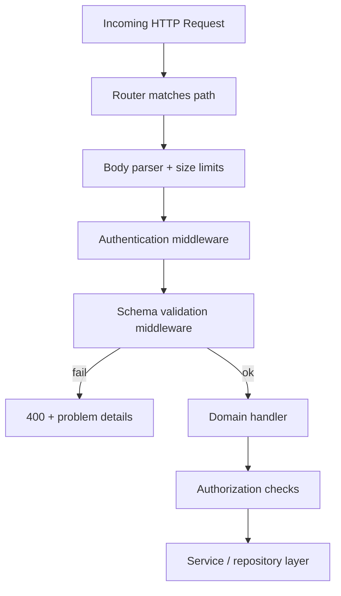
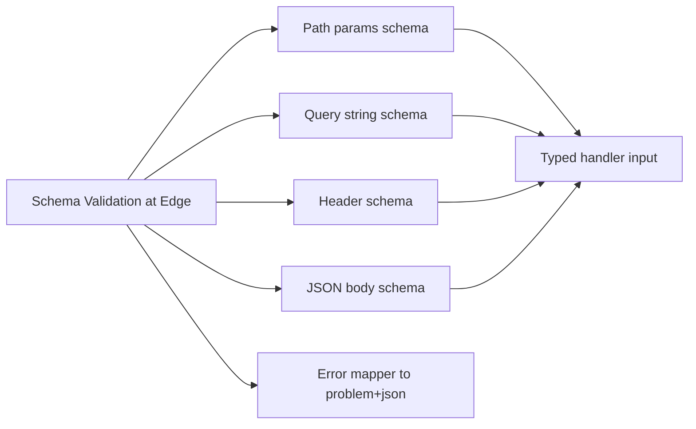
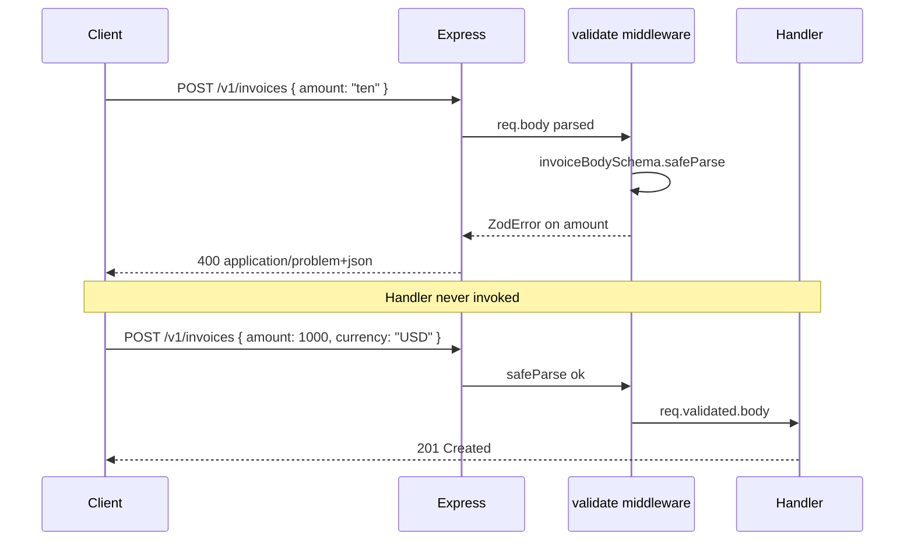

# Schema Validation at the Edge

## Overview

**Schema validation at the edge** means rejecting malformed or semantically invalid HTTP input **before** it reaches domain logic, using declarative schemas that describe allowed shapes, types, ranges, and coercions for params, query strings, headers, and bodies. In Express services, this typically lives in middleware that runs immediately after routing and authentication context is established but before handlers mutate state.

The edge is the contract boundary: clients see `400 Bad Request` with field-level detail; your service layer never receives `undefined` where a UUID was promised, never parses dates twice, and never trusts `req.body` as honest JSON. Validation is not security by itself—it is **structural integrity** that makes authorization, business rules, and observability predictable.

## Learning Objectives

- Place validation in the middleware pipeline with correct ordering relative to auth and body parsing
- Define reusable schemas for params, query, headers, and JSON bodies with Zod (or equivalent)
- Map validation failures to stable `400` responses aligned with your error envelope policy
- Distinguish syntactic validation (shape/types) from semantic validation (business invariants)
- Connect runtime schemas to OpenAPI contracts for drift detection

## Prerequisites

- [[07-Backend/02-Frameworks-and-Middleware/Middleware Pipeline and Error Middleware|Middleware Pipeline and Error Middleware]]
- [[07-Backend/01-HTTP-APIs-and-Contracts/Status Codes as Product Policy|Status Codes as Product Policy]]
- [[02-JavaScript/07-Production-JavaScript/Error Design and Exception Safety|Error Design and Exception Safety]]

## Difficulty

`intermediate`

## Estimated Time

- Reading: 1.5 hours
- Exercises: 2 hours
- Mini project: 4 hours

## History

Early web frameworks treated `req.body` as a bag of untyped properties. PHP and Rails added form validators; JSON APIs inherited the same pattern with ad-hoc `if (!body.email)` checks scattered through handlers. **JSON Schema** (IETF draft → standard) formalized document validation; **OpenAPI** adopted it for API descriptions. In the Node ecosystem, **Joi**, **Ajv**, and **Zod** became the dominant runtime validators—Zod especially for TypeScript because inferred types flow from schemas to handlers without code generation.

The shift to "validation at the edge" reflects microservice maturity: fail fast at the HTTP boundary, keep domain services free of transport concerns, and make invalid traffic cheap to reject (important for abuse resistance—see [[07-Backend/03-Validation-Errors-and-Versioning/Input Limits Uploads and Content-Type Enforcement|Input Limits Uploads and Content-Type Enforcement]]).

## Problem It Solves

| Failure mode | Without edge validation | With edge validation |
| --- | --- | --- |
| Type confusion | `"123"` vs `123` breaks SQL or comparisons | Coercion policy explicit; wrong types rejected |
| Missing fields | `undefined` propagates; NPE in DB layer | Required fields enforced before handler |
| Oversized payloads | Memory blow-up in handler | Rejected at parser + schema max limits |
| Contract drift | Docs say one shape; server accepts another | Schema is source of truth; OpenAPI diff in CI |
| Inconsistent errors | Each handler invents error text | Central mapper → problem+json envelope |

Validation at the edge does **not** replace authorization ([[07-Backend/05-Authorization-and-Tenancy/Resource Ownership Checks|Resource Ownership Checks]]) or authentication ([[07-Backend/04-Authentication/JWT Access Tokens and Claims|JWT Access Tokens and Claims]]). It ensures the request is **well-formed enough** to evaluate those policies.

## Internal Implementation

Validation middleware typically:

1. Selects the schema set for the route (method + path + API version).
2. Parses/coerces raw inputs (query strings are always strings until coerced).
3. Runs `safeParse` (non-throwing) and collects `ZodIssue[]`.
4. On failure, calls `next(validationError)` mapped to `400` + field paths.
5. On success, attaches typed `req.validated` (or overwrites `req.body` deliberately—document the choice).



### Ordering matters

- **After** body parser: JSON must be parsed (or stream validated separately for huge payloads).
- **Before** handlers: domain code assumes validated types.
- **Often after** auth: some schemas depend on tenant or role (e.g., admin-only fields)—but anonymous routes validate before auth.

## Mermaid Diagrams

### Structure



### Sequence / Lifecycle



## Examples

### Minimal Example

```typescript
// Node 20+ / TypeScript 5+ / Express 4
import express from "express";
import { z } from "zod";

const app = express();
app.use(express.json({ limit: "100kb" }));

const createUserBody = z.object({
  email: z.string().email(),
  displayName: z.string().min(1).max(80),
});

app.post("/users", (req, res, next) => {
  const parsed = createUserBody.safeParse(req.body);
  if (!parsed.success) {
    res.status(400).json({
      title: "Validation failed",
      errors: parsed.error.flatten().fieldErrors,
    });
    return;
  }
  const { email, displayName } = parsed.data;
  res.status(201).json({ id: "usr_1", email, displayName });
});

app.listen(3000);
```

### Production-Shaped Example

```typescript
// Node 20+ / TypeScript 5+ / Express 4 + Zod
import express, { Request, Response, NextFunction } from "express";
import { z, ZodSchema } from "zod";

type ValidatedRequest<T> = Request & { validated: T };

function validate<T extends Record<string, ZodSchema>>(schemas: T) {
  return (req: Request, _res: Response, next: NextFunction) => {
    const result: Record<string, unknown> = {};
    for (const [key, schema] of Object.entries(schemas)) {
      const source =
        key === "body" ? req.body :
        key === "query" ? req.query :
        key === "params" ? req.params :
        req.headers;
      const parsed = schema.safeParse(source);
      if (!parsed.success) {
        return next(Object.assign(new Error("validation_failed"), {
          status: 400,
          issues: parsed.error.issues,
        }));
      }
      result[key] = parsed.data;
    }
    (req as ValidatedRequest<typeof result>).validated = result;
    next();
  };
}

const listInvoicesQuery = z.object({
  status: z.enum(["draft", "sent", "paid"]).optional(),
  page: z.coerce.number().int().min(1).default(1),
  limit: z.coerce.number().int().min(1).max(100).default(20),
});

const invoiceIdParam = z.object({
  invoiceId: z.string().uuid(),
});

const createInvoiceBody = z.object({
  customerId: z.string().uuid(),
  lineItems: z.array(z.object({
    sku: z.string().min(1),
    quantity: z.number().int().positive(),
    unitPriceCents: z.number().int().nonnegative(),
  })).min(1),
  dueDate: z.coerce.date(),
});

const app = express();
app.use(express.json({ limit: "256kb" }));

app.get(
  "/v1/invoices/:invoiceId",
  validate({ params: invoiceIdParam, query: listInvoicesQuery }),
  async (req: ValidatedRequest<{ params: z.infer<typeof invoiceIdParam> }>, res, next) => {
    try {
      const { invoiceId } = req.validated.params;
      // domain + ownership check follows
      res.json({ id: invoiceId, status: "draft" });
    } catch (err) {
      next(err);
    }
  },
);

// Central error middleware maps validation_failed → RFC 7807 (see Problem Details note)
app.use((err: any, _req: Request, res: Response, _next: NextFunction) => {
  if (err.message === "validation_failed") {
    res.status(400).type("application/problem+json").json({
      type: "https://api.example.com/problems/validation-error",
      title: "Request validation failed",
      status: 400,
      errors: err.issues?.map((i: z.ZodIssue) => ({
        path: i.path.join("."),
        message: i.message,
      })),
    });
    return;
  }
  res.status(500).type("application/problem+json").json({ title: "Internal error", status: 500 });
});

app.listen(3000);
```

Semantic rules (e.g., "due date must be after issue date") belong in the **domain layer** after structural validation passes—return `422 Unprocessable Entity` when the shape is valid but business invariants fail.

## Trade-offs

| Dimension | Upside | Downside | When it matters |
| --- | --- | --- | --- |
| Library (Zod vs Ajv) | Zod: TS inference, readable API | Zod: slower than Ajv on huge JSON | High-throughput ingest APIs |
| Strict vs coerce | Coerce query strings to numbers/dates | Silent coercion hides client bugs | Public APIs with messy clients |
| Single vs split schemas | Per-route schemas are precise | Duplication across versions | Multi-version APIs |
| Fail fast | Cheap rejection, clear 400s | Must maintain schemas alongside code | High abuse or high traffic |
| OpenAPI sync | Contract tests catch drift | Two sources unless generated from one | Partner integrations |

### When to Use

- Every mutating endpoint (`POST`, `PUT`, `PATCH`, `DELETE`)
- List endpoints with pagination/filter query params
- Webhooks and partner APIs with published contracts

### When Not to Use

- Raw binary/stream uploads validated by signature/size, not JSON schema (see Input Limits note)
- Internal service-to-service calls where protobuf/Avro already enforces shape
- Replacing authorization ("valid UUID" ≠ "caller may access this UUID")

## Exercises

1. Add validation for `PATCH /v1/users/:userId` where at least one of `displayName` or `avatarUrl` must be present (hint: `z.object().refine()`).
2. Write a middleware unit test that asserts a malformed body never calls the handler (spy on `next` and handler).
3. Compare `z.coerce.number()` vs strict `z.number()` for query `?page=2` and `?page=abc`; document error shapes.
4. Generate an OpenAPI fragment from your Zod schemas (or manually diff) and list one intentional drift scenario.
5. Measure handler CPU with and without validation on 10k req/s synthetic load—when does Ajv win?

## Mini Project

Build a **validation middleware package** for your Express clone ([[07-Backend/02-Frameworks-and-Middleware/Express Clone Design|Express Clone Design]]) that accepts `{ params?, query?, body?, headers? }` schemas, attaches `req.validated`, and integrates with your problem+json error middleware. Cover three routes in the URL Shortener API mini project.

## Portfolio Project

In [[07-Backend/projects/Backend Service Toolkit/README|Backend Service Toolkit]], add a `validateRequest()` helper, shared pagination query schema, and CI check that OpenAPI request bodies match Zod definitions.

## Interview Questions

1. Where in the Express pipeline should validation run relative to authentication and body parsing? Why?
2. What is the difference between syntactic validation and semantic/business validation? Which status codes?
3. Why coerce query parameters, and what are the risks?
4. How do you prevent validation logic duplication across API v1 and v2?
5. Can validation middleware replace authorization? Give a concrete counterexample.

### Stretch / Staff-Level

1. Design validation for a `POST` that accepts either `application/json` or `multipart/form-data` with the same logical fields—how do schemas differ?
2. How would you validate JSON Schema for a 50 MB streaming upload without buffering the entire body?

## Common Mistakes

- Validating in handlers ad hoc—errors and types diverge across routes
- Using `parse()` instead of `safeParse()` and leaking stack traces
- Overwriting `req.body` silently without typing `req.validated`
- Treating validation as security (missing authZ on validated IDs)
- No max length on strings/arrays—DoS via huge payloads

## Best Practices

- One error mapper; field paths stable for client automation
- Shared primitives: `paginationQuery`, `uuidParam`, `email`, `moneyCents`
- Keep domain invariants out of Zod unless purely structural
- Log validation failure metrics (tagged by route)—spike may indicate attack or broken client
- Version schemas with API versions ([[07-Backend/03-Validation-Errors-and-Versioning/API Versioning Strategies|API Versioning Strategies]])

## Summary

Schema validation at the edge is the HTTP service's type system: declarative schemas reject malformed input before domain code runs, produce consistent client errors, and anchor OpenAPI contracts. In Express, implement it as dedicated middleware after parsing and before handlers, use non-throwing parse paths, attach typed results to the request, and reserve business rule failures for the domain layer with appropriate status codes.

## Further Reading

- [[07-Backend/03-Validation-Errors-and-Versioning/Problem Details and Error Envelopes|Problem Details and Error Envelopes]]
- [[07-Backend/01-HTTP-APIs-and-Contracts/OpenAPI as Executable Contract|OpenAPI as Executable Contract]]
- RFC 7807 Problem Details for HTTP APIs
- Zod documentation — `safeParse`, `refine`, `superRefine`

## Related Notes

- [[07-Backend/02-Frameworks-and-Middleware/Middleware Pipeline and Error Middleware|Middleware Pipeline and Error Middleware]]
- [[07-Backend/03-Validation-Errors-and-Versioning/Problem Details and Error Envelopes|Problem Details and Error Envelopes]]
- [[07-Backend/03-Validation-Errors-and-Versioning/Input Limits Uploads and Content-Type Enforcement|Input Limits Uploads and Content-Type Enforcement]]
- [[07-Backend/01-HTTP-APIs-and-Contracts/Status Codes as Product Policy|Status Codes as Product Policy]]
- [[02-JavaScript/07-Production-JavaScript/Error Design and Exception Safety|Error Design and Exception Safety]]

## Progress Checklist

- [ ] Explained from first principles
- [ ] Drew at least one Mermaid diagram
- [ ] Implemented a minimal version
- [ ] Documented trade-offs and non-goals
- [ ] Completed exercises
- [ ] Practiced interview questions aloud
- [ ] Linked prerequisites and dependents
