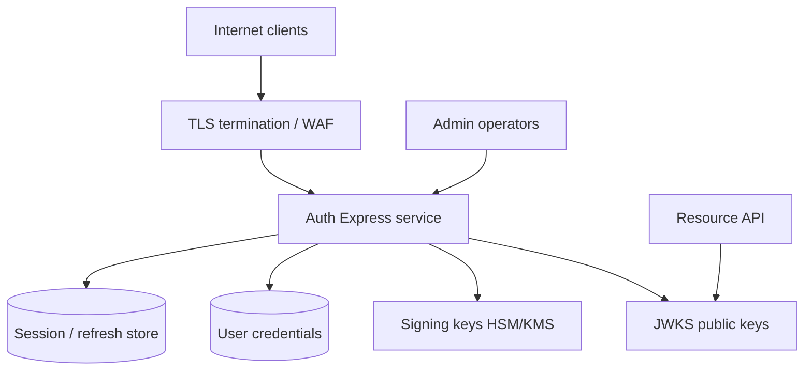
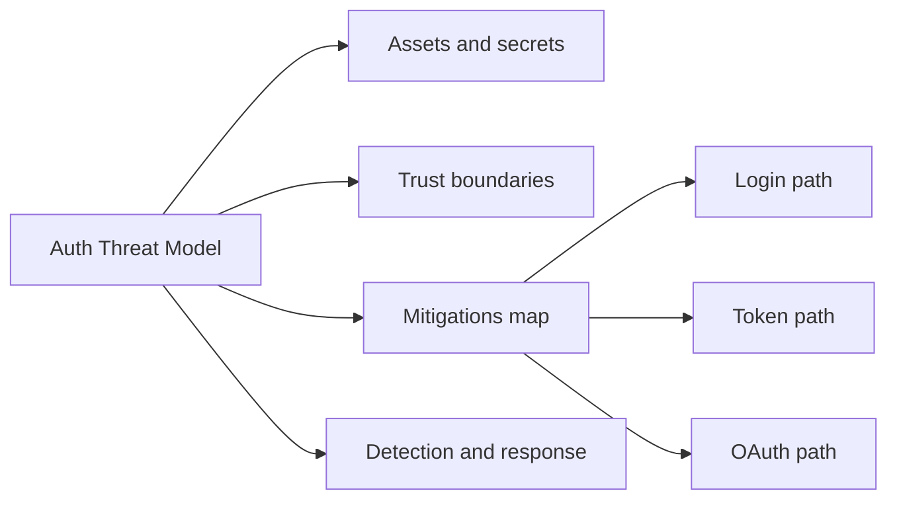
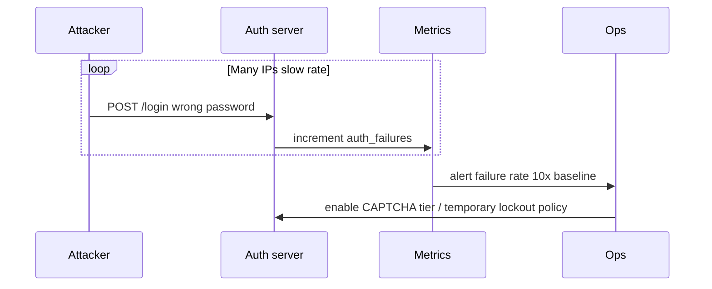

# Authentication Server Threat Model

## Overview

An **authentication server threat model** enumerates **assets**, **trust boundaries**, **attackers**, and **mitigations** for login, token issuance, and session lifecycle—not generic app security. Assets include user credentials, refresh tokens, signing keys, session stores, and OAuth client secrets. Attackers range from credential stuffers and phishing operators to malicious OAuth clients and insider DB access.

The Backend track owns **application-level controls** in Express auth services: rate limits, uniform errors, PKCE, rotation, secure cookies, audit logs. Deep crypto, formal STRIDE workshops, and WAF tuning → [[18-Security/README|Security]]. This note connects auth patterns to **concrete threats** so you implement defenses deliberately, not from checklist memory.

## Learning Objectives

- Build a lightweight STRIDE-style threat model for an auth server
- Map threats to controls across login, token, OAuth, and session flows
- Identify monitoring signals for credential stuffing and token abuse
- Design incident response for key compromise and mass session revoke
- Separate auth server trust boundary from resource API boundary

## Prerequisites

- [[07-Backend/04-Authentication/Password Hashing and Credential Storage|Password Hashing and Credential Storage]]
- [[07-Backend/04-Authentication/Refresh Token Rotation|Refresh Token Rotation]]
- [[07-Backend/06-Reliability-and-Abuse-Resistance/Rate Limiting and Quotas|Rate Limiting and Quotas]]

## Difficulty

`advanced`

## Estimated Time

- Reading: 2 hours
- Exercises: 3 hours
- Mini project: 6 hours

## History

Auth breaches (LinkedIn, Dropbox, OAuth redirect bugs) drove industry focus from "hash passwords" to **systemic** models: OAuth CSRF via `state`, open redirects, JWT `alg:none`, refresh token plaintext storage. OWASP ASVS and NIST 800-63B codify control levels; product teams adapt them to their auth server's architecture.

## Problem It Solves

| Failure mode | Controls without model | Threat-modeled auth server |
| --- | --- | --- |
| Unknown attack surface | Random hardening | Prioritized mitigations |
| OAuth misconfiguration | Production exploit | Redirect URI allowlist by design |
| Credential stuffing | User blame | Rate limit + MFA signal |
| Key leak | Rotate JWT secret manually | JWKS rotation runbook |
| Insider DB read | Passwords exposed | Hashed creds + hashed refresh |

## Internal Implementation

### Trust boundaries



### STRIDE mapping (selected)

| Threat | Example | Mitigation |
| --- | --- | --- |
| Spoofing | Fake login form | OIDC federated IdP, branding, HSTS |
| Tampering | Modify token claims | RS256 signature, verify on resource API |
| Repudiation | Deny admin action | Audit log with actor + IP + traceId |
| Information disclosure | User enumeration | Uniform login errors; rate limits |
| Denial of service | Login flood | Rate limit, CAPTCHA escalation, IP reputation |
| Elevation | Stolen refresh | Rotation + reuse detection; short access TTL |

## Mermaid Diagrams

### Structure



### Sequence / Lifecycle — credential stuffing detection



## Examples

### Minimal Example — threat → control table excerpt

| Flow step | Threat | Control |
| --- | --- | --- |
| POST /login | Credential stuffing | 5/min/IP + 20/min/account + uniform 401 |
| POST /token | Refresh theft | HttpOnly cookie, rotation, hashed storage |
| GET /authorize | Open redirect | Strict redirect_uri exact match |
| JWT issue | Key compromise | KMS-backed keys, kid rotation, short TTL |

### Production-Shaped Example — Express hardening sketch

```typescript
import express, { Request, Response, NextFunction } from "express";
import rateLimit from "express-rate-limit";
import { randomUUID } from "node:crypto";

const app = express();
app.use(express.json({ limit: "16kb" }));
app.set("trust proxy", 1); // behind reverse proxy for correct IP

app.use((req, _res, next) => {
  req.traceId = req.header("x-request-id") ?? randomUUID();
  next();
});

const loginLimiter = rateLimit({
  windowMs: 60_000,
  max: 10,
  standardHeaders: true,
  legacyHeaders: false,
  keyGenerator: (req) => `${req.ip}:${req.body?.email ?? "unknown"}`,
  handler: (_req, res) => {
    res.status(429).type("application/problem+json").json({
      type: "https://api.example.com/problems/rate-limited",
      title: "Too many login attempts",
      status: 429,
    });
  },
});

function audit(event: string, req: Request, meta: Record<string, unknown> = {}) {
  console.log(JSON.stringify({
    event,
    traceId: (req as any).traceId,
    ip: req.ip,
    userAgent: req.header("user-agent"),
    ...meta,
  }));
}

app.post("/v1/auth/login", loginLimiter, async (req, res) => {
  audit("auth.login_attempt", req, { email: req.body?.email });
  // verify password — uniform timing/errors
  const success = false; // stub
  if (!success) {
    audit("auth.login_failure", req);
    return res.status(401).type("application/problem+json").json({
      type: "https://api.example.com/problems/invalid-credentials",
      title: "Invalid email or password",
      status: 401,
    });
  }
  audit("auth.login_success", req, { userId: "usr_42" });
  res.json({ ok: true });
});

// OAuth: reject unknown redirect_uri before showing login
app.get("/oauth2/authorize", (req: Request, res: Response) => {
  const redirectUri = String(req.query.redirect_uri ?? "");
  const allowed = new Set(["https://app.example.com/auth/callback"]);
  if (!allowed.has(redirectUri)) {
    audit("oauth.redirect_rejected", req, { redirectUri });
    return res.status(400).type("application/problem+json").json({
      type: "https://api.example.com/problems/invalid-client",
      title: "Invalid redirect_uri",
      status: 400,
    });
  }
  // continue authorize flow
  res.status(501).end();
});

// Security headers on auth responses
app.use((_req, res, next) => {
  res.setHeader("X-Content-Type-Options", "nosniff");
  res.setHeader("Cache-Control", "no-store");
  next();
});

app.listen(3000);
```

Runbooks (not code): **key compromise** → rotate JWKS, shorten access TTL temporarily, revoke all refresh families; **OAuth client leak** → disable client_id, notify tenants.

## Trade-offs

| Dimension | Upside | Downside | When it matters |
| --- | --- | --- | --- |
| Strict rate limits | Blocks stuffing | Locks out NAT users | Login endpoint |
| CAPTCHA on anomaly | Stops bots | UX friction | Spike detection |
| Uniform errors | Privacy | Harder support debug | Public login |
| Aggressive session revoke | Contain breach | User re-login pain | Reuse detected |
| Federated OIDC | Offload password risk | IdP dependency | Enterprise SSO |

### When to Use

- Designing or reviewing any Authentication Server mini project or production IdP integration
- Prioritizing security backlog for auth endpoints
- Onboarding engineers to auth codepaths

### When Not to Use

- Replacing formal penetration tests or Security track depth
- Threat modeling entire product in one note—scope to auth boundary

## Exercises

1. Draw trust boundary diagram for your Authentication Server mini project; list five assets.
2. For each OAuth parameter (`state`, `redirect_uri`, `client_id`), list one attack and mitigation.
3. Define metrics and alerts: login failure rate, refresh reuse count, token issue rate.
4. Write incident runbook outline for leaked `JWT_PRIVATE_KEY` (one page).
5. Red-team scenario: open redirect on `/authorize`—trace exploit and fix.

## Mini Project

Produce **AUTH_THREAT_MODEL.md** for [[07-Backend/projects/Authentication Server/README|Authentication Server]] with STRIDE table, mitigations implemented in code, and open risks.

## Portfolio Project

Backend Service Toolkit security appendix: auth threat model template, control checklist mapped to ASVS L2 auth chapters.

## Interview Questions

1. Top three threats to a login endpoint and mitigations?
2. How does refresh token reuse detection limit blast radius?
3. Why uniform login error messages matter for security?
4. Open redirect in OAuth—how does it become account takeover?
5. What do you log on auth events vs what must you never log?

### Stretch / Staff-Level

1. Compare threat model for self-hosted auth vs Auth0-class IdP—what risks transfer?
2. Design gradual MFA step-up triggered by risk signals without locking all users.

## Common Mistakes

- Threat model as one-time doc never tied to code
- Logging passwords or refresh tokens in debug traces
- Rate limit only by IP—attackers distribute; add account-level limits
- Ignoring auth server `Cache-Control: no-store`
- Same signing key for dev and prod

## Best Practices

- Review threat model when adding grants, clients, or token fields
- Audit log immutable store for login success/failure, token issue, revoke
- Separate auth service deployment and DB from main product DB when feasible
- Pen-test OAuth redirect and CSRF yearly
- Cross-link mitigations to notes: [[07-Backend/04-Authentication/Refresh Token Rotation|Refresh Token Rotation]], [[07-Backend/04-Authentication/Sessions Cookies and CSRF Boundaries|Sessions Cookies and CSRF Boundaries]]

## Summary

Authentication servers face concentrated attacks: credential stuffing, token theft, OAuth misconfiguration, and key compromise. A practical threat model maps assets and trust boundaries to controls—rate limits, hashed secrets, PKCE, rotation, uniform errors, audit logs, and runbooks—implemented in Express at the auth boundary while deferring deep crypto curriculum to the Security track.

## Further Reading

- OWASP ASVS — Authentication and Session Management
- OWASP OAuth 2.0 Cheat Sheet
- NIST SP 800-63B — Digital Identity Guidelines
- [[18-Security/README|Security]] track

## Related Notes

- [[07-Backend/04-Authentication/Password Hashing and Credential Storage|Password Hashing and Credential Storage]]
- [[07-Backend/04-Authentication/Refresh Token Rotation|Refresh Token Rotation]]
- [[07-Backend/04-Authentication/OAuth2 and OIDC Application Flows|OAuth2 and OIDC Application Flows]]
- [[07-Backend/06-Reliability-and-Abuse-Resistance/Rate Limiting and Quotas|Rate Limiting and Quotas]]
- [[07-Backend/10-Production-Services/Security Review Checklist for APIs|Security Review Checklist for APIs]]

## Progress Checklist

- [ ] Explained from first principles
- [ ] Drew at least one Mermaid diagram
- [ ] Implemented a minimal version
- [ ] Documented trade-offs and non-goals
- [ ] Completed exercises
- [ ] Practiced interview questions aloud
- [ ] Linked prerequisites and dependents
