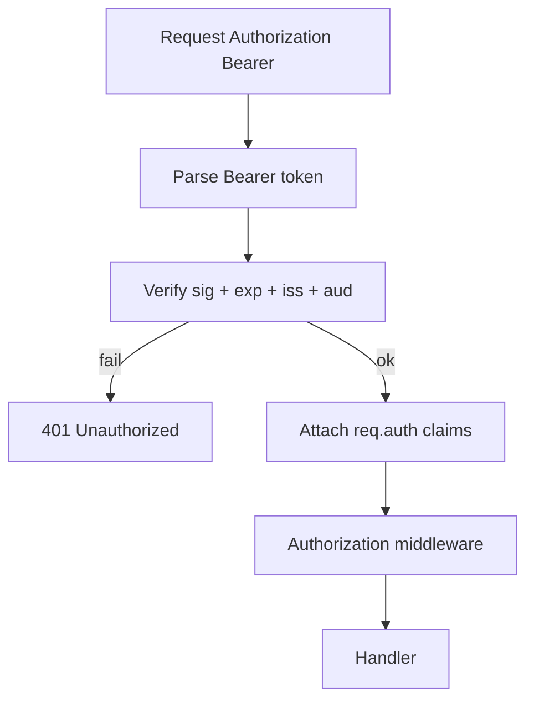
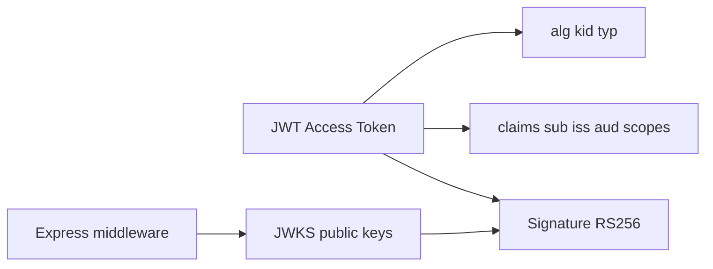
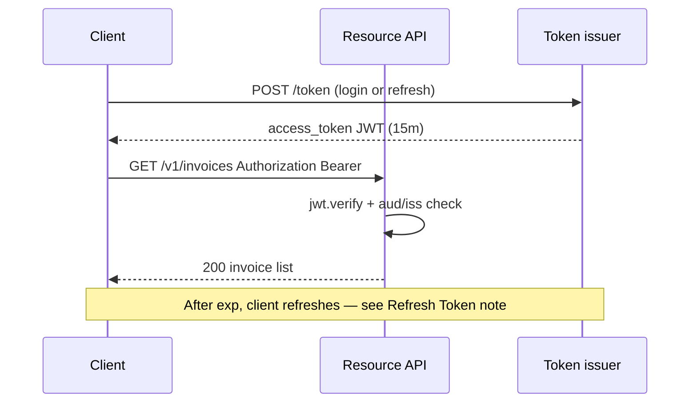

# JWT Access Tokens and Claims

## Overview

A **JWT (JSON Web Token) access token** is a compact, signed (often also encrypted) string carrying **claims**—statements about the subject (`sub`), issuer (`iss`), audience (`aud`), expiry (`exp`), scopes, tenant ID, and custom roles. Clients send it as `Authorization: Bearer <token>`. Resource servers **verify signature**, `exp`, `iss`, and `aud` on every request—no server-side session lookup required for authentication (authorization may still hit DB).

Express middleware extracts the Bearer token, verifies with **JWKS** (asymmetric) or shared secret (symmetric—discouraged for multi-service), and attaches `req.auth` for downstream guards. Access tokens should be **short-lived** (minutes); long-lived sessions use refresh tokens ([[07-Backend/04-Authentication/Refresh Token Rotation|Refresh Token Rotation]]). Cryptographic details → [[18-Security/README|Security]].

## Learning Objectives

- Structure access token claims for identity, tenancy, and scopes—avoid PII bloat
- Implement Bearer verification middleware in Express with JWKS rotation
- Distinguish authentication (valid token) from authorization (permitted action)
- Choose short TTL and clock skew tolerance appropriately
- Avoid storing JWTs in localStorage when XSS risk favors HttpOnly cookie patterns

## Prerequisites

- [[07-Backend/04-Authentication/Sessions Cookies and CSRF Boundaries|Sessions Cookies and CSRF Boundaries]]
- [[07-Backend/05-Authorization-and-Tenancy/RBAC and Permission Modeling|RBAC and Permission Modeling]]
- [[07-Backend/02-Frameworks-and-Middleware/Middleware Pipeline and Error Middleware|Middleware Pipeline and Error Middleware]]

## Difficulty

`intermediate`

## Estimated Time

- Reading: 2 hours
- Exercises: 3 hours
- Mini project: 5 hours

## History

JWT (2015, RFC 7519) popularized self-contained tokens for microservices and SPAs. Misuse followed: long-lived JWTs in localStorage, putting entire user objects in claims, skipping `aud` validation. Industry corrected toward **opaque refresh tokens**, **short access TTL**, and **OIDC** standard claims ([[07-Backend/04-Authentication/OAuth2 and OIDC Application Flows|OAuth2 and OIDC Application Flows]]).

## Problem It Solves

| Failure mode | Session cookie only | Short-lived JWT access |
| --- | --- | --- |
| Mobile/SPA cross-origin | Cookie CSRF complexity | Bearer header, no cookie |
| Microservice auth | Central session store hit | Local verify with public key |
| Horizontal scale | Sticky sessions | Stateless verification |
| Revocation delay | Instant session kill | Short TTL limits exposure |

JWT access tokens **do not** solve instant revocation alone—that requires short TTL + refresh rotation or token blocklists for exceptional cases.

## Internal Implementation



Standard registered claims to validate:

| Claim | Purpose |
| --- | --- |
| `sub` | Subject user/service ID |
| `iss` | Token issuer URL |
| `aud` | Intended resource server |
| `exp` / `nbf` | Expiry / not-before |
| `iat` | Issued at (skew checks) |

## Mermaid Diagrams

### Structure



### Sequence / Lifecycle



## Examples

### Minimal Example

```typescript
import jwt from "jsonwebtoken";

const token = jwt.sign(
  { sub: "usr_42", scope: "invoices:read" },
  process.env.JWT_SECRET!,
  { algorithm: "HS256", expiresIn: "15m", issuer: "https://auth.example.com" },
);

const payload = jwt.verify(token, process.env.JWT_SECRET!, {
  algorithms: ["HS256"],
  issuer: "https://auth.example.com",
});
```

Prefer RS256 + JWKS in multi-service production.

### Production-Shaped Example

```typescript
import express, { Request, Response, NextFunction } from "express";
import jwt from "jsonwebtoken";
import jwksRsa from "jwks-rsa";

export interface AccessTokenClaims {
  sub: string;
  iss: string;
  aud: string | string[];
  exp: number;
  scope?: string;
  tenant_id?: string;
  roles?: string[];
}

declare global {
  namespace Express {
    interface Request {
      auth?: AccessTokenClaims;
    }
  }
}

const ISSUER = "https://auth.example.com";
const AUDIENCE = "https://api.example.com";

const jwksClient = jwksRsa({
  jwksUri: `${ISSUER}/.well-known/jwks.json`,
  cache: true,
  rateLimit: true,
});

function getKey(header: jwt.JwtHeader, callback: jwt.SigningKeyCallback) {
  if (!header.kid) return callback(new Error("missing kid"));
  jwksClient.getSigningKey(header.kid, (err, key) => {
    if (err) return callback(err);
    callback(null, key!.getPublicKey());
  });
}

export function authenticateBearer(requiredScopes: string[] = []) {
  return (req: Request, res: Response, next: NextFunction) => {
    const header = req.header("authorization");
    const match = header?.match(/^Bearer (.+)$/i);
    if (!match) {
      return res.status(401).type("application/problem+json").json({
        type: "https://api.example.com/problems/unauthenticated",
        title: "Missing Bearer token",
        status: 401,
      });
    }

    jwt.verify(
      match[1],
      getKey,
      {
        algorithms: ["RS256"],
        issuer: ISSUER,
        audience: AUDIENCE,
        clockTolerance: 5,
      },
      (err, decoded) => {
        if (err || !decoded || typeof decoded === "string") {
          return res.status(401).type("application/problem+json").json({
            type: "https://api.example.com/problems/invalid-token",
            title: "Invalid or expired token",
            status: 401,
          });
        }
        const claims = decoded as AccessTokenClaims;
        const scopes = new Set((claims.scope ?? "").split(" ").filter(Boolean));
        if (requiredScopes.some((s) => !scopes.has(s))) {
          return res.status(403).type("application/problem+json").json({
            type: "https://api.example.com/problems/forbidden",
            title: "Insufficient scope",
            status: 403,
          });
        }
        req.auth = claims;
        next();
      },
    );
  };
}

const app = express();

app.get("/v1/invoices", authenticateBearer(["invoices:read"]), (req, res) => {
  res.json({ tenantId: req.auth!.tenant_id, userId: req.auth!.sub, items: [] });
});

app.listen(3000);
```

Keep claims minimal: IDs and roles/scopes, not email/name unless needed every request.

## Trade-offs

| Dimension | Upside | Downside | When it matters |
| --- | --- | --- | --- |
| Stateless verify | Fast; no session DB | Hard instant revoke | High-traffic APIs |
| Rich claims | Fewer DB lookups | Stale roles until expiry | Read-heavy |
| RS256 + JWKS | Key rotation | JWKS fetch failure modes | Multi-service |
| HS256 shared secret | Simple dev | Secret sprawl in microservices | Monolith only |
| Bearer header | CSRF-free for API | XSS steals token if in JS | SPA architecture |

### When to Use

- Mobile apps and SPAs calling APIs cross-origin
- Microservices verifying tokens at edge without session store
- Short-lived authorization with scopes

### When Not to Use

- Long-lived "session" in a JWT—use refresh token pattern
- Storing secrets or PII in payload (JWT is base64, not encrypted by default)
- Replacing authorization—scopes/roles still need policy checks

## Exercises

1. Add middleware rejecting tokens missing `tenant_id` for multi-tenant routes.
2. Simulate clock skew: token `nbf` 30s future—verify with/without `clockTolerance`.
3. List claims that should never appear in JWT; justify each.
4. Implement scope check vs RBAC role check—when do both coexist?
5. Parse JWT without verify—show why client-side "decode" is not trust.

## Mini Project

Issue RS256 access tokens from Authentication Server login; protect `/v1/me` on a second Express app with JWKS middleware.

## Portfolio Project

JWT claims standard for Backend Service Toolkit: required claims, TTL, rotation, and anti-patterns doc.

## Interview Questions

1. Difference between validating `iss`, `aud`, and `exp`?
2. Why keep access tokens short-lived?
3. JWT in HttpOnly cookie vs Authorization header—CSRF and XSS trade-offs?
4. How do you revoke a JWT before expiry in production?
5. Symmetric vs asymmetric signing for microservices?

### Stretch / Staff-Level

1. Design token exchange (RFC 8693) between internal services with different audiences.
2. When would you choose opaque access tokens + introspection instead of JWT?

## Common Mistakes

- `alg: none` acceptance (always allowlist algorithms)
- Skipping audience validation
- Week-long access token TTL
- Putting permissions that change minute-by-minute only in JWT with no refresh
- Trusting client-decoded payload without verify

## Best Practices

- RS256/ES256 with JWKS; rotate keys with `kid`
- 5–15 minute access TTL typical; refresh for continuity
- Scopes for coarse API authorization; fine checks in [[07-Backend/05-Authorization-and-Tenancy/RBAC and Permission Modeling|RBAC]]
- Log auth failures without logging full token
- BFF can hold cookie; browser never sees Bearer token

## Summary

JWT access tokens carry signed, short-lived claims verified on each request—ideal for stateless authentication across services and non-cookie clients. Express middleware validates signature, issuer, audience, and expiry, attaches claims to the request, and separates authentication from authorization. Pair with refresh rotation, minimal claims, and asymmetric keys in production.

## Further Reading

- RFC 7519 — JSON Web Token
- RFC 8725 — JWT Best Current Practices
- [[07-Backend/04-Authentication/Refresh Token Rotation|Refresh Token Rotation]]

## Related Notes

- [[07-Backend/04-Authentication/Refresh Token Rotation|Refresh Token Rotation]]
- [[07-Backend/04-Authentication/OAuth2 and OIDC Application Flows|OAuth2 and OIDC Application Flows]]
- [[07-Backend/04-Authentication/Sessions Cookies and CSRF Boundaries|Sessions Cookies and CSRF Boundaries]]
- [[07-Backend/05-Authorization-and-Tenancy/RBAC and Permission Modeling|RBAC and Permission Modeling]]
- [[18-Security/README|Security]]

## Progress Checklist

- [ ] Explained from first principles
- [ ] Drew at least one Mermaid diagram
- [ ] Implemented a minimal version
- [ ] Documented trade-offs and non-goals
- [ ] Completed exercises
- [ ] Practiced interview questions aloud
- [ ] Linked prerequisites and dependents
